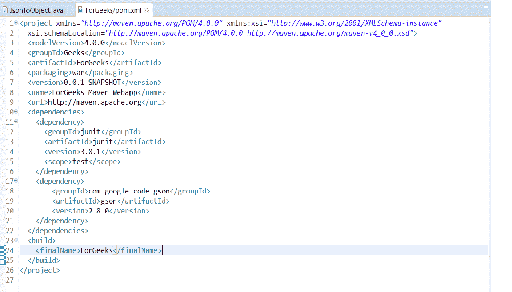
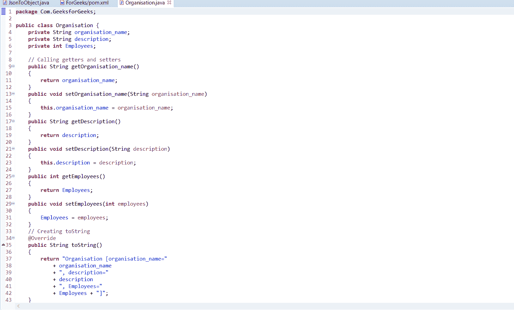
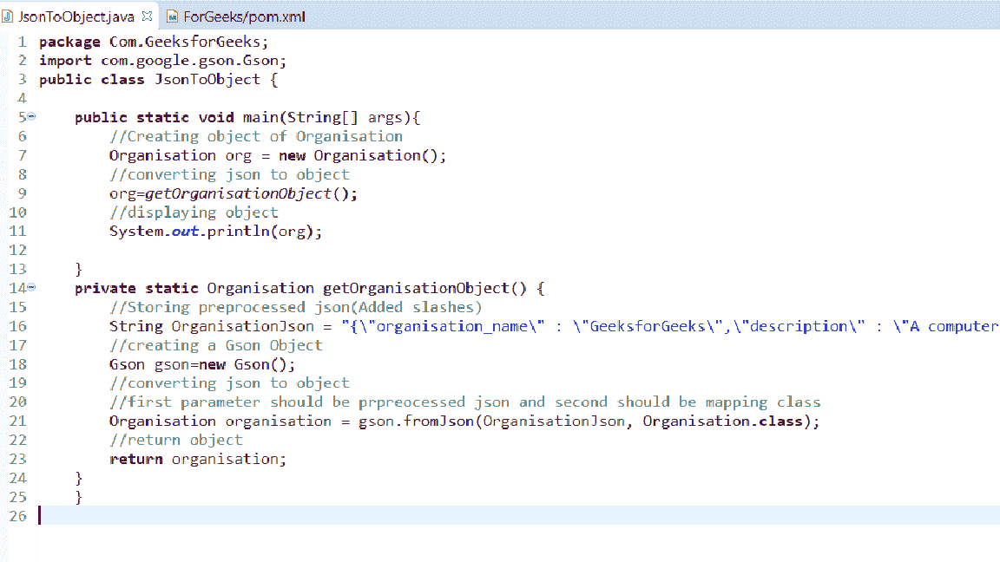

# 使用 GSON

将 Json 字符串转换为 Java 对象

> 原文:[https://www . geesforgeks . org/convert-JSON-string-to-Java-object-using-gson/](https://www.geeksforgeeks.org/convert-json-string-to-java-object-using-gson/)

**先决条件:** [使用 GSON](https://www.geeksforgeeks.org/convert-java-object-to-json-string-using-gson/)
将 Java 对象转换为 Json 字符串 [JSON](https://www.geeksforgeeks.org/tag/json/) 代表 **JavaScript 对象符号**。这是一种标准的基于文本的格式，显示基于 JavaScript 对象语法的结构化数据。它通常用于在 web 应用程序中传输数据。强烈建议在服务器和 web 应用程序之间传输数据。
要将一个 Java 对象转换成 JSON，可以使用以下方法:

*   **GSON:** 是一个开源的 Java 库，用于将 Java 对象序列化和反序列化为 JSON。
*   [杰克逊原料药](https://www.geeksforgeeks.org/convert-java-object-to-json-string-using-jackson-api/)

在本文中，预定义的 JSON 字符串使用 GSON 转换为 Java 对象。
**例:**

> **输入:**
> {
> 【organization _ name】:【Geeks forgeeks】、
> 【description】:【Geeks 的计算机科学门户】、
> 【Employee】:【2000】
> }
> **输出:**
> organization【organization _ name = Geeks forgeeks，description = Geeks 的计算机科学门户，Employees = 0】
> **输入:**
> {
> 【学生

**操作步骤如下:**

*   **添加 Jackson 的 jar 文件(在 Maven 项目的情况下，在 pom.xml 文件中添加 Gson 依赖项)**

## 超文本标记语言

```
<dependency>
       <groupId>com.google.code.gson</groupId>
       <artifactId>gson</artifactId>
       <version>2.6.2</version>
   </dependency>
```

下面是显示该步骤的截图:-



*   **创建一个 POJO(普通旧 Java 对象)转换成 JSON**

## Java 语言(一种计算机语言，尤用于创建网站)

```
package GeeksforGeeks.Geeks;
public class Organisation {
    private String organisation_name;
    private String description;
    private int Employees;

    // Calling getters and setters
    public String getOrganisation_name()
    {
        return organisation_name;
    }
    public void setOrganisation_name(String organisation_name)
    {
        this.organisation_name = organisation_name;
    }
    public String getDescription()
    {
        return description;
    }
    public void setDescription(String description)
    {
        this.description = description;
    }
    public int getEmployees()
    {
        return Employees;
    }
    public void setEmployees(int employees)
    {
        Employees = employees;
    }

    // Creating toString
    @Override
    public String toString()
    {
        return "Organisation [organisation_name="
            + organisation_name
            + ", description="
            + description
            + ", Employees="
            + Employees + "]";
    }
}
```

下面是显示该步骤的截图:-



*   **创建一个用于存储 Json 字符串的字符串变量:**
    **注意:**这个 Json 字符串不应该是简单的 Json 字符串。对 JSON 字符串进行预处理，并在将其传递到 GSON 对象之前添加斜线。
    **预处理示例:**

> **初始 JSON 字符串:**
> {“organization _ name”:“Geeks forgeeks”、“description”:“Geeks 的计算机科学门户”、“Employee”:“2000”}
> **预处理 JSON 字符串:**
> {“organization _ name”:“Geeks forgeeks”、“description”:“Geeks 的计算机科学门户”、“Employee”:“2000”}

*   **创建一个 Java 类，用于将 Json 转换为 Organisation 对象:**

## Java 语言(一种计算机语言，尤用于创建网站)

```
package GeeksforGeeks.Geeks;

import com.google.gson.Gson;

public class JsonToObject {

    public static void main(String[] args)
    {
        // Creating object of Organisation
        Organisation org = new Organisation();

        // Converting json to object
        org = getOrganisationObject();

        // Displaying object
        System.out.println(org);
    }

    private static Organisation getOrganisationObject()
    {
        // Storing preprocessed json(Added slashes)
        String OrganisationJson
            = "{\"organisation_name\"
            : \"GeeksforGeeks\",
            \"description\"
            : \"A computer Science portal for Geeks\",
            \"Employee\"
            : \"2000\"}";

        // Creating a Gson Object
        Gson gson = new Gson();

        // Converting json to object
        // first parameter should be prpreocessed json
        // and second should be mapping class
        Organisation organisation
            = gson.fromJson(OrganisationJson,
                            Organisation.class);

        // return object
        return organisation;
    }
}
```

下面是显示该步骤的截图:-



*   **执行流程**

**输出:**

> 组织[组织名称=极客博客，描述=极客的计算机科学门户，员工=0]