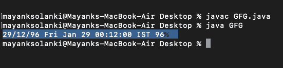

# 在 Java 中将字符串转换为日期

> 原文:[https://www . geesforgeks . org/convert-string-to-date-in-Java/](https://www.geeksforgeeks.org/convert-string-to-date-in-java/)

给定日期格式的字符串，任务是将该字符串转换为实际日期。这里的主要概念是 parse()方法，它有助于转换。

插图:

```
Input : string = "2018-10-28T15:23:01Z"
Output: 2018-10-28T15:23:01Z

Input : string = "28 October, 2018"
Output: 2018-10-28
```

**方法:**

1.  使用即时课程
2.  使用 datetimeformatter 类
3.  使用简单日期格式类

现在让我们讨论一下

**方法 1:** [使用即时类](https://www.geeksforgeeks.org/java-time-instant-class-in-java/)

**java.time 包**中的**即时类**给出纳秒精度。它类似于日期类，但精度更高。

**进场:**

1.  获取要转换的字符串。
2.  创建一个空的即时时间戳对象
3.  使用 Instant.parse()方法将字符串转换为日期。
4.  如果转换成功，则打印日期
5.  如果转换不成功，则会引发 DateTimeParseException。

**示例:**

## Java 语言(一种计算机语言，尤用于创建网站)

```
// Java Program to Convert String to Date

// Importing required classes
import java.time.Instant;
import java.time.format.DateTimeParseException;

// Main class
class GFG {

    // Method
    // To convert String to Date
    public static Instant getDateFromString(String string)
    {
        // Creating an instant object
        Instant timestamp = null;

        // Parsing the string to Date
        timestamp = Instant.parse(string);

        // Returning the converted timestamp
        return timestamp;
    }

    // Method 2
    // Main driver method
    public static void main(String[] args)
    {
        // Getting the string
        String string = "2018-10-28T15:23:01Z";

        // Try block to check for exceptions
        try {

            // Getting the Date from String by
            // creating object of Instant class
            Instant timestamp = getDateFromString(string);

            // Printing the converted date
            System.out.println(timestamp);
        }

        // Catch block to handle exceptions
        catch (DateTimeParseException e) {

            // Throws DateTimeParseException
            // if the string cannot be parsed
            System.out.println("Exception: " + e);
        }
    }
}
```

**Output:**

```
2018-10-28T15:23:01Z
```

**方法 2:** [使用日期时间格式化程序类](https://www.geeksforgeeks.org/localdatetime-parse-method-in-java-with-examples/)

**进场:**

1.  获取要转换的字符串和所需的格式。
2.  创建一个空的本地日期对象
3.  使用 LocalDate.parse()方法将字符串转换为日期。
4.  如果转换成功，则打印日期
5.  如果字符串模式无效，则会引发 IllegalArgumentException。
6.  如果转换不成功，则会引发 DateTimeParseException。

**例**

## Java 语言(一种计算机语言，尤用于创建网站)

```
// Java program to convert String to Date

// Importing required classes
import java.time.LocalDate;
import java.time.format.DateTimeFormatter;
import java.time.format.DateTimeParseException;

// Main class
class GFG {

    // Method 1
    // To convert String to Date
    public static LocalDate
    getDateFromString(String string,
                      DateTimeFormatter format)
    {

        // Converting the string to date
        // in the specified format
        LocalDate date = LocalDate.parse(string, format);

        // Returning the converted date
        return date;
    }

    // Method 2
    // Main driver method
    public static void main(String[] args)
    {
        // Getting the custom string input
        String string = "28 October, 2018";

        // Getting the format by creating an object of
        // DateTImeFormatter class
        DateTimeFormatter format
            = DateTimeFormatter.ofPattern("d MMMM, yyyy");

        // Try block tp check for exceptions
        try {

            // Getting the Date from String
            LocalDate date
                = getDateFromString(string, format);

            // Printing the converted date
            System.out.println(date);
        }

        // Block 1
        // Catch block to handle exceptions occuring
        // if the String pattern is invalid
        catch (IllegalArgumentException e) {

            // Display the exception
            System.out.println("Exception: " + e);
        }

        // Block 2
        // If the String was unable to be parsed
        catch (DateTimeParseException e) {

            // Display the exception
            System.out.println("Exception: " + e);
        }
    }
}
```

**Output:**

```
2018-10-28
```

**方法 3:** [使用简单日期格式类](https://www.geeksforgeeks.org/java-simpledateformat-set-1/)

**程序:**

1.  获取字符串输入并将其存储到字符串中
2.  参照简单日期格式类创建日期类的对象
3.  将日期格式解析到其中。
4.  打印相应的日期。

**例**

## Java 语言(一种计算机语言，尤用于创建网站)

```
// Java Program to Convert String to Date

// Importing required classes
import java.text.SimpleDateFormat;
import java.util.Date;

// Main class
class GFG {

    // main driver method
    public static void main(String[] args) throws Exception
    {

        // Custom string as input
        String strDate = "29/12/96";

        // Creating an object of Date class with reference
        // to SimpleDateFormat class and
        // lately parsing the above string into it
        Date date = new SimpleDateFormat("dd/mm/yyyy")
                        .parse(strDate);

        // Print and display the date corresponding to
        // above input string
        System.out.print(strDate + " " + date);
    }
}
```

**输出:**

