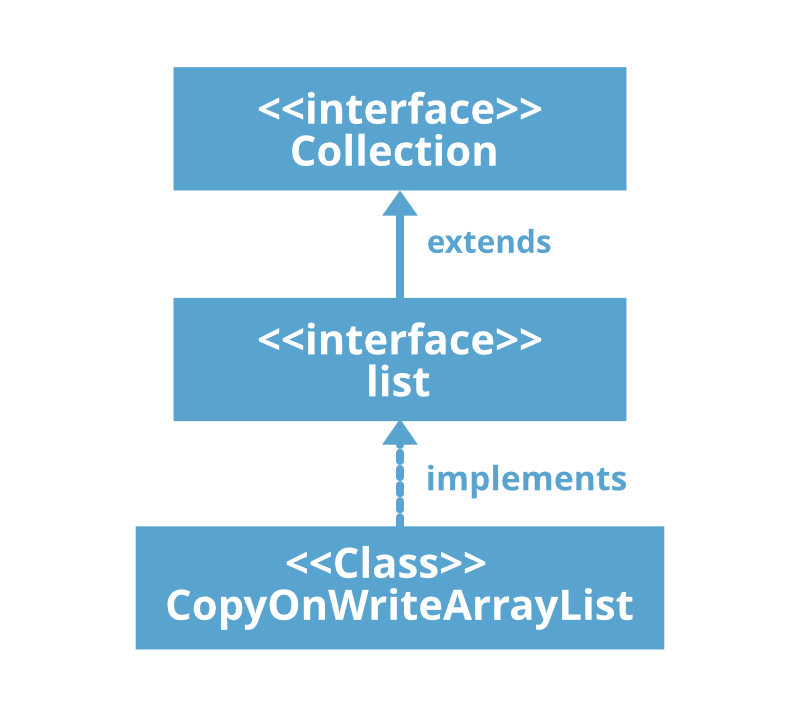

# Java 中的 copy onwriterarraylist

> 原文:[https://www.geeksforgeeks.org/copyonwritearraylist-in-java/](https://www.geeksforgeeks.org/copyonwritearraylist-in-java/)

**copy onwriterarraylist 类**在 JDK 1.5 中引入，实现了 [**列表界面**](https://www.geeksforgeeks.org/list-interface-java-examples/) 。它是 [**数组列表**](https://www.geeksforgeeks.org/arraylist-in-java/) 的增强版，其中所有修改(添加、设置、删除等)都是通过制作一个新副本来实现的。在 **java.util.concurrent** 包中找到。它是为在并发环境中使用而创建的数据结构。



**以下是关于 CopyOnWriteArrayList 的几点:**

*   顾名思义，CopyOnWriteArrayList 创建底层数组列表的克隆副本，对于特定点的每个更新操作，两者都将自动同步，这由 JVM 负责。因此，对正在执行读取操作的线程没有影响。
*   使用成本很高，因为每次更新操作都会创建一个克隆副本。因此，如果我们频繁的操作是读操作，那么 CopyOnWriteArrayList 是最好的选择。
*   带下划线的数据结构是一个可增长的数组。
*   这是数组列表的线程安全版本。
*   保留插入，允许重复、空和异构对象。
*   关于 copy onwriterarraylist 最重要的一点是 copy onwriterarraylist 的[迭代器](https://www.geeksforgeeks.org/iterators-in-java/)不能执行移除操作，否则我们会得到运行时异常，表示**不支持操作异常。**在 CopyOnWriteArrayList 迭代器上添加()和 set()方法也会引发**UnsupportedOperationException。**同样，CopyOnWriteArrayList 的迭代器永远不会抛出**ConcurrentModificationException**。

**申报:**

> 公共类 copy onwriterarraylist<e>扩展对象实现列表<e>，随机访问，可克隆，可序列化</e></e>

这里，E 是这个集合中的元素类型。

**注意:**类实现**可序列化**、**可克隆**、**可迭代<E>T7】、**集合<E>T9】、[列表<E>T11】、**随机访问**接口。](https://www.geeksforgeeks.org/list-interface-java-examples/)****

**施工人员:**

**1。copy onwriterarraylist()**:创建一个空列表。

```java
CopyOnWriteArrayList c = new CopyOnWriteArrayList();
```

**2。copy onwriterarraylist(Collection obj)**:创建一个包含指定集合元素的列表，按照集合迭代器返回元素的顺序。

```java
CopyOnWriteArrayList c = new CopyOnWriteArrayList(Collection obj);
```

**3。CopyOnWriteArrayList(对象[]obj)；**:创建一个包含给定数组副本的列表。

```java
CopyOnWriteArrayList c = new CopyOnWriteArrayList(Object[] obj);
```

**示例:**

## Java 语言(一种计算机语言，尤用于创建网站)

```java
// Java program to illustrate
// CopyOnWriteArrayList class
import java.util.*;
import java.util.concurrent.CopyOnWriteArrayList;

public class ConcurrentDemo extends Thread {

    static CopyOnWriteArrayList<String> l
        = new CopyOnWriteArrayList<String>();

    public void run()
    {
        // Child thread trying to
        // add new element in the
        // Collection object
        l.add("D");
    }

    public static void main(String[] args)
        throws InterruptedException
    {
        l.add("A");
        l.add("B");
        l.add("c");

        // We create a child thread
        // that is going to modify
        // ArrayList l.
        ConcurrentDemo t = new ConcurrentDemo();
        t.run();

        Thread.sleep(1000);

        // Now we iterate through
        // the ArrayList and get
        // exception.
        Iterator itr = l.iterator();
        while (itr.hasNext()) {
            String s = (String)itr.next();
            System.out.println(s);
            Thread.sleep(1000);
        }
        System.out.println(l);
    }
}
```

**Output**

```java
A
B
c
D
[A, B, c, D]

```

**迭代 copy onwriterarraylist:**我们可以使用[迭代器()](https://www.geeksforgeeks.org/copyonwritearraylist-iterator-method-in-java/)方法迭代 copy onwriterarraylist。需要注意的重要一点是，我们创建的迭代器是原始列表的不可变快照。因为这个属性，我们可以看到 **GfG** 在第一次迭代时是不打印的。

## Java 语言(一种计算机语言，尤用于创建网站)

```java
// Java program to illustrate
// CopyOnWriteArrayList class
import java.io.*;
import java.util.*;
import java.util.concurrent.*;

class Demo {
    public static void main(String[] args)
    {

        CopyOnWriteArrayList<String> list
            = new CopyOnWriteArrayList<>();

        // Initial Iterator
        Iterator itr = list.iterator();
        list.add("GfG");
        System.out.println("List contains: ");
        while (itr.hasNext())
            System.out.println(itr.next());

        // iterator after adding an element
        itr = list.iterator();
        System.out.println("List contains:");
        while (itr.hasNext())
            System.out.println(itr.next());
    }
}
```

**Output**

```java
List contains: 
List contains:
GfG

```

**copy onwriterarraylist 的方法:**

<figure class="table">

| 

方法

 | 

描述

 |
| --- | --- |
| [加(E e)](https://www.geeksforgeeks.org/copyonwritearraylist-add-method-in-java/) | 将指定的元素追加到此列表的末尾。 |
| [添加(int 索引，E 元素)](https://www.geeksforgeeks.org/copyonwritearraylist-add-method-in-java/) | 在列表中的指定位置插入指定元素。 |
| [addAll(收藏<？延伸 E > c)](https://www.geeksforgeeks.org/copyonwritearraylist-addall-method-in-java-with-examples/) | 按照指定集合的迭代器返回的顺序，将指定集合中的所有元素追加到该列表的末尾。 |
| [addAll(int index，Collection <？延伸 E > c)](https://www.geeksforgeeks.org/copyonwritearraylist-addall-method-in-java-with-examples/) | 从指定位置开始，将指定集合中的所有元素插入此列表。 |
| [添加收藏<？延伸 E > c)](https://www.geeksforgeeks.org/copyonwritearraylist-addallabsent-method-in-java-with-examples/) | 按照指定集合的迭代器返回的顺序，将指定集合中尚未包含在此列表中的所有元素追加到此列表的末尾。 |
| [addif(e)](https://www.geeksforgeeks.org/copyonwritearraylist-addifabsent-method-in-java/) | 追加元素(如果不存在)。 |
| [晴()](https://www.geeksforgeeks.org/copyonwritearraylist-clear-method-in-java/#:~:text=The%20clear()%20method%20of,after%20the%20function%20is%20called.&text=Parameters%3A%20The%20function%20does%20not%20accept%20any%20parameters.) | 从此列表中移除所有元素。 |
| [克隆()](https://www.geeksforgeeks.org/copyonwritearraylist-clone-method-in-java/) | 返回此列表的浅拷贝。 |
| [包含(对象 o)](https://www.geeksforgeeks.org/copyonwritearraylist-contains-method-in-java/) | 如果此列表包含指定的元素，则返回 true。 |
| [包含所有(收藏<？> c)](https://www.geeksforgeeks.org/copyonwritearraylist-containsall-method-in-java/) | 如果此列表包含指定集合的所有元素，则返回 true。 |
| [等于(对象 o)](https://www.geeksforgeeks.org/copyonwritearraylist-equals-method-in-java-with-examples/) | 将指定的对象与该列表进行比较，看是否相等。 |
| [forEach(消费者<？超 E >动作)](https://www.geeksforgeeks.org/copyonwritearraylist-foreach-method-in-java-with-examples/) | 对 Iterable 的每个元素执行给定的操作，直到所有元素都被处理完或者该操作引发异常。 |
| [get(int index)](https://www.geeksforgeeks.org/copyonwritearraylist-get-method-in-java/#:~:text=The%20get(index)%20method%20of,element%20at%20the%20specified%20index.&text=Parameters%3A%20The%20function%20accepts%20a,element%20at%20the%20given%20index.) | 返回列表中指定位置的元素。 |
| [hashCode()](https://www.geeksforgeeks.org/copyonwritearraylist-hashcode-method-in-java/) | 返回此列表的哈希代码值。 |
| [指数 Of(E，E，int 指数)](https://www.geeksforgeeks.org/copyonwritearraylist-indexof-method-in-java/) | 返回列表中指定元素的第一个匹配项的索引，从索引向前搜索，如果找不到该元素，则返回-1。 |
| [索引（对象 o）](https://www.geeksforgeeks.org/copyonwritearraylist-indexof-method-in-java/) | 返回此列表中指定元素的第一个匹配项的索引，如果此列表不包含该元素，则返回-1。 |
| [【isempty()](https://www.geeksforgeeks.org/copyonwritearraylist-isempty-method-in-java/) | 如果此列表不包含任何元素，则返回 true。 |
| [迭代器()](https://www.geeksforgeeks.org/copyonwritearraylist-iterator-method-in-java/) | 以正确的顺序返回列表中元素的迭代器。 |
| [最后索引(E，E，int 索引)](https://www.geeksforgeeks.org/copyonwritearraylist-lastindexof-method-in-java/) | 返回列表中指定元素最后一次出现的索引，从索引开始向后搜索，如果找不到该元素，则返回-1。 |
| [最后索引（对象 o）](https://www.geeksforgeeks.org/copyonwritearraylist-lastindexof-method-in-java/) | 返回此列表中指定元素最后一次出现的索引，如果此列表不包含该元素，则返回-1。 |
| [列表迭代器()](https://www.geeksforgeeks.org/copyonwritearraylist-listiterator-method-in-java/) | 返回列表中元素的列表迭代器(按正确的顺序)。 |
| [列表迭代器(int index)](https://www.geeksforgeeks.org/copyonwritearraylist-listiterator-method-in-java/) | 从列表中的指定位置开始，返回列表中元素的列表迭代器(按正确的顺序)。 |
| [移除(int index)](https://www.geeksforgeeks.org/copyonwritearraylist-remove-method-in-java-with-examples/#:~:text=The%20remove(Object%20o)%20method,is%20present%20in%20the%20list.&text=Parameters%3A%20This%20method%20accepts%20a%20mandatory%20parameter%20o%2C%20the%20element,from%20the%20list%2C%20if%20present.) | 移除列表中指定位置的元素。 |
| [移除(物体 o)](https://www.geeksforgeeks.org/copyonwritearraylist-remove-method-in-java-with-examples/#:~:text=The%20remove(Object%20o)%20method,is%20present%20in%20the%20list.&text=Parameters%3A%20This%20method%20accepts%20a%20mandatory%20parameter%20o%2C%20the%20element,from%20the%20list%2C%20if%20present.) | 从列表中删除指定元素的第一个匹配项(如果存在)。 |
| [移除所有(集合<？> c)](https://www.geeksforgeeks.org/copyonwritearraylist-removeall-method-in-java-with-examples/#:~:text=The%20removeAll()%20method%20in,CopyOnArrayList%20object%20you%20call%20on.&text=Parameter%3A%20The%20method%20accepts%20only,removed%20from%20the%20calling%20object.) | 从此列表中移除指定集合中包含的所有元素。 |
| [removeIf(谓语<？超 E >滤镜)](https://www.geeksforgeeks.org/copyonwritearraylist-removeif-method-in-java-with-examples/#:~:text=The%20removeIf()%20method%20of,that%20satisfies%20the%20specified%20condition.&text=Parameters%3A%20This%20method%20accepts%20a,are%20removed%20from%20this%20List.) | 移除此集合中满足给定谓词的所有元素。 |
| [更换所有(无操作员< E >操作员)](https://www.geeksforgeeks.org/copyonarraylist-replaceall-method-in-java-with-examples/) | 将列表中的每个元素替换为对该元素应用运算符的结果。 |
| [零售(收藏<？> c)](https://www.geeksforgeeks.org/copyonwritearraylist-retainall-method-in-java-with-examples/) | 仅保留此列表中包含在指定集合中的元素。 |
| [集合(int 索引，E 元素)](https://www.geeksforgeeks.org/copyonwritearraylist-set-method-in-java-with-examples/#:~:text=The%20set(E%20e)%20method,replaced%20by%20the%20new%20element.) | 用指定的元素替换列表中指定位置的元素。 |
| [尺寸()](https://www.geeksforgeeks.org/copyonwritearraylist-size-method-in-java/#:~:text=The%20size()%20method%20of,of%20elements%20in%20the%20list.&text=Parameters%3A%20The%20function%20does%20not,the%20size%20of%20the%20list.) | 返回此列表中的元素数量。 |
| 排序(比较器 super E> c) | 根据指定比较器引发的顺序对该列表进行排序。 |
| [分流器()](https://www.geeksforgeeks.org/copyonwritearraylist-spliterator-method-in-java/) | 返回列表中元素的拆分器。 |
| [子列表（int fromIndex， int toIndex）](https://www.geeksforgeeks.org/copyonwritearraylist-sublist-method-in-java-with-examples/) | 返回此列表中从索引(包括)到索引(不包括)之间的部分的视图。 |
| [toaarray()](https://www.geeksforgeeks.org/copyonwritearraylist-toarray-method-in-java/) | 返回一个数组，该数组按正确的顺序(从第一个元素到最后一个元素)包含列表中的所有元素。 |
| [toaarray(t[]a)](https://www.geeksforgeeks.org/copyonwritearraylist-toarray-method-in-java/) | 返回一个数组，该数组包含此列表中按正确顺序排列的所有元素(从第一个到最后一个元素)；返回数组的运行时类型是指定数组的运行时类型。 |
| [toString()](https://www.geeksforgeeks.org/copyonwritearraylist-tostring-method-in-java/) | 返回此列表的字符串表示形式。 |

</figure>

**从接口 java.util.Collection 继承的方法:**

<figure class="table">

| 

方法

 | 

描述

 |
| --- | --- |
| 并行流() | 以此集合为源返回一个可能并行的流。 |
| 流() | 返回以此集合为源的顺序流。 |

</figure>

**注意:**当我们更喜欢在并发环境中使用类似数组列表的数据结构时，我们应该使用**copy onwriterarraylist**。

**必读:**

*   [数组列表和 CopyOnWriteArrayList 的区别](https://www.geeksforgeeks.org/difference-arraylist-copyonwritearraylist/)