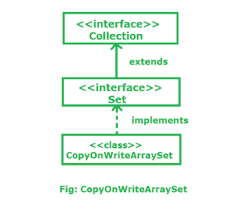

# Java 中的 copy onwriterarrayset

> 原文:[https://www.geeksforgeeks.org/copyonwritearrayset-in-java/](https://www.geeksforgeeks.org/copyonwritearrayset-in-java/)

**copy onwriterarrayset**是 [Java 集合框架](https://www.geeksforgeeks.org/collections-in-java-2/)的成员。这是一个使用内部[副本写数组列表](https://www.geeksforgeeks.org/copyonwritearraylist-in-java/)进行所有操作的集合。它是在 JDK 1.5 中引入的，我们可以说它是 Set 的线程安全版本。要使用这个类，我们需要从 **java.util.concurrent** 包导入它。



***共享 Set 的一些属性，也有自己的属性:***

*   CopyOnWriteArraySet 的内部实现仅为[copy onwriterarraylist](https://www.geeksforgeeks.org/copyonwritearraylist-in-java/)。
*   多个线程能够同时执行更新操作，但是对于每个更新操作，会创建一个单独的克隆副本**。每次更新都会创建一个新的克隆副本，这是很昂贵的。因此，如果需要多次更新操作，则不建议使用 CopyOnWriteArraySet。**
*   **当一个线程迭代集合时，其他线程可以执行更新，这里我们不会得到任何运行时异常，比如**ConcurrentModificationException。****
*   **CopyOnWriteArraySet 类的迭代器只能执行只读，不应该执行删除，否则我们会得到运行时异常**UnsupportedOperationException。****
*   **在集合大小通常保持较小的应用程序中使用 CopyOnWriteArraySet，只读操作大大超过了变异操作，并且您需要在遍历过程中防止线程之间的干扰。**
*   **CopyOnWriteArraySet 有助于最大限度地减少程序员控制的同步步骤，并将控制转移到内置的、经过良好测试的 API。**

****阶级等级:**** 

```java
java.lang.Object
   ↳ java.util.AbstractCollection<E>
        ↳ java.util.AbstractSet<E>
             ↳ java.util.concurrent.CopyOnWriteArraySet<E> 
```

****申报:****

```java
public class CopyOnWriteArraySet<E> extends AbstractSet<E> implements Serializable 
```

**这里， **E** 是存储在此集合中的元素类型。实现**可序列化**、**可迭代< E >** 、**集合< E >** 、[设置< E >](https://www.geeksforgeeks.org/set-in-java/) 接口。**

****施工人员:****

****1。copy onwriterarrayset()**:创建一个空集合。**

> **copy onwriterarrayset<e>c = new copy onwriterarrayset<e>()；</e></e>**

****2。CopyOnWriteArraySet(集合 c)** :创建包含指定集合的所有元素的集合。**

> **copy onwriterarrayset<e>c =新的 copy onwriterarrayset<e>(集合 c)；</e></e>**

****例:**** 

## **Java 语言(一种计算机语言，尤用于创建网站)**

```java
// Java program to illustrate 
// CopyOnWriteArraySet class
import java.util.concurrent.*;
import java.util.*;

public class ConcurrentDemo extends Thread {

    static CopyOnWriteArraySet l = new CopyOnWriteArraySet();

    public void run()
    {
        // Child thread trying to add
        // new element in the Set object
        l.add("D");
    }

    public static void main(String[] args) 
    {
          // add elements using add method
        l.add("A");
        l.add("B");
        l.add("C");

        // We create a child thread 
        // that is going to modify 
        // CopyOnWriteArraySet l.
        ConcurrentDemo t = new ConcurrentDemo();

          // run the child thread
        t.start();

        // Wait for the thread to 
        // add the element.
        try {
            Thread.sleep(2000);
        }
        catch (InterruptedException e) {
            System.out.println("child going to add element");
        }

        System.out.println(l);

        // Now we iterate through the 
        // CopyOnWriteArraySet and we
        // wont get exception.
        Iterator itr = l.iterator();
        while (itr.hasNext()) 
        {
            String s = (String)itr.next();
            System.out.println(s);

            if(s.equals("C"))
            {
                // Here we will get
                // RuntimeException
                itr.remove();
            }
        }
    }
}
```

****输出:**** 

```java
[A, B, C, D]
A
B
C
Exception in thread "main" java.lang.UnsupportedOperationException
    at java.util.concurrent.CopyOnWriteArrayList$COWIterator.remove(CopyOnWriteArrayList.java:1176)
    at ConcurrentDemo.main(ConcurrentDemo.java:56) 
```

****迭代 copy onwriterarrayset:**我们可以使用[迭代器()](https://www.geeksforgeeks.org/copyonwritearrayset-iterator-method-in-java/)方法，按照添加元素的顺序迭代这个集合中包含的元素。返回的迭代器提供了构造迭代器时集合状态的不可变快照。由于这个属性， **GeeksforGeeks** 在第一次迭代时不会被打印。迭代时不需要同步。迭代器不支持 remove 方法。**

## **Java 语言(一种计算机语言，尤用于创建网站)**

```java
// Java program to illustrate
// Iterating over CopyOnWriteArraySet class
import java.io.*;
import java.util.*;
import java.util.concurrent.*;

class IteratingCopyOnWriteArraySet {
    public static void main(String[] args)
    {

          // create an instance of
          // CopyOnWriteArraySet
        CopyOnWriteArraySet<String> set
            = new CopyOnWriteArraySet<>();

        // Initial Iterator
        Iterator itr = set.iterator();

          // add elements using add() method
        set.add("GeeksforGeeks");

          // print the contents 
          // of set to the console
        System.out.println("Set contains: ");
        while (itr.hasNext())
            System.out.println(itr.next());

        // iterator after adding an element
        itr = set.iterator();

          // print the elements to the console
        System.out.println("Set contains:");
        while (itr.hasNext())
            System.out.println(itr.next());
    }
}
```

****Output:**

```java
Set contains: 
Set contains:
GeeksforGeeks
```** 

### **CopyOnWriteArraySet 中的方法**

*   ****E**–元素类型**

<figure class="table">

| 

方法

 | 

描述

 |
| --- | --- |
| [加(E e)](https://www.geeksforgeeks.org/copyonwritearrayset-add-method-in-java/) | 如果指定的元素尚不存在，则将该元素添加到该集合中。 |
| [addAll(收藏<？延伸 E > c)](https://www.geeksforgeeks.org/copyonwritearrayset-addall-method-in-java-with-examples/) | 如果指定集合中的所有元素尚不存在，则将它们添加到该集合中。 |
| [晴()](https://www.geeksforgeeks.org/copyonwritearrayset-clear-method-in-java/) | 从该集中移除所有元素。 |
| [包含(对象 o)](https://www.geeksforgeeks.org/copyonwritearrayset-contains-method-in-java/) | 如果此集合包含指定的元素，则返回 true。 |
| [包含所有(收藏<？> c)](https://www.geeksforgeeks.org/copyonwritearrayset-containsall-method-in-java-with-example/) | 如果此集合包含指定集合的所有元素，则返回 true。 |
| [等于(对象 o)](https://www.geeksforgeeks.org/copyonwritearrayset-equals-method-in-java/) | 将指定的对象与此相等集进行比较。 |
| [forEach(消费者<？超 E >动作)](https://www.geeksforgeeks.org/copyonwritearrayset-foreach-method-in-java-with-examples/) | 对 Iterable 的每个元素执行给定的操作，直到所有元素都被处理完或者该操作引发异常。 |
| [【isempty()](https://www.geeksforgeeks.org/copyonwritearrayset-isempty-method-in-java/) | 如果此集合不包含元素，则返回 true。 |
| [迭代器()](https://www.geeksforgeeks.org/copyonwritearrayset-iterator-method-in-java/) | 按照元素添加的顺序返回包含在该集合中的元素的迭代器。 |
| [移除(物体 o)](https://www.geeksforgeeks.org/copyonwritearrayset-remove-method-in-java/#:~:text=The%20remove()%20method%20of,is%20present%20in%20the%20set.&text=Parameters%3A%20The%20function%20accepts%20a,from%20the%20set%20if%20present.) | 如果存在指定的元素，则从该集中移除该元素。 |
| [移除所有(集合<？> c)](https://www.geeksforgeeks.org/copyonwritearrayset-removeall-method-in-java-with-examples/) | 从该集合中移除指定集合中包含的所有元素。 |
| [removeIf(谓语<？超 E >滤镜)](https://www.geeksforgeeks.org/copyonwritearrayset-removeif-method-in-java-with-examples/) | 移除此集合中满足给定谓词的所有元素。 |
| [零售(收藏<？> c)](https://www.geeksforgeeks.org/copyonwritearrayset-retainall-method-in-java-with-example/) | 仅保留该集合中包含在指定集合中的元素。 |
| [尺寸()](https://www.geeksforgeeks.org/copyonwritearrayset-size-method-in-java/) | 返回该集合中的元素数量。 |
| [分流器()](https://www.geeksforgeeks.org/copyonwritearrayset-spliterator-method-in-java/) | 按照元素添加的顺序，返回此集合中元素的拆分器。 |
| [toaarray()](https://www.geeksforgeeks.org/copyonwritearrayset-toarray-method-in-java-with-example/) | 返回包含该集合中所有元素的数组。 |
| [toaarray(t[]a)](https://www.geeksforgeeks.org/copyonwritearrayset-toarray-method-in-java-with-example/) | 返回包含该集合中所有元素的数组；返回数组的运行时类型是指定数组的运行时类型。 |

</figure>

### **从 java.util.AbstractSet 类继承的方法**

<figure class="table">

| 

方法

 | 

描述

 |
| --- | --- |
| [hashCode()](https://www.geeksforgeeks.org/abstractset-hashcode-method-in-java-with-examples/) | 返回该集合的哈希代码值。 |

</figure>

### **从 java.util.AbstractCollection 类继承的方法**

<figure class="table">

| 

方法

 | 

描述

 |
| --- | --- |
| [toString()](https://www.geeksforgeeks.org/abstractset-tostring-method-in-java-with-example/) | 返回此集合的字符串表示形式。 |

</figure>

### **从接口 java.util.Collection 继承的方法**

<figure class="table">

| 

方法

 | 

描述

 |
| --- | --- |
| 并行流() | 以此集合为源返回一个可能并行的流。 |
| 流() | 返回以此集合为源的顺序流。 |

</figure>

### **HashSet 与 CopyOnWriteArraySet**

<figure class="table">

| 

财产

 | 

哈希集

 | 

copy onwriterarrayset

 |
| --- | --- | --- |
| *包装* | 属于 **java.util** 包 | 属于 **java.util.concurrent** 包 |
| *同步* | 同步意味着只有一个线程可以访问或修改它。HashSet 未同步。 | 它是同步的。 |
| *迭代器* | 迭代器返回我的方法[迭代器()](https://www.geeksforgeeks.org/hashset-iterator-method-in-java/)和列表迭代器()是[快速失败](https://www.geeksforgeeks.org/fail-fast-fail-safe-iterators-java/)。 | 返回的迭代器是[故障安全](https://www.geeksforgeeks.org/fail-fast-fail-safe-iterators-java/)。 |
| *在版本*中增加 | 它是在 JDK 1.2 中添加的 | 它是在 JDK 1.5 中添加的 |
| *性能* | 因为不同步，所以速度很快。 | 因为是同步的，所以它比 HashSet 慢。 |
| 例外 | 它可能会抛出**ConcurrentModificationException**，因为许多线程可以同时访问它。 | 它不会抛出**ConcurrentModificationException**，因为它是同步的。 |

</figure>

****参考:**[https://docs . Oracle . com/en/Java/javase/11/docs/API/Java . base/Java/util/concurrent/copy onwriterarrayset . html](https://docs.oracle.com/en/java/javase/11/docs/api/java.base/java/util/concurrent/CopyOnWriteArraySet.html)**