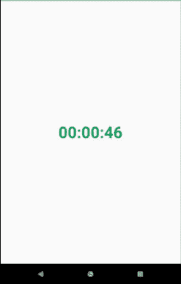

# 安卓中的 CountDownTimer 示例

> 原文:[https://www . geeksforgeeks . org/countdowtimer-in-Android-with-example/](https://www.geeksforgeeks.org/countdowntimer-in-android-with-example/)

CountDownTimer 应用程序是关于设置一个时间，它以相反的顺序移动，因为它显示了即将到来的事件的剩余时间。countdowtimer 是一种精确的计时器，可用于网站或博客，显示任何特殊事件的倒计时，如生日或周年纪念日。同样，这里让我们创建一个[安卓应用](https://www.geeksforgeeks.org/introduction-to-android-development/)来学习如何创建一个简单的**倒计时**应用。因此，让我们开始一步一步地创建应用程序，直到它完成。



### 方法

**第一步:创建新项目**

要在安卓工作室创建新项目，请参考[如何在安卓工作室创建/启动新项目](https://www.geeksforgeeks.org/android-how-to-create-start-a-new-project-in-android-studio/)。注意，选择 [**Java**](https://www.geeksforgeeks.org/java/) 作为编程语言。

**第二步:使用 activity_main.xml 文件**

在 **activity_main.xml** 文件中，只添加一个 [TextView](https://www.geeksforgeeks.org/textview-widget-in-android-using-java-with-examples/) 来显示 CountDownTimer。下面是 **activity_main.xml** 文件的完整代码。

## activity_main.xml

```java
<?xml version="1.0" encoding="utf-8"?>
<androidx.constraintlayout.widget.ConstraintLayout
    xmlns:android="http://schemas.android.com/apk/res/android"
    xmlns:app="http://schemas.android.com/apk/res-auto"
    xmlns:tools="http://schemas.android.com/tools"
    android:layout_width="match_parent"
    android:layout_height="match_parent"
    android:background="#fff"
    tools:context=".MainActivity">

    <!-- Here adding a TextView to show countdown -->
    <TextView
        android:id="@+id/textView"
        android:layout_width="0dp"
        android:layout_height="0dp"
        android:background="?android:attr/detailsElementBackground"
        android:gravity="center_horizontal|center_vertical"
        android:text="TextView"
        android:textColor="@color/colorPrimary"
        android:textSize="36sp"
        android:textStyle="bold"
        app:layout_constraintBottom_toBottomOf="parent"
        app:layout_constraintEnd_toEndOf="parent"
        app:layout_constraintHorizontal_bias="0.0"
        app:layout_constraintStart_toStartOf="parent"
        app:layout_constraintTop_toTopOf="parent"
        app:layout_constraintVertical_bias="0.0" />

</androidx.constraintlayout.widget.ConstraintLayout>
```

**第三步:使用 MainActivity.java 文件**

现在在**MainActivity.java**文件中，创建一个文本视图的对象，并用其 id 映射组件(文本视图)。

> //初始化文本视图
> 
> 文本视图文本视图：
> 
> text view = findviewbyid(r . text view)的缩写形式。

安排倒计时，直到未来某个时间，沿途每隔一段时间定期通知。在文本字段中显示 50 秒倒计时的示例:

> 新 countdowtimer(50000，1000){ 0
> 
> 公共 void onTick(long millisUntilFinished){ 0
> 
> //用于将数字格式化为 2 位数
> 
> 数字格式 f =新的十进制格式(“00”)；
> 
> long hour =(millisUntilFinished/3600000)% 24；
> 
> 龙敏=(millisUntilFinished/60000)60%；
> 
> long sec =(millisUntilFinished/1000)60%；
> 
> textView.setText(f.format(小时)+":+f . format(分钟)+":+f . format(秒))；
> 
> }
> 
> //任务结束后会在那里打印 00:00:00
> 
> public void onFinish(){ 0
> 
> textView.setText（"00：00：00"）;
> 
> }
> 
> }.start()；

**MainActivity.java**文件的完整代码如下。

## MainActivity.java

```java
package org.gfg.countdowntimer;

import android.os.Bundle;
import android.os.CountDownTimer;
import android.widget.TextView;
import androidx.appcompat.app.AppCompatActivity;
import java.text.DecimalFormat;
import java.text.NumberFormat;

public class MainActivity extends AppCompatActivity {
    // Initializing my textView
    TextView textView;

    @Override
    protected void onCreate(Bundle savedInstanceState) {
        super.onCreate(savedInstanceState);
        setContentView(R.layout.activity_main);

        textView = findViewById(R.id.textView);
        // Time is in millisecond so 50sec = 50000 I have used
        // countdown Interveal is 1sec = 1000 I have used
        new CountDownTimer(50000, 1000) {
            public void onTick(long millisUntilFinished) {
                // Used for formatting digit to be in 2 digits only
                NumberFormat f = new DecimalFormat("00");
                long hour = (millisUntilFinished / 3600000) % 24;
                long min = (millisUntilFinished / 60000) % 60;
                long sec = (millisUntilFinished / 1000) % 60;
                textView.setText(f.format(hour) + ":" + f.format(min) + ":" + f.format(sec));
            }
            // When the task is over it will print 00:00:00 there
            public void onFinish() {
                textView.setText("00:00:00");
            }
        }.start();
    }
}
```

#### 输出:在模拟器上运行

<video class="wp-video-shortcode" id="video-477941-1" width="640" height="360" preload="metadata" controls=""><source type="video/mp4" src="https://media.geeksforgeeks.org/wp-content/uploads/20200901011851/countdowntimer.mp4?_=1">[https://media.geeksforgeeks.org/wp-content/uploads/20200901011851/countdowntimer.mp4](https://media.geeksforgeeks.org/wp-content/uploads/20200901011851/countdowntimer.mp4)</video>

### 脉冲卸载

**pulse untdown**中的 [安卓](https://www.geeksforgeeks.org/introduction-to-android-development/) 是 CountDownTimer 的替代品。用pulse untdown 代替 countdowtimer非常容易实现，因为pulse untdown 提供了一个默认布局，带有一些漂亮的动画。默认情况下 **的** **起始值** 为 10，而的**结束值** 为 0。假设有需要  一个  **的竞猜 app** ，而在那个加时限回答问题的地方有**pulse untdown**可以使用。要在安卓系统中实现**pulse undown**请参考**[**pulse undown 并举例说明。**](https://www.geeksforgeeks.org/pulsecountdown-in-android-with-example/)** 

**

**脉搏下降****