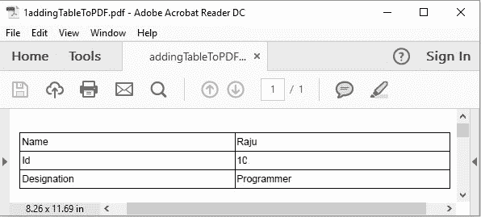

# 使用 Java 在 PDF 中创建表格

> 原文:[https://www . geesforgeks . org/create-a-table-in-a-pdf-using-Java/](https://www.geeksforgeeks.org/create-a-table-in-a-pdf-using-java/)

使用 Java 在 PDF 中创建表格是通过安装文档类来完成的。实例化此类时，将一个 PdfDocument 对象作为参数传递给它的构造函数。然后，要为文档添加一个表，实例化 table 类，并使用 ***add()方法*** 将该对象添加到文档中。

**注意:** [需要外部 jar 文件对 PDF 进行操作。](https://jar-download.com/?search_box=com.itextpdf.layout)

下面是一个示例 pdf 使用 java 在 PDF 中添加一个表格，包括所有步骤:

## Java 语言(一种计算机语言，尤用于创建网站)

```
// Adding table in a pdf using java
import com.itextpdf.kernel.pdf.PdfDocument;
import com.itextpdf.kernel.pdf.PdfWriter;

import com.itextpdf.layout.Document;
import com.itextpdf.layout.element.Cell;
import com.itextpdf.layout.element.Table;

public class AddingTableToPDF {
    public static void main(String args[]) throws Exception
    {
        String file
            = "C:/EXAMPLES/itextExamples/addingTableToPDF.pdf";

        // Step-1 Creating a PdfDocument object
        PdfDocument pdfDoc
            = new PdfDocument(new PdfWriter(file));

        // Step-2 Creating a Document object
        Document doc = new Document(pdfDoc);

        // Step-3 Creating a table
        Table table = new Table(2);

        // Step-4 Adding cells to the table
        table.addCell(new Cell().add("Name"));
        table.addCell(new Cell().add("Raju"));
        table.addCell(new Cell().add("Id"));
        table.addCell(new Cell().add("1001"));
        table.addCell(new Cell().add("Designation"));
        table.addCell(new Cell().add("Programmer"));

        // Step-6 Adding Table to document
        doc.add(table);

        // Step-7 Closing the document
        doc.close();
        System.out.println("Table created successfully..");
    }
}
```

**输出:**

