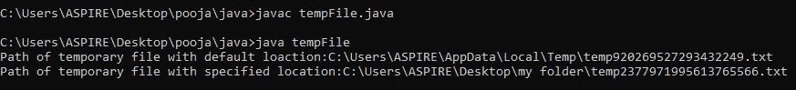
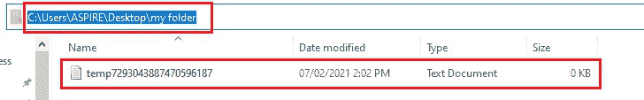
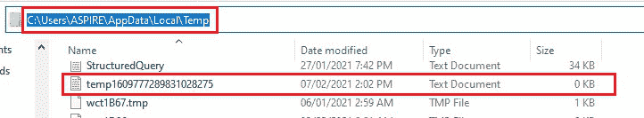

# 用 Java 创建一个临时文件

> 原文:[https://www . geeksforgeeks . org/create-a-临时文件-in-java/](https://www.geeksforgeeks.org/create-a-temporary-file-in-java/)

在 Java 中，我们可以使用名为[*file . createtempfile()*](https://www.geeksforgeeks.org/file-createtempfile-method-in-java-with-examples/)的现有方法创建一个临时文件，该方法在指定的目录中创建新的空文件。 *createTempFile()* 函数在给定的目录中创建一个临时文件(如果没有提到目录，则选择默认目录)，该函数使用作为参数传递的前缀和后缀生成文件名。如果后缀为空，则函数使用”。tmp "作为后缀。然后，该函数返回创建的文件

**场景:**有两种场景可以创建临时文件。

1.  *createTempFile(字首、字尾、目录)*T3]
2.  *createTempFile(字首、字尾、空值)*

**方法—场景 1**

此方法在指定的目录中创建新的空文件，使用给定的前缀和后缀生成其名称。

**语法:**

```java
public static File createTempFile(String prefix,String suffix,File directory)
```

**参数:**取 3 个参数——前缀、后缀、目录。

1.  前缀:前缀字符串用于生成文件名，长度必须至少为三个字符。
2.  后缀:后缀字符串用于生成文件名。可能是。“txt”或“null”。在“空”的情况下。将使用 tmp”。
3.  目录:要在其中创建文件的目录，如果要使用默认的临时文件目录，则为空。

**返回类型:**表示新创建的空文件的抽象路径名

**异常:**

*   如果前缀参数包含少于三个字符。
*   IOException:如果无法创建文件。
*   SecurityException:如果安全管理器存在，并且其 security manager 和 *checkWrite()* 方法不允许创建文件。

**方法—场景 2**

这个方法在默认的临时文件目录中创建新的空文件，使用给定的前缀和后缀来生成它的名称。调用这个方法相当于调用 *createTempFile(前缀，后缀，null)* 。

**语法:**

```java
public static File createTempFile(String prefix,String suffix)
```

**参数:**只需要两个参数——前缀和后缀

1.  前缀:前缀字符串用于生成文件名，长度必须至少为三个字符
2.  后缀:后缀字符串用于生成文件名。可能是。“txt”或“null”。在“空”的情况下。将使用“tmp”

**返回类型:**表示新创建的空文件的抽象路径名

**异常:**

1.  如果前缀参数包含的字符少于三个，则使用 IllegalArgumentExpression:**。**
2.  **IOException:如果无法创建文件。**
3.  **SecurityException:如果安全管理器存在，并且其 security manager 和 *checkWrite()* 方法不允许创建文件。**

****例****

## **Java 语言(一种计算机语言，尤用于创建网站)**

```java
// Java Program to Create a Temporary File in Java

// Importing all input output classes
import java.io.File;
import java.io.IOException;

//  Class
public class GFG {

    // Main driver method
    public static void main(String[] args)
        throws IOException
    {

        // Try block to check for exceptions
        try {

            // Step 1
            // Creating temporary file with default location
            // by creating an object of File type
            File obj1 = File.createTempFile("temp", ".txt");

            // Step 2
            // Obtaining absolute path of the path
            // returned by createTempfile() function
            String path = obj1.getAbsolutePath();

            // Step 3
            // Print and display the default path of
            // temporary file
            System.out.println(
                "Path of temporary file with default loaction:"
                + path);

            // Step 4
            // Creating temporary file with specified
            // location again by creating another object of
            // File type which is custom local directory
            File obj2 = File.createTempFile(
                "temp", ".txt",
                new File(
                    "C:/Users/ASPIRE/Desktop/my folder"));

            // Step 5
            // Obtaining absolute path of the path
            // returned by createTempfile() function
            path = obj2.getAbsolutePath();

            // Step 6
            // Print and display the specified path of
            // temporary file
            System.out.println(
                "Path of temporary file with specified location:"
                + path);
        }

        // Catch block to handle exception if occurs
        catch (IOException e) {

            // Print the line number where exception occur
            // using printStackTrace() method
            e.printStackTrace();
        }
    }
}
```

****输出:****

****

**下面的快照也附加在本地计算机的这些目录中，如下所示:**

**在给定路径创建临时文件的情况**

****

**在默认路径下创建临时文件的情况**

****