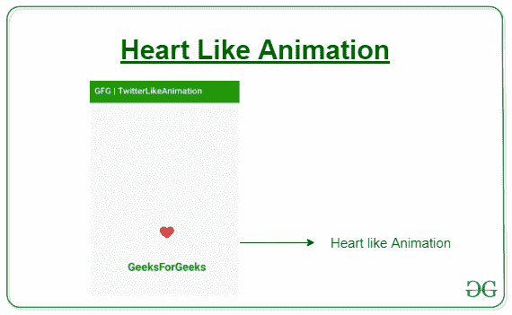

# 在安卓中创建 Instagram/Twitter 心形动画

> 原文:[https://www . geeksforgeeks . org/create-an-insta gram-Twitter-heart-like-animation-in-Android/](https://www.geeksforgeeks.org/create-an-instagram-twitter-heart-like-animation-in-android/)

在这篇文章中，让我们学习如何在 android 中创建 Instagram/Twitter heart Like 动画。推特的 Like 动画相当不错，很有吸引力。假设你想做一个像推特、Instagram 或脸书这样的应用程序，用户可以在那里喜欢文章，你可以使用这个视图。你也可以用 [**狮子座**](https://github.com/plattysoft/Leonids) 来代替这个，但是和**狮子座**相比，这个非常容易使用。这是一个**动画库**，动画有助于获得用户的关注，所以最好学习一下。


### 方法

1.  在 **[build.gradle](https://www.geeksforgeeks.org/android-build-gradle/)** 文件中添加支持库，并在依赖项部分添加依赖项。

    ```java
    implementation 'pub.hanks:smallbang:1.2.2'     
    ```

2.  创建一个新的**安卓资源目录**，右键单击**资源文件夹- >安卓资源目录**，确保选择资源类型为**颜色**。
3.  现在在颜色目录中创建新文件 **text_selector.xml** ，并添加以下代码。该文件用于根据**文本视图**的状态选择**文本颜色**。

    ## text _ selector . XML

    ```java
    <?xml version="1.0" encoding="utf-8"?>
    <selector xmlns:android="http://schemas.android.com/apk/res/android">
        <item android:color="@color/colorPrimary"
              android:state_selected="true"/>
        <item android:color="#D6D6D6"/>
    </selector>
    ```

4.  现在在可绘制目录中创建新文件 **ic_heart.xml** 并添加以下代码，或者您可以从这个 [**链接**](https://www.flaticon.com/) 下载矢量图像并粘贴到可绘制文件夹中。

    ## IC _ heart . XML

    ```java
    <vector android:height="32dp" 
        android:viewportHeight="412.735"
        android:viewportWidth="412.735" 
        android:width="32dp" 
        xmlns:android="http://schemas.android.com/apk/res/android">
        <path android:fillColor="#FF000000" 
         android:pathData="M295.706,35.522C295.706,35.522 295.706,
              35.522 295.706,35.522c-34.43,-0.184 -67.161,14.937 
              -89.339,41.273c-22.039,-26.516 -54.861,-41.68 -89.339,
              -41.273C52.395,35.522 0,87.917 0,152.55C0,263.31 193.306,
              371.456 201.143,375.636c3.162,2.113 7.286,2.113 10.449,
              0c7.837,-4.18 201.143,-110.759 201.143,-223.086C412.735,
              87.917 360.339,35.522 295.706,35.522zM206.367,
              354.738C176.065,336.975 20.898,242.412 20.898,152.55c0,
              -53.091 43.039,-96.131 96.131,-96.131c32.512,-0.427 
              62.938,15.972 80.457,43.363c3.557, 4.905 10.418,5.998
              15.323,2.44c0.937,-0.68 1.761,-1.503 2.44,
              -2.44c29.055,-44.435 88.631,-56.903 133.066,-27.848c27.202,
              17.787 43.575,48.114 43.521,80.615C391.837,243.456 236.669,
              337.497 206.367,354.738z"/>
    </vector>
    ```

5.  现在在可绘制目录中创建新文件 **ic_heart_red.xml** 并添加以下代码，或者您可以从这个 [**链接**](https://www.flaticon.com/) 下载矢量图像并粘贴到可绘制文件夹中。

    ## IC _ heart _ red . XML

    ```java
    <vector xmlns:android="http://schemas.android.com/apk/res/android"
        android:width="391.837dp"
        android:height="391.837dp"
        android:viewportWidth="391.837"
        android:viewportHeight="391.837">
      <path
          android:pathData="M285.257,35.528c58.743,0.286 106.294,
                  47.836 106.58,106.58c0,107.624 -195.918,214.204
                 -195.918,214.204S0,248.165 0,142.108c0,
                 -58.862 47.717,-106.58 106.58,-106.58l0,0c36.032,
                 -0.281 69.718,17.842 89.339,48.065C215.674,53.517 
                  249.273,35.441 285.257,35.528z"
          android:fillColor="#D7443E"/>
    </vector>
    ```

6.  现在在 drawable 中创建新文件 **heart_selector.xml** ，并添加以下代码。该文件用于根据**图像视图**的状态选择**图像**。

    ## heart _ selector . XML

    ```java
    <?xml version="1.0" encoding="utf-8"?>
    <selector xmlns:android="http://schemas.android.com/apk/res/android">
        <item android:drawable="@drawable/ic_heart_red"
              android:state_selected="true"/>
        <item android:drawable="@drawable/ic_heart"/>
    </selector>
    ```

7.  在 **activity_main.xml** 文件中添加以下代码。在这个文件中，我们将一个**图像视图**和一个**文本视图**作为子视图添加到**小视图**布局中。在 imageView 的 src 标签中添加 **heart_selector** ，在 TextView 的 textColor 标签中添加 **text_Selector** 。

    ## activity _ main . XML

    ```java
    <?xml version="1.0" encoding="utf-8"?>
    <LinearLayout
        xmlns:android="http://schemas.android.com/apk/res/android"
        android:layout_width="match_parent"
        android:layout_height="match_parent"
        android:orientation="vertical"
        android:gravity="center">

        <xyz.hanks.library.bang.SmallBangView
            android:layout_margin="20dp"
            android:id="@+id/imageViewAnimation"
            android:layout_width="wrap_content"
            android:layout_height="wrap_content"
            >
            <ImageView
                android:id="@+id/imageView"
                android:layout_width="wrap_content"
                android:layout_height="wrap_content"
                android:layout_gravity="center"
                android:src="@drawable/heart_selector"
               />

        </xyz.hanks.library.bang.SmallBangView>

        <xyz.hanks.library.bang.SmallBangView

            android:id="@+id/textViewAnimation"
            android:layout_width="match_parent"
            android:layout_height="wrap_content">

            <TextView
                android:textColor="@color/text_selector"
                android:textAlignment="center"
                android:layout_width="match_parent"
                android:layout_height="wrap_content"
                android:text="GeeksForGeeks"
                android:textSize="25sp"
                android:textStyle="bold" />
        </xyz.hanks.library.bang.SmallBangView>
    </LinearLayout>
    ```

8.  在**MainActivity.java**文件中添加以下代码。在这个文件中，我们将 **OnClickListner** 添加到 **ImageView** 和 **TextView** 中，只要用户点击视图，就会自动调用它们。如果状态为真，即已经选择了图像视图或文本视图，我们将设置选定为假，否则在视图上调用 LikeAnimation。

    ## MainActivity.java

    ```java
    package org.geeksforgeeks.twitterLikeAnimaton;          

    import android.os.Bundle;
    import android.view.View;
    import androidx.annotation.Nullable;
    import androidx.appcompat.app.AppCompatActivity;
    import xyz.hanks.library.bang.SmallBangView;

    public class MainActivity extends AppCompatActivity {

        SmallBangView imageView,textView;

        @Override
        protected void onCreate(@Nullable Bundle savedInstanceState) {
            super.onCreate(savedInstanceState);
            setContentView(R.layout.activity_main);

            textView = findViewById(R.id.textViewAnimation);
            imageView = findViewById(R.id.imageViewAnimation);

            textView.setOnClickListener(
                     new View.OnClickListener() {
                @Override
                public void onClick(View v) {
                    if (textView.isSelected()) {
                        textView.setSelected(false);
                    } else {
                        // if not selected only 
                        // then show animation.
                        textView.setSelected(true);
                        textView.likeAnimation();
                    }
                }
            });

            imageView.setOnClickListener(
                      new View.OnClickListener() {
                @Override
                public void onClick(View v) {
                    if (imageView.isSelected()) {
                        imageView.setSelected(false);
                    } else {
                        // if not selected only 
                        // then show animation.
                        imageView.setSelected(true);
                        imageView.likeAnimation();
                    }
                }
            });
        }
    }
    ```

    ### 作为模拟器运行

    <video class="wp-video-shortcode" id="video-460673-1" width="320" height="540" preload="metadata" controls=""><source type="video/mp4" src="https://media.geeksforgeeks.org/wp-content/uploads/20200723022557/Record_2020-07-23-02-24-23_69fa71ed7e998de6cab47c8740bea3c11.mp4?_=1">[https://media.geeksforgeeks.org/wp-content/uploads/20200723022557/Record_2020-07-23-02-24-23_69fa71ed7e998de6cab47c8740bea3c11.mp4](https://media.geeksforgeeks.org/wp-content/uploads/20200723022557/Record_2020-07-23-02-24-23_69fa71ed7e998de6cab47c8740bea3c11.mp4)</video>