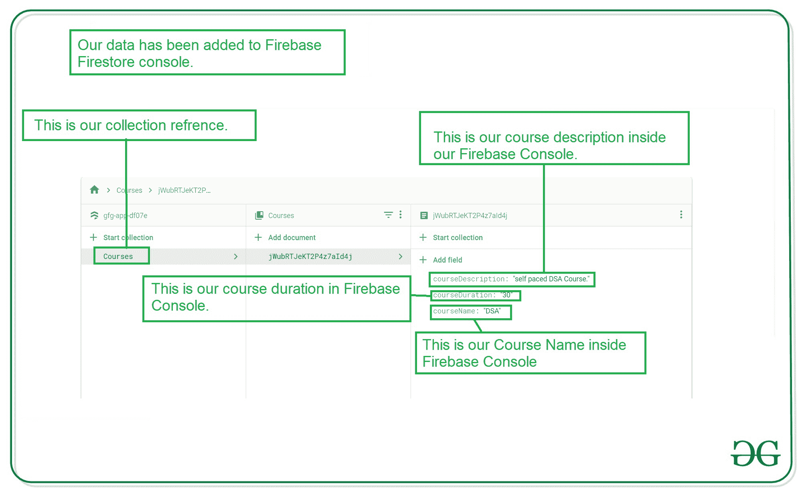

# 如何在安卓中创建数据并添加到 Firebase Firestore？

> 原文:[https://www . geeksforgeeks . org/create-and-add-data-to-firebase-firestore-in-Android/](https://www.geeksforgeeks.org/create-and-add-data-to-firebase-firestore-in-android/)

[Firebase](https://www.geeksforgeeks.org/firebase-introduction/) 是谷歌的一款著名产品，被如此多的开发者用来为他们的网站和应用添加后端功能。Firebase 将使您的工作对于后端数据库和处理数据库变得更加容易。在本文中，我们将看一下 **Firebase Firestore 在安卓**中的实现。这是 **4 篇文章**的系列文章，我们将在安卓中用 **Firebase Firestore** 执行基本的 **CRUD(创建、读取、更新和删除)**操作。我们将在本系列中介绍以下 4 篇文章:

1.  **如何在安卓中创建数据并添加到 Firebase Firestore？**
2.  [如何在安卓系统中**读取【Firebase Firestore 的数据？**](https://www.geeksforgeeks.org/how-to-read-data-from-firebase-firestore-in-android/)
3.  [如何在安卓 Firebase Firestore 中**更新**数据？](https://www.geeksforgeeks.org/how-to-update-data-in-firebase-firestore-in-android/)
4.  [如何在安卓中**删除【Firebase Firestore 的数据？**](https://www.geeksforgeeks.org/how-to-delete-data-from-firebase-firestore-in-android/)

### 什么是 Firebase Firestore？

**Firebase Firestore** 是一个云 NoSQL 数据库，用于在应用程序中**添加、检索和更新**数据。基本上，它是一个数据库，用于存储您的 **Firebase 控制台**中的数据。Firestore 中的数据以文档的形式存储，因此在 Firebase 内部管理这些数据变得很容易。

### 在 Firebase 实时数据库上使用 Firestore 有什么好处？

Firestore 拥有比 Firebase 实时数据库更好的查询。它具有高度的可扩展性，并且数据可以在 Firebase Firestore 中得到适当的管理。在 Firebase Firestore 数据库中访问服务器端的数据变得很容易。与 Firebase 实时数据库相比，Firestore 要简单得多。你可以在 [Firebase 实时数据库和 Firestore 数据库](https://www.geeksforgeeks.org/realtime-database-vs-firestore/)上查看更详细的指南。

### 我们将在本文中构建什么？

在本文中，我们将构建一个简单的安卓应用程序，其中我们将通过一些文本字段从用户那里收集数据，并将这些数据发送到我们的 **Firebase Cloud Firestore** 控制台，这些数据将存储在我们的 Firebase 数据库中。

### **分步实施**

**第一步:创建新项目**

要在安卓工作室创建新项目，请参考[如何在安卓工作室创建/启动新项目](https://www.geeksforgeeks.org/android-how-to-create-start-a-new-project-in-android-studio/)。注意选择 **Java** 作为编程语言。

**第二步:将你的应用连接到 Firebase**

创建新项目后。导航到顶部栏上的工具选项。点击火焰基地。点击 Firebase 后，你可以看到截图中下面提到的右栏。


在那一栏中，导航到火基云火石。点击那个选项，你会看到两个选项:连接应用到 Firebase 和添加云 Firestore 到你的应用。单击立即连接选项，您的应用程序将连接到 Firebase。之后点击第二个选项，现在你的应用程序连接到 Firebase。将您的应用程序连接到 Firebase 后，您将看到下面的屏幕。


之后，验证 Firebase Firestore 数据库的依赖项已经添加到我们的 Gradle 文件中。导航到该文件中的**应用程序>梯度脚本**。检查是否添加了以下依赖项。如果您的 build.gradle 文件中不存在以下依赖项。在依赖项部分添加以下依赖项。

> 实现' com . Google . firebase:firebase-firestore:22 . 0 . 1 '

添加此依赖项后，同步您的项目，现在我们可以创建我们的应用程序了。如果你想了解更多关于连接你的应用到 Firebase。参考这篇文章，详细了解如何将[添加到安卓应用](https://www.geeksforgeeks.org/adding-firebase-to-android-app/)中。

**第 3 步:使用 AndroidManifest.xml 文件**

为了向 Firebase 添加数据，我们应该授予访问互联网的权限。要添加这些权限，请导航至**应用程序>和**。在该文件中添加以下权限。

## 可扩展标记语言

```java
<!--Permissions for internet-->
<uses-permission android:name="android.permission.INTERNET" />
<uses-permission android:name="android.permission.ACCESS_NETWORK_STATE" />
```

**第 4 步:使用 activity_main.xml 文件**

转到 **activity_main.xml** 文件，参考以下代码。下面是 **activity_main.xml** 文件的代码。

## 可扩展标记语言

```java
<?xml version="1.0" encoding="utf-8"?>
<LinearLayout
    xmlns:android="http://schemas.android.com/apk/res/android"
    xmlns:tools="http://schemas.android.com/tools"
    android:layout_width="match_parent"
    android:layout_height="match_parent"
    android:orientation="vertical"
    tools:context=".MainActivity">

    <!--Edittext for getting course Name-->
    <EditText
        android:id="@+id/idEdtCourseName"
        android:layout_width="match_parent"
        android:layout_height="wrap_content"
        android:layout_marginStart="10dp"
        android:layout_marginTop="20dp"
        android:layout_marginEnd="10dp"
        android:hint="Course Name"
        android:importantForAutofill="no"
        android:inputType="text" />

    <!--Edittext for getting course Duration-->
    <EditText
        android:id="@+id/idEdtCourseDuration"
        android:layout_width="match_parent"
        android:layout_height="wrap_content"
        android:layout_marginStart="10dp"
        android:layout_marginTop="20dp"
        android:layout_marginEnd="10dp"
        android:hint="Course Duration in min"
        android:importantForAutofill="no"
        android:inputType="time" />

    <!--Edittext for getting course Description-->
    <EditText
        android:id="@+id/idEdtCourseDescription"
        android:layout_width="match_parent"
        android:layout_height="wrap_content"
        android:layout_marginStart="10dp"
        android:layout_marginTop="20dp"
        android:layout_marginEnd="10dp"
        android:hint="Course Description"
        android:importantForAutofill="no"
        android:inputType="text" />

    <!--Button for adding your course to Firebase-->
    <Button
        android:id="@+id/idBtnSubmitCourse"
        android:layout_width="match_parent"
        android:layout_height="wrap_content"
        android:layout_margin="10dp"
        android:text="Submit Course Details"
        android:textAllCaps="false" />

</LinearLayout>
```

**第五步:创建一个新的 Java 类来存储数据**

为了将数据发送到 Firebase Firestore 数据库，我们必须创建一个对象类，并将整个对象类发送到 Firebase。要创建一个对象类，导航到**应用程序> java >你的应用程序的包名>右键单击它，然后单击新建> Java 类>给你的类命名**。这里我们将其命名为**球场**，并添加以下代码。

## Java 语言(一种计算机语言，尤用于创建网站)

```java
public class Courses {

    // variables for storing our data.
    private String courseName, courseDescription, courseDuration;

    public Courses() {
        // empty constructor
        // required for Firebase.
    }

    // Constructor for all variables.
    public Courses(String courseName, String courseDescription, String courseDuration) {
        this.courseName = courseName;
        this.courseDescription = courseDescription;
        this.courseDuration = courseDuration;
    }

    // getter methods for all variables.
    public String getCourseName() {
        return courseName;
    }

    public void setCourseName(String courseName) {
        this.courseName = courseName;
    }

    public String getCourseDescription() {
        return courseDescription;
    }

    // setter method for all variables.
    public void setCourseDescription(String courseDescription) {
        this.courseDescription = courseDescription;
    }

    public String getCourseDuration() {
        return courseDuration;
    }

    public void setCourseDuration(String courseDuration) {
        this.courseDuration = courseDuration;
    }
}
```

**步骤 6:使用 MainActivity.java 文件**

转到**MainActivity.java**文件，参考以下代码。以下是**MainActivity.java**文件的代码。代码中添加了注释，以更详细地理解代码。

## Java 语言(一种计算机语言，尤用于创建网站)

```java
import android.os.Bundle;
import android.text.TextUtils;
import android.view.View;
import android.widget.Button;
import android.widget.EditText;
import android.widget.Toast;

import androidx.annotation.NonNull;
import androidx.appcompat.app.AppCompatActivity;

import com.google.android.gms.tasks.OnFailureListener;
import com.google.android.gms.tasks.OnSuccessListener;
import com.google.firebase.firestore.CollectionReference;
import com.google.firebase.firestore.DocumentReference;
import com.google.firebase.firestore.FirebaseFirestore;

public class MainActivity extends AppCompatActivity {

    // creating variables for our edit text
    private EditText courseNameEdt, courseDurationEdt, courseDescriptionEdt;

    // creating variable for button
    private Button submitCourseBtn;

    // creating a strings for storing
    // our values from edittext fields.
    private String courseName, courseDuration, courseDescription;

    // creating a variable
    // for firebasefirestore.
    private FirebaseFirestore db;

    @Override
    protected void onCreate(Bundle savedInstanceState) {
        super.onCreate(savedInstanceState);
        setContentView(R.layout.activity_main);

        // getting our instance
        // from Firebase Firestore.
        db = FirebaseFirestore.getInstance();

        // initializing our edittext and buttons
        courseNameEdt = findViewById(R.id.idEdtCourseName);
        courseDescriptionEdt = findViewById(R.id.idEdtCourseDescription);
        courseDurationEdt = findViewById(R.id.idEdtCourseDuration);
        submitCourseBtn = findViewById(R.id.idBtnSubmitCourse);

        // adding on click listener for button
        submitCourseBtn.setOnClickListener(new View.OnClickListener() {
            @Override
            public void onClick(View v) {

                // getting data from edittext fields.
                courseName = courseNameEdt.getText().toString();
                courseDescription = courseDescriptionEdt.getText().toString();
                courseDuration = courseDurationEdt.getText().toString();

                // validating the text fields if empty or not.
                if (TextUtils.isEmpty(courseName)) {
                    courseNameEdt.setError("Please enter Course Name");
                } else if (TextUtils.isEmpty(courseDescription)) {
                    courseDescriptionEdt.setError("Please enter Course Description");
                } else if (TextUtils.isEmpty(courseDuration)) {
                    courseDurationEdt.setError("Please enter Course Duration");
                } else {
                    // calling method to add data to Firebase Firestore.
                    addDataToFirestore(courseName, courseDescription, courseDuration);
                }
            }
        });
    }

    private void addDataToFirestore(String courseName, String courseDescription, String courseDuration) {

        // creating a collection reference
        // for our Firebase Firetore database.
        CollectionReference dbCourses = db.collection("Courses");

        // adding our data to our courses object class.
        Courses courses = new Courses(courseName, courseDescription, courseDuration);

        // below method is use to add data to Firebase Firestore.
        dbCourses.add(courses).addOnSuccessListener(new OnSuccessListener<DocumentReference>() {
            @Override
            public void onSuccess(DocumentReference documentReference) {
                // after the data addition is successful
                // we are displaying a success toast message.
                Toast.makeText(MainActivity.this, "Your Course has been added to Firebase Firestore", Toast.LENGTH_SHORT).show();
            }
        }).addOnFailureListener(new OnFailureListener() {
            @Override
            public void onFailure(@NonNull Exception e) {
                // this method is called when the data addition process is failed.
                // displaying a toast message when data addition is failed.
                Toast.makeText(MainActivity.this, "Fail to add course \n" + e, Toast.LENGTH_SHORT).show();
            }
        });
    }
}
```

添加此代码后，转到此链接打开 [Firebase](https://firebase.google.com/) 。点击此链接后，您将看到下面的页面，在此页面上点击右上角的转到控制台选项。


点击此屏幕后，您将看到下面的屏幕，其中包含您选择项目的所有项目。


在该屏幕中，单击左侧窗口中的 n Firebase Firestore 数据库。


点击创建数据库选项后，您将看到下面的屏幕。


在此屏幕中，我们必须选择“在测试模式下启动”选项。我们使用测试模式，因为我们没有在我们的应用程序中设置身份验证。所以我们在测试模式下选择开始。选择测试模式后，点击下一步选项，您将看到下面的屏幕。


在这个屏幕中，我们只需要点击启用按钮来启用我们的 Firebase Firestore 数据库。完成这个过程后，我们只需要运行我们的应用程序，在我们的应用程序中添加数据，然后点击提交按钮。您将看到在 Firebase 控制台中添加的数据。



下面是应用程序的输出。

### **输出:**

<video class="wp-video-shortcode" id="video-539385-1" width="640" height="360" preload="metadata" controls=""><source type="video/mp4" src="https://media.geeksforgeeks.org/wp-content/uploads/20210103114054/Screenrecorder-2021-01-03-11-39-24-255.mp4?_=1">[https://media.geeksforgeeks.org/wp-content/uploads/20210103114054/Screenrecorder-2021-01-03-11-39-24-255.mp4](https://media.geeksforgeeks.org/wp-content/uploads/20210103114054/Screenrecorder-2021-01-03-11-39-24-255.mp4)</video>