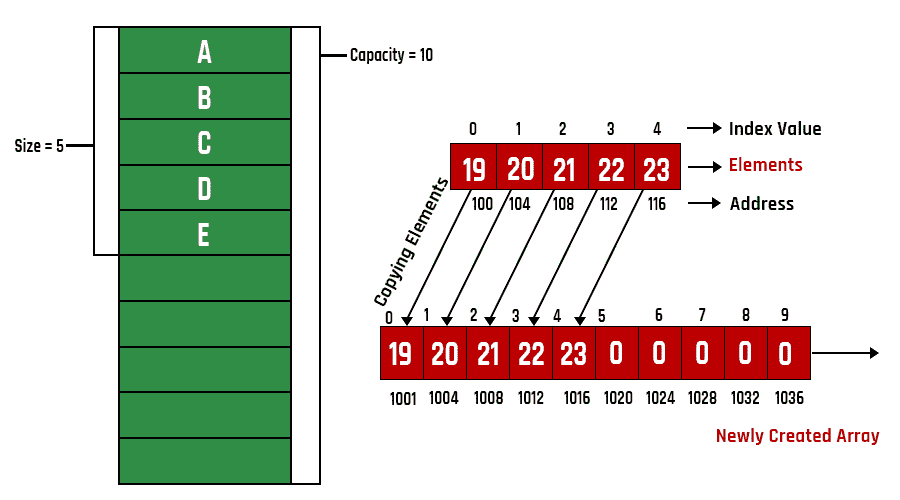

# 在 Java 中创建动态数组

> 原文:[https://www . geesforgeks . org/creating-a-dynamic-array-in-Java/](https://www.geeksforgeeks.org/creating-a-dynamic-array-in-java/)

数组是线性数据结构，这意味着类似类型的元素将以已知的连续方式插入。现在我们知道数组有一个问题，即大小需要在声明时指定，或者在 java 中从用户那里获取，这限制了我们自己。因此，在 java 中出现了动态数组，当数组变满时，可以随着数组大小的增加添加条目。新数组的大小将增加到原始数组的两倍。现在，所有元素都保留在一个新的数组中，该数组具有指定的数组域大小，并且在新形成的数组中，剩余的元素添加在它们之后。这个数组一直在动态增长。



**程序:**

1.  首先，我们用私有访问说明符声明了一个 int 类型的数组。
2.  声明计数变量。
3.  创建一个构造函数，初始化给定长度的数组。
4.  神奇之处在于方法插入。
5.  首先，在我们插入值之前，它会检查数组和 count 变量的长度。如果两者的大小相同，那么就说数组已满。
6.  然后我们创建一个新的数组，它的大小是前一个数组的两倍。
7.  刚刚用前一个数组初始化了新数组，又重新初始化回前一个数组。

**实现:**创建一个声明 int arr 和 int count 的数组类。我们刚刚创建了一个数组，只要数组满了，数组就会被调整大小。

**例**

## Java 语言(一种计算机语言，尤用于创建网站)

```java
// Java Program to Create a Dynamic Array

// Class 1
// Helper class
class Array {

    // Member variables of this class
    // Private access modifier
    private int arr[];
    private int count;

    // Note they can only be called through function

    // Method 1
    // Inside helper class
    // to compute length of an array
    public Array(int length) { arr = new int[length]; }

    // Method 2
    // Inside helper class
    // To print array
    public void printArray()
    {

        // Iterating over array using for loop
        for (int i = 0; i < count; i++) {

            // Print the elements of an array
            System.out.print(arr[i] + " ");
        }
    }

    // Method 3
    // Inside Helper class
    public void insert(int element)
    {

        if (arr.length == count) {

            // Creating a new array double the size
            // of array declared above
            int newArr[] = new int[2 * count];

            // Iterating over new array using for loop
            for (int i = 0; i < count; i++) {
                newArr[i] = arr[i];
            }

            // Assigning new array to original array
            // created above
            arr = newArr;
        }

        arr[count++] = element;
    }
}

// Class 2
// Main class
public class GFG {

    // Main driver method
    public static void main(String[] args)
    {

        // Creating object of Array(user-defined) class
        Array numbers = new Array(3);

        // Adding elements more than size specified above
        // to the array to illustrate dynamic nature
        // using the insert() method

        // Custom input elements
        numbers.insert(10);
        numbers.insert(30);
        numbers.insert(40);
        numbers.insert(50);

        // Calling the printArray() method to print
        // new array been dynamically created
        numbers.printArray();
    }
}
```

**Output**

```java
10 30 40 50 
```