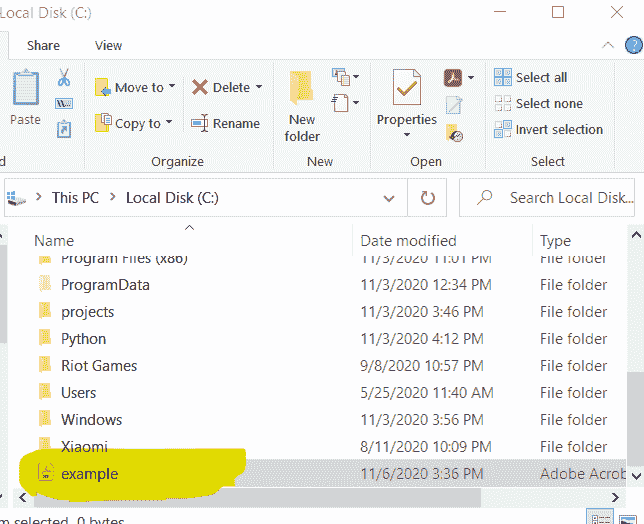
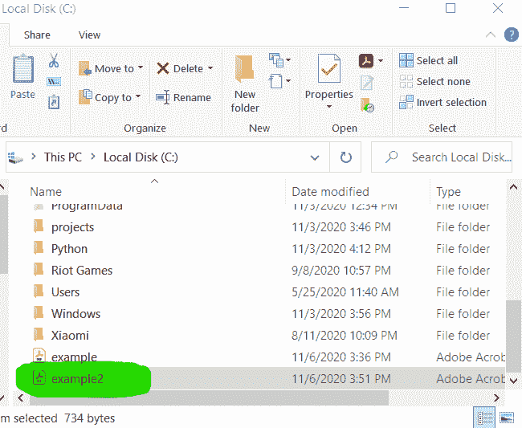
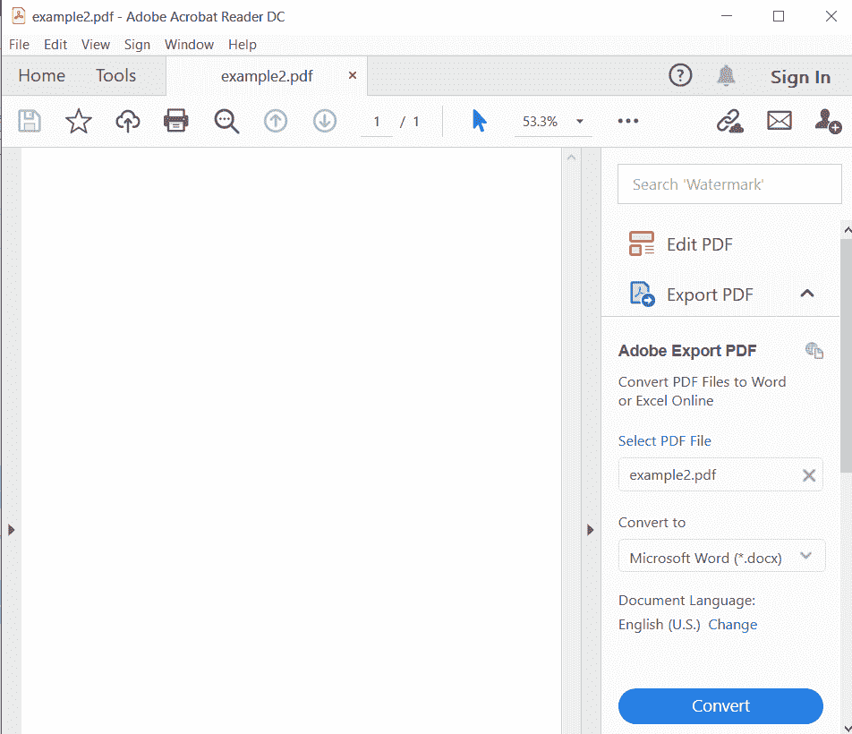

# 使用 Java 创建一个空的 PDF 文档

> 原文:[https://www . geesforgeks . org/creating-an-empty-pdf-document-use-Java/](https://www.geeksforgeeks.org/creating-an-empty-pdf-document-using-java/)

为了使用 Java 创建一个 PDF 文档，我们需要知道编写代码所必需的包/库。因此，为了创建一个 PDF 文档，我们将使用 **iText 7** 库。要知道如何在你的工作区安装这个库，你可以点击[链接](https://kb.itextpdf.com/home/it7kb/installation-guidelines/installing-itext-7-pdfocr-for-java-developers)。

### **创建空 PDF 文档**

要创建一个空的 PDF 文档，我们首先需要实例化 **Document** 类，在这样做的时候，我们必须传递一个 PDF Document 对象作为参数。以下是创建空 PDF 文档时使用的组件。

**1。PdfWritter**

PdfWritter 类属于 com.itextpdf.kernel.pdf 包**。**我们可以说这个类是一个 PDF 的文档编写器。在实例化 PdfWritter 对象的对象时，我们必须传递一个字符串值，它代表文件的路径，我们希望在这里创建 PDF。

**注意:**在传递文件<u>的路径时，</u>确保你的 IDE 有**权限在该目录下写/读文件**，否则会给出 **FileNotFound** 错误。

**语法**

```
String path = "C:/JavaExamples/example.pdf";
PdfWriter writer = new PdfWriter(path);
```

**2 .pdf 文件〔t1〕**

PdfDocument 类属于包**com.itextpdf.kernel.pdf**。此类代表 **PDF 文档**。在实例化这个类时，我们必须传递 **PdfWriter 对象**作为参数。

**语法**

```
//writer is the PdfWriter object
PdfDocument pdf = new PdfDocument(writer);
```

**3。文件**

文档类属于包 **com.itextpdf.layout** 。是 **IText** 的核心类之一。*如果你想从头开始生成一个 PDF，那么你**必须使用**文档类*。在实例化 Document 类时，我们需要传递 **PdfDocument 对象**作为参数。

**创建文档对象的语法:**

```
//pdf is the PdfDocument object
Document doc = new Document(pdf);
```

**4。关闭文件**

使用**文档**类的 **close()** 方法关闭文档，如下所示。

```
// Closing the document 
doc.close();
```

**例 1:**

## Java 语言(一种计算机语言，尤用于创建网站)

```
// let us import all required packages

import com.itextpdf.kernel.pdf.PdfDocument;
import com.itextpdf.kernel.pdf.PdfWriter;
import com.itextpdf.layout.Document;

public class Pdf {

    public static void main(String args[]) throws Exception
    {
        // Creating a PdfWriter to C:/example.pdf
        String path = "C:/example.pdf";
        PdfWriter writer = new PdfWriter(path);

        // Creating a PdfDocument object
        PdfDocument pdf = new PdfDocument(writer);

        // Creating a Document object
        Document document = new Document(pdf);

        // to check if its created or not
        System.out.println("Your PDF has been created");
    }
}
```

**输出**



**注:**

1.  这是一个空文档，您可能会在打开此 PDF 时出现错误，因为这是一个 0 页的 PDF。
2.  如果您没有权限写入/读取该目录中的文件，您可能会遇到**文件未找到错误**，因此您可以**以管理员身份运行您的 IDE**，然后它就会工作。

**例 2:**

现在让我们创建一个空页面的 PDF。

## Java 语言(一种计算机语言，尤用于创建网站)

```
import com.itextpdf.kernel.pdf.PdfDocument;
import com.itextpdf.kernel.pdf.PdfWriter;
import com.itextpdf.layout.Document;

public class Pdf {

    public static void main(String args[]) throws Exception
    {
        // Setting the Path
        String path = "C:/example2.pdf";

        // Creating a PdfWriter object
        PdfWriter writer = new PdfWriter(path);

        // Creating a PdfDocument object
        PdfDocument pdf = new PdfDocument(writer);

        // this line is used to add a
        // new page in the pdf
        pdfDoc.addNewPage();

        // Creating a Document object
        Document document = new Document(pdf);

        // Closing the document object
        document.close();

        System.out.println("Your pdf has been created");
    }
}
```

**输出**



让我们打开那个 PDF。

