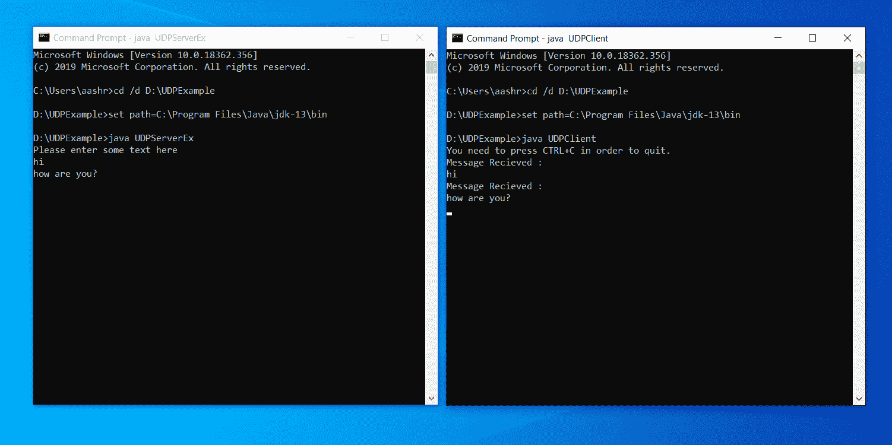

# 使用数据语法包和数据语法套接字类创建服务器-客户端应用程序

> 原文:[https://www . geeksforgeeks . org/creating-an-server-client-application-use-datagrammpacket-and-datagrammsocket-class/](https://www.geeksforgeeks.org/creating-an-server-client-application-using-the-datagrampacket-and-datagramsocket-classes/)

要创建一个使用 UDP 在客户机和服务器之间建立连接的应用程序，我们需要执行以下步骤:

*   创建服务器程序
*   创建客户端程序
*   执行客户端和服务器程序

让我们执行以下小节中的步骤:

**<u>创建服务器程序</u>**

让我们创建一个名为 UDPServerEx 的服务器类，它从用户那里获取消息并将消息(数据报)发送给客户端。清单 1 显示了 UDPServerEx.java 文件的代码:

**文件名:UDPServerEx.java**

## Java 语言(一种计算机语言，尤用于创建网站)

```
// A server that sends messages to the client

import java.net.*;

class UDPServerEx {

    public static DatagramSocket mySocket;
    public static byte myBuffer[] = new byte[2000];

    public static void serverMethod() throws Exception
    {
        int position = 0;
        while (true) {
            int charData = System.in.read();
            switch (charData) {
            case -1:
                System.out.println(
                    "The execution of "
                    + "the server has been terminated");
                return;
            case '\r':
                break;
            case '\n':
                mySocket.send(
                    new DatagramPacket(
                        myBuffer,
                        position,
                        InetAddress.getLocalHost(),
                        777));
                position = 0;
                break;
            default:
                myBuffer[position++]
                    = (byte)charData;
            }
        }
    }
    public static void main(String args[]) throws Exception
    {
        System.out.println("Please enter some text here");
        mySocket = new DatagramSocket(888);
        serverMethod();
    }
}
```

**编译 UDPServerEx.java 文件:**

```
D:\UDPExample>javac UDPServerEx.java
```

***注意:路径可能因保存文件的位置而异。**T3】*

**<u>创建客户端程序</u>**

让我们创建一个名为 UDPClient 的客户端类，它接受从服务器发送的消息，UDPServerEx 类。然后，客户端在命令提示符下显示收到的消息。清单 2 显示了 UDPClient.java 文件的代码:

**文件名:UDPClient.java**

## Java 语言(一种计算机语言，尤用于创建网站)

```
// UDPClient that receives and
// displays messages sent from the server

import java.net.*;
class UDPClient {

    public static DatagramSocket mySocket;
    public static byte myBuffer[] = new byte[2000];

    public static void clientMethod() throws Exception
    {
        while (true) {
            DatagramPacket dataPacket
                = new DatagramPacket(myBuffer,
                                     myBuffer.length);
            mySocket.receive(dataPacket);
            System.out.println("Message Received :");
            System.out.println(
                new String(
                    dataPacket.getData(),
                    0,
                    dataPacket.getLength()));
        }
    }
    public static void main(String args[]) throws Exception
    {
        System.out.println(
            "You need to press CTRL+C"
            + " in order to quit.");
        mySocket = new DatagramSocket(777);
        clientMethod();
    }
}
```

**使用以下命令编译 UDPClient.java 文件:**

```
D:\UDPExample>javac UDPClient.java
```

**<u>输出</u>**

**注意:**要执行 UDPServerEx 和 UDPClient 类，请在两个单独的命令提示符窗口中运行 UDPServerEx.java 和 UDPClient.java。请记住，UDPServerEx 类在 UDPClient 类之前执行。图 1 显示了 UDP 服务器 java 和 UDPClient.java 文件的输出:

[](https://media.geeksforgeeks.org/wp-content/uploads/20190922165217/blog-1.11.png)

显示 UDPServerEx 和 UDPClient 类的输出