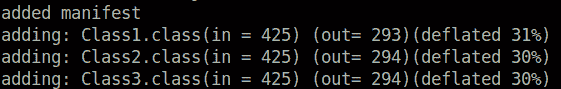
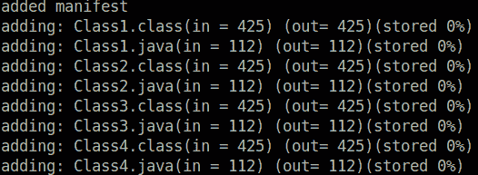

# 在 Linux 终端中创建并执行. jar 文件

> 原文:[https://www . geesforgeks . org/creating-and-executing-a-jar-file-in-Linux-terminal/](https://www.geeksforgeeks.org/creating-and-executing-a-jar-file-in-linux-terminal/)

JAR——Java 档案。它就像一个 zip 文件，但是对于 java 类来说。它结合了所有的。Java 中的类文件合并成一个。jar 文件。它用于在一次操作中下载 HTTP 上的所有 java 类。这些可以使用“jar”命令行界面工具来创建。它还有一个可选的 META-INF，可以包含像–

*   **MANIFEST。MF–**清单文件用于定义扩展名和包相关数据。
*   **INDEX。列表–**它包含应用程序或扩展中定义的包的位置信息。
*   **x . SF–**这是签名文件，其中‘x’是基本文件名。
*   **x . DSA–**该文件存储对应签名文件的数字签名。
*   **服务/–**该目录存储所有服务提供商配置文件。

最常见和最常用的文件是 MANIFEST。中频

### 要求

必须安装 Java (JDK + JRE)。使用命令检查–

```
Java --version
```

```
jar --version
```

### **创建 Jar 文件**

让我们考虑 4 个类文件——类 1、类 2、类 3、类 4

## Java 语言(一种计算机语言，尤用于创建网站)

```
class Class2 {
    public static void cls2Method(){
        System.out.println(" Hello from Class2 ");
    }
}

class Class3 {
    public static void cls3Method(){
        System.out.println(" Hello from Class3 ");
    }
}

 class Class4 {
    public static void cls4Method(){
        System.out.println(" Hello from Class4 ");
    }
}

public class Class1 {
    public static void main(String[] args){
        System.out.println(" Hello from Class1 ");

        Class2.cls2Method();
        Class3.cls3Method();
        Class4.cls4Method();

    }
}
```

**输出**

```
Hello from Class1 
Hello from Class2 
Hello from Class3 
Hello from Class4 
```

让我们将它们移动到一个名为“allClasses.jar”的 jar 文件中。

**运行命令:**

> jar–创建–文件 all classes . jar class 1 . class 2 . class 3 . class

要获得清晰的输出，请使用–verbose

> jar–创建–详细–文件 all classes . jar class 1 . class 2 . class 3 . class

**输出:**



这将在文件夹中创建一个 **allClasses.jar** 文件。让我们彻底理解上面的命令。

1.  **–创建:**这是一个创建 jar 文件的选项。我们可以执行更多的操作，如提取、更新等。
2.  **–verbose:**它给出了一个清晰明了的输出，显示了幕后发生的事情。
3.  **–文件文件名:**文件名是 jar 文件的名称。扩展名(。jar)是可选的。
4.  最后，我们指定要放入 jar 文件的整个文件列表。

该命令的简写为–

```
jar -cvf allClasses.jar *
```

**注意:** *代表当前文件夹中的所有文件。小心使用*。

**要更新，**

```
jar -uf allClasses.jar Class4.class
```

-u 代表–更新。

这将使用新的 Class4.class 更新所有 class . jar 文件

从详细的输出中，很明显压缩正在发生，要绕过压缩或在没有压缩的情况下归档文件，请使用选项**–不压缩**。

> jar–创建–详细–无压缩–文件 all classes . jar class 1 . class 2 . class 3 . class

或者

```
jar -cvf0 allClasses.jar *
```

**输出:**



### 执行 Jar 文件

jar 文件的执行相当简单。只需使用命令

```
java -jar allClasses.jar
```

如果这给出了一个错误–**没有主清单属性，在 allClasses.jar** 中

打开**。/META-INF/MANIFEST。MF** 文件并在其中添加一行。

> 主类:类名

在我们的例子中，类名将是“类 1”，因为它是我们的主类。

现在，文件将如下所示

```
Manifest-Version: 1.0
Created-By: Ubuntu
Main-Class: Class1
```

再次运行命令

```
java -jar allClasses.jar
```

**输出:**

```
Hello from Class1 
Hello from Class2 
Hello from Class3 
Hello from Class4 
```

**注意:**不要在 MANIFEST 中的行与行之间留下任何空格。否则它会显示**意外错误**。

如果仍然出现错误并且无法找到错误，请使用以下解决方法–

```
java -cp allClasses.jar Class1
```

其中 Class1 是主类的名称。

**注:**

要提取，请使用命令–

```
jar --extract --file allClasses.jar
```

**或**

```
jar -xf allClasses.jar
```