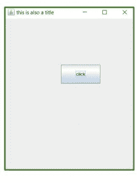
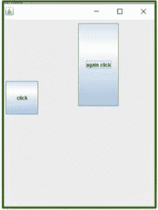
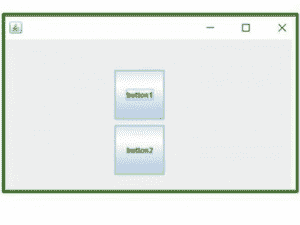

# 在 Java 中使用摆动创建帧

> 原文:[https://www . geesforgeks . org/creating-frames-use-swings-Java/](https://www.geeksforgeeks.org/creating-frames-using-swings-java/)

Swing 是 **JFC (Java 基础类)**的一部分。用 Java 构建图形用户界面需要使用 Swings。Swing Framework 包含大量组件，这些组件允许高级定制并提供丰富的功能，用于创建基于窗口的应用程序。

Java swing 组件是轻量级的，独立于平台，提供强大的组件，如表格、滚动面板、按钮、列表、颜色选择器等。在本文中，我们将看到如何在 Java 中使用 Swings 制作框架。创建框架的方法:

**方法:**

1.  通过创建框架类的对象(关联)
2.  通过扩展框架类(继承)
3.  使用“在主框架内摆动”创建框架()

**方式 1:** 通过创建 Frame 类的对象(关联)

在本文中，我们将看到如何通过实例化 JFrame 类来创建 JFrame 窗口。

**示例:**

## Java 语言(一种计算机语言，尤用于创建网站)

```java
// Java program to create frames
// using association

import javax.swing.*;
public class test1
{
    JFrame frame;

    test1()
    {
        // creating instance of JFrame with name "first way"
        frame=new JFrame("first way");

        // creates instance of JButton
        JButton button = new JButton("let's see");

        button.setBounds(200, 150, 90, 50);

        // setting close operation
        frame.setDefaultCloseOperation(JFrame.EXIT_ON_CLOSE);

        // adds button in JFrame
        frame.add(button);

        // sets 500 width and 600 height
        frame.setSize(500, 600);

        // uses no layout managers
        frame.setLayout(null);

        // makes the frame visible
        frame.setVisible(true);
    }

    public static void main(String[] args)
    {
        new test1();
    }
}
```

**方式二:通过扩展 Frame 类(继承)**

在本例中，我们将继承 JFrame 类来创建 JFrame 窗口，因此不需要显式创建 JFrame 类的实例。

**示例:**

## Java 语言(一种计算机语言，尤用于创建网站)

```java
// Java program to create a
// frame using inheritance().

import javax.swing.*;

// inheriting JFrame
public class test2 extends JFrame
{
    JFrame frame;
    test2()
    {
        setTitle("this is also a title");

        // create button
        JButton button = new JButton("click");

        button.setBounds(165, 135, 115, 55);

        // adding button on frame
        add(button);

        // setting close operation
        setDefaultCloseOperation(JFrame.EXIT_ON_CLOSE);

        setSize(400, 500);
        setLayout(null);
        setVisible(true);
    }

    public static void main(String[] args)
    {
        new test2();
    }
}
```

**输出:**



> **注意:**你将无法在在线编译器上运行这段代码，所以我添加了一个图像来显示输出。

**方式 3:** 使用主框架内侧摆动创建框架()

**例 1:**

## Java 语言(一种计算机语言，尤用于创建网站)

```java
// Java program to create a frame
// using Swings in main().

import javax.swing.*;
public class Swing_example
{
    public static void main(String[] args)
    {
        // creates instance of JFrame
        JFrame frame1 = new JFrame();

        // creates instance of JButton
        JButton button1 = new JButton("click");
        JButton button2 = new JButton("again click");

        // x axis, y axis, width, height
        button1.setBounds(160, 150 ,80, 80);
        button2.setBounds(190, 190, 100, 200);

        // adds button1 in Frame1
        frame1.add(button1);

        // adds button2 in Frame1
        frame1.add(button2);

        // 400 width and 500 height of frame1
        frame1.setSize(400, 500) ;

        // uses no layout managers
        frame1.setLayout(null);

        // makes the frame visible
        frame1.setVisible(true);
    }
}
```

**输出:**



> **注意:**你无法在在线编译器上运行这段代码，所以我添加了一个图片来展示输出。

**例 2:**

## Java 语言(一种计算机语言，尤用于创建网站)

```java
// Java program to create a frame
// using Swings in main().

import javax.swing.*;
public class Swing_example_2
{
    public static void main(String[] args)
    {
        // creates instance of JFrame
        JFrame frame1 = new JFrame();

        // creates instance of JButton
        JButton button1 = new JButton("button1");

        // "button2" appears on the button
        JButton button2 = new JButton("button2");

        // x axis, y axis, width, height
        button1.setBounds(180, 50, 80, 80);
        button2.setBounds(180, 140, 80, 80);

        //adds button1 in Frame1
        frame1.add(button1);

        //adds button2 in Frame1
        frame1.add(button2);

        //400 width and 500 height of frame1
        frame1.setSize(500, 300) ;

        //uses no layout managers
        frame1.setLayout(null);

        //makes the frame visible
        frame1.setVisible(true);
    }
}
```

**输出:**



> **注意:**你无法在在线编译器上运行这段代码，所以我添加了一个图片来展示输出。

本文由 **Shitij Chawla** 供稿。如果你喜欢 GeeksforGeeks 并想投稿，你也可以使用[write.geeksforgeeks.org](https://write.geeksforgeeks.org)写一篇文章或者把你的文章邮寄到 review-team@geeksforgeeks.org。看到你的文章出现在极客博客主页上，帮助其他极客。如果你发现任何不正确的地方，或者你想分享更多关于上面讨论的话题的信息，请写评论。