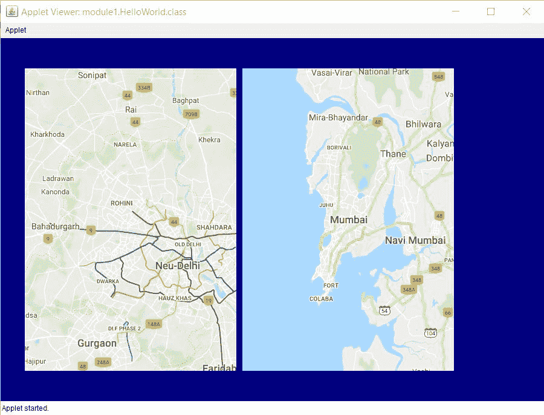

# 用 Java 创建交互式地图和地理可视化

> 原文:[https://www . geesforgeks . org/creating-interactive-map-and-geo-visualization-in-Java/](https://www.geeksforgeeks.org/creating-interactive-maps-and-geo-visualizations-in-java/)

**展开**是一个在[处理](https://www.geeksforgeeks.org/introduction-to-processing-java/)和 [Java](https://www.geeksforgeeks.org/java-tutorials/) 中创建交互式地图和地理可视化的库。在本文中，我们将讨论展开的特性，以及如何在 Java 和 Processing 中使用它来创建交互式地图。

使用展开的主要目的是在 java 和处理中不仅创建静态地图，而且创建交互式地图。从[官网](http://unfoldingmaps.org/)下载展开模板就可以轻松安装在 eclipse 上。由于展开提供的特性，它被广泛使用，例如:

1.  **交互事件:**在展开中，我们可以轻松创建交互地图。像缩放和平移这样的基本交互都包含在这个库中。除此之外，更高级的功能，如概览、细节或多点触摸手势也可以轻松添加到地图中。
2.  **数据可视化:**这个库非常健壮，它甚至允许用户创建地理定位标记来在地图上显示数据。这种视觉风格可以自由调整。该库还支持用户加载和显示用户定义的形状，如点、线或多边形。
3.  **风格化地图:**这个库是一个基于标题的地图库。该库允许地图标题具有各种地理特征和样式。它还配有地图提供商，如*开放街道地图*或*tile mil*。
4.  **Clean &扩展代码:**这个库允许初学者轻松创建简单的地图。高级用户也可以绘制他们的原型或者创建他们自己复杂的可视化。

**方法:**
在这个实现中，让我们考虑绘制两个地图，一个是*德里*另一个是*孟买*使用这个库。创建的地图是交互式的，因为我们可以放大和缩小。我们需要用这个地方的纬度和经度来建立我们的地图。程序中的绘制功能反复运行，在画布上反复绘制地图。

下面是上述方法的实现:

```java
// Java implementation of using
// unfolding maps

// Importing the libraries in eclipse
import processing.core.PApplet;
import de.fhpotsdam.unfolding.UnfoldingMap;
import de.fhpotsdam.unfolding.geo.Location;
import de.fhpotsdam.unfolding
    .providers.AbstractMapProvider;
import de.fhpotsdam.unfolding
    .providers.Google;
import de.fhpotsdam.unfolding
    .providers.MBTilesMapProvider;
import de.fhpotsdam.unfolding
    .utils.MapUtils;

// Class to make the map
public class MakeYourMap extends PApplet {

    // To keep eclipse from reporting
    // a warning
    private static final long
        serialVersionUID
        = 1L;

    // Initializing the height and
    // width of the map
    private static int mapWidth = 350;
    private static int mapHeight = 500;

    // This map is used to display Mumbai
    UnfoldingMap map1;

    // This map is used to display Delhi
    UnfoldingMap map2;

    // Function which implements the unfolds
    // library
    public void setup()
    {
        // Set the Applet window to be
        // 900x600 width and height.
        // The OPENGL argument indicates
        // to use the Processing
        // library's 2D drawing
        size(900, 600, P2D);

        // This sets the background colour
        // for the Applet. Here, colour
        // blue is choosen
        this.background(0, 0, 128);

        // Select a map provider.
        // Here we are using google provider
        AbstractMapProvider provider
            = new Google.GoogleTerrainProvider();

        // Set a zoom level to focus on
        // our specified location
        int zoomLevel = 10;

        // Creating the first map
        map1 = new UnfoldingMap(
            this, 40, 50, mapWidth,
            mapHeight, provider);

        // This line zooms in and centers
        // the map at 28.7041 (latitude)
        // and  77.1025° (longitude) for Mumbai.
        map1.zoomAndPanTo(
            zoomLevel,
            new Location(28.7041f, 77.1025f));

        // This line makes the map interactive
        // as we can zoom in and out. And, here
        // we have zoomed our focus to the
        // Mumbai location by setting the
        // zoom level to 10.
        MapUtils
            .createDefaultEventDispatcher(
                this, map1);

        // Creating the same map for
        // Delhi
        AbstractMapProvider provider2
            = new Google.GoogleMapProvider();

        map2 = new UnfoldingMap(
            this, 40 + mapWidth + 10, 50,
            mapWidth, mapHeight, provider2);

        // 19.0760 (latitude) and
        // 72.8777 (longitude) are for Delhi
        map2.zoomAndPanTo(
            zoomLevel,
            new Location(19.0760f, 72.8777f));

        // This line makes the map interactive
        MapUtils
            .createDefaultEventDispatcher(
                this, map2);
    }

    // Function to draw the applet window
    public void draw()
    {
        // The draw method is implemented
        // repeatedly by drawing our maps
        // again and again on the canvas
        map1.draw();
        map2.draw();
    }
}
```

**输出:**运行上述代码，得到如下输出:
[](https://media.geeksforgeeks.org/wp-content/uploads/20200512062925/up5.jpg)