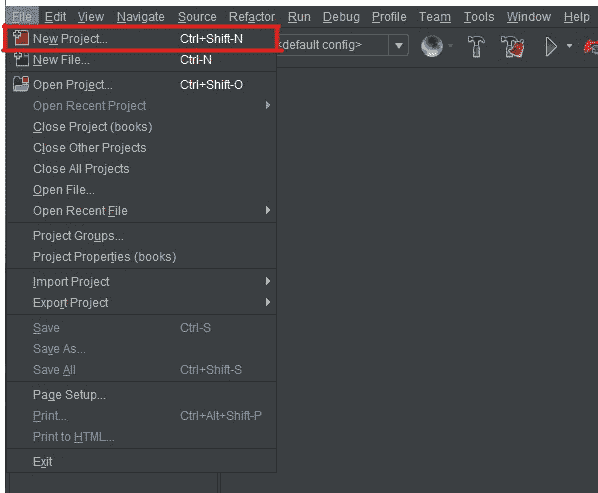
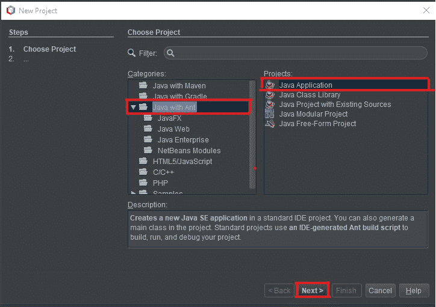
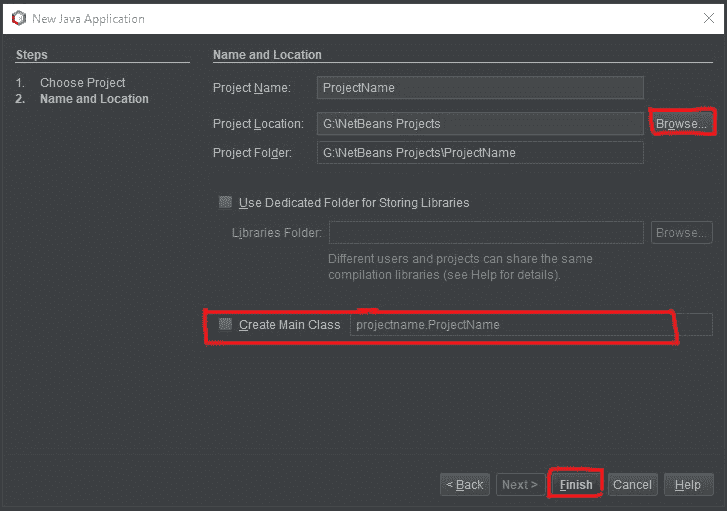
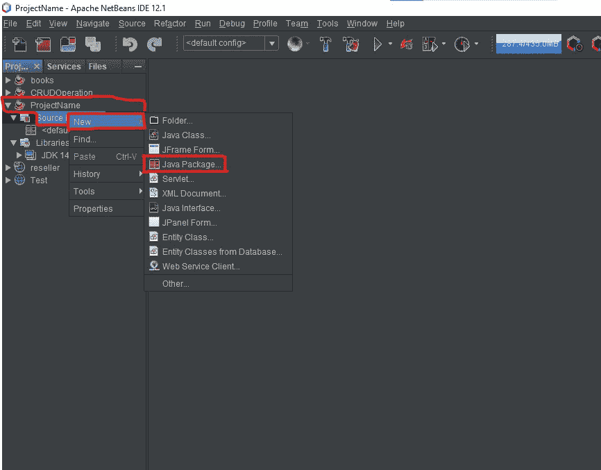
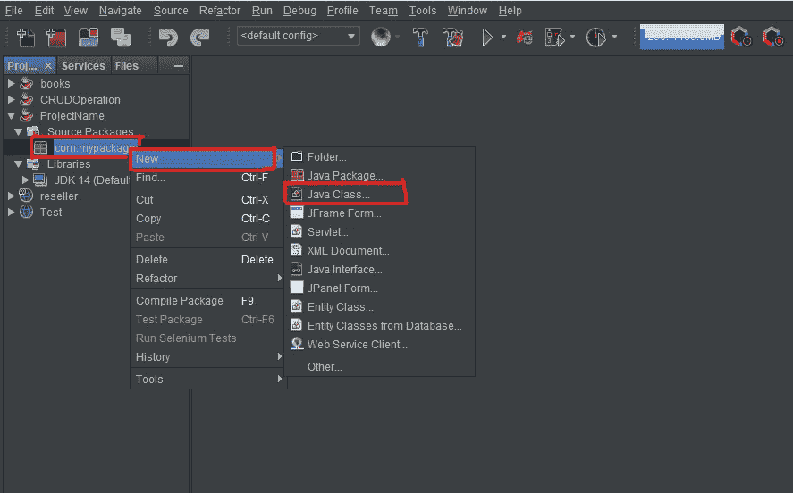
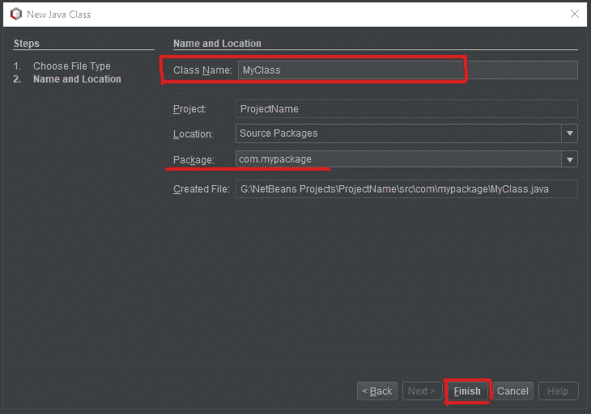
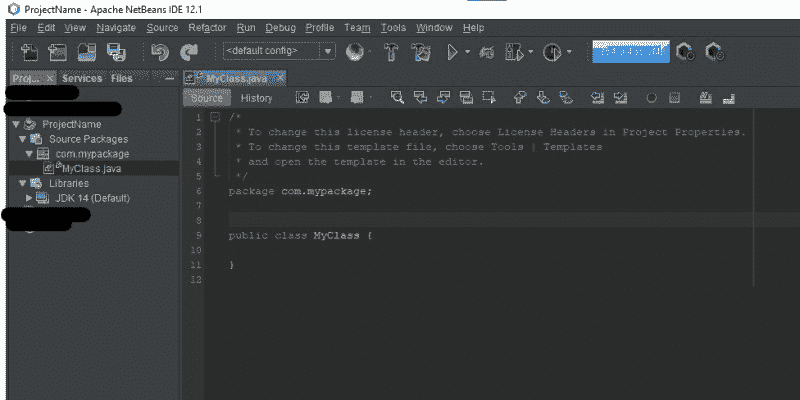

# 在 Apache NetBeans 中创建不带 Maven 的 Java 项目(11 及更高版本)

> 原文:[https://www . geesforgeks . org/creating-Java-project-不带-maven-in-apache-netbeans-11 及更高版本/](https://www.geeksforgeeks.org/creating-java-project-without-maven-in-apache-netbeans-11-and-higher/)

在本文中，您将找到在 Apache NetBeans (v 11 及更高版本)中创建一个没有 Maven 的简单 Java 项目的步骤。自从 maven 推出以来，Java Project 的创建直接转移到了“Java with Ant”下，因此，将自己升级到新的 Apache NetBeans 的极客们面临的问题是找到创建简单 Java Project 的选项，即不使用 maven。

> 描述是这样的:-在**的 **Java 应用程序**中，你是
> 在一个标准的 IDE 项目中创建新的 Java SE 应用程序。您也可以在项目中生成一个主类。标准项目使用 IDE 生成的 Ant 构建脚本来构建、运行和调试您的项目。**

按照下面提供的步骤来实现相同的效果:

**步骤 1:** 创建您的简单 Java 项目
**步骤 1.1**–右键单击导航栏中的**文件**选项。
**步骤 1.2**–点击**新建项目**。(同样的快捷键是–**Ctrl+Shift+N**)
**Step 1.3**–在**类别**下选择**带 Ant 的 Java。**
**步骤 1.4**–在**项目**下选择 **Java 应用。**
**步骤 1.5**–点击**下一步。**
**第 1.6 步**–提供“com.packagename”等包名(这是写包名的标准)。
**步骤 1.7**–仅当您希望项目中包含 main()函数的默认类时，才选中**创建主类**的复选框。
**第 1.8 步**–**完成。**

 

单击“完成”后，将创建您的项目。

**步骤 2:在项目内部创建一个 java 包。**

在 IDE 提供的默认包中创建类并不是一个好的做法。因此，一般建议创建自己的包。

一个包通常有一个像“com.mypackage”这样的名字，这是因为在实践中，包的名字是作为公司域名的反向保留的。例如:-如果一家公司有一个“historyclass.com”的域名，那么包名将像“com.historyclass”一样，并遵循诸如世界历史、印度历史等子主题。

**步骤 2.1**–展开您创建的项目，然后左键单击**源包。**
**第 2.2 步**–点击**新建。**
**步骤 2.3**–选择 **Java 包。**
**步骤 2.4**–提供包的名称，如“com.packagename”。
**第 2.5 步**–点击**完成。**

 

该包将在源包下创建。

**步骤 3:在任何包中创建一个 Java 类。**

**步骤 3.1**–左键单击要在其中创建 java 类的包。
**第 3.2 步**–点击**新增**。
**步骤 3.3**–选择的 **Java 类**。
**步骤 3.4**–提供类的名称，如“MyClass”。
**第 3.5 步**–点击**完成**。

到目前为止，我们已经成功创建了 **Java 项目、Java 包**和 **Java 类。**