# 用 Tomcat 服务器在 Eclipse IDE 中创建 JSP

> 原文:[https://www . geesforgeks . org/creating-JSP-in-eclipse-ide-with-Tomcat-server/](https://www.geeksforgeeks.org/creating-jsp-in-eclipse-ide-with-tomcat-server/)

**Eclipse IDE** 是一个开源的集成开发环境，很受 Java 应用程序开发(Java SE 和 Java EE)和 Android 应用程序的欢迎。它还通过可扩展插件支持 C/C++、PHP、Python、Perl 和其他网络项目开发。

[JSP](https://www.geeksforgeeks.org/introduction-to-jsp/) 代表 java 服务器页面。它是一种服务器端技术，用于创建 web 应用程序和创建动态 web 内容。在这种情况下，JSP 标签用于将 JAVA 代码插入到 HTML 页面中。它是 servlet 技术的高级版本。它是一种基于网络的技术，帮助我们创建动态的和平台无关的网页。在处理客户端的请求之前，JSP 首先被 JSP 容器转换成 servlet。

**Tomcat Server** 是最好的 web 服务器之一，也是 Apache 软件基金会(ASF)开发的开源 Java Servlet 容器，很多开发人员在进行项目工作时都会用到它。它升华到如此大的程度仅仅是因为它的经典性和速度，并且实现了主要包括 servlets、JSP 和表达式语言的 J2EE 规范。有了这些重要功能，Tomcat 服务器仍然是市场上最好的网络服务器之一。

**方法:**

它主要包括三个步骤，还包括子步骤。为了在 Eclipse IDE 中用 Tomcat 服务器创建 JSP，这些都在下面依次描述，如下所示:

1.  制作动态网页项目
2.  制作一个 JSP
3.  开始 tomcat 服务器并部署项目

**第一步:制作动态网页项目**

**1.1** 在此步骤中，要制作动态网页项目，请点击文件菜单- >新建- >动态网页项目。

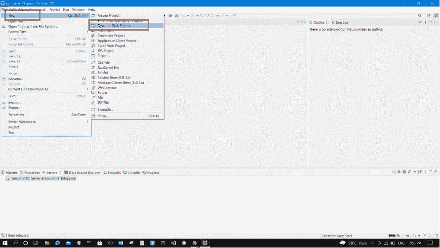

**1.2** 点击动态网页项目后，写出你的**项目名称**如 HelloWorld。然后点击**下一步**。

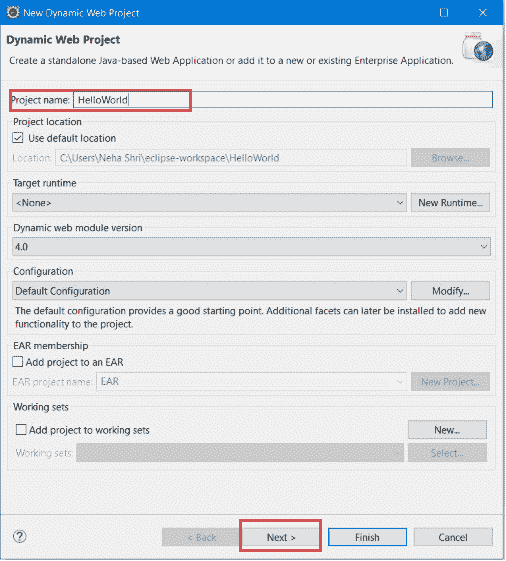

**1.3** 再次点击**下一步- >完成**，如下图所示。

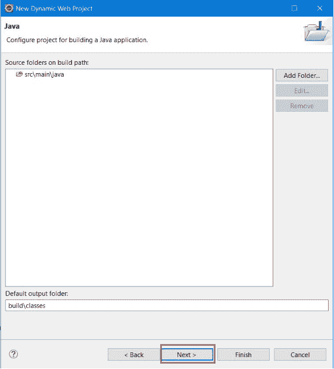 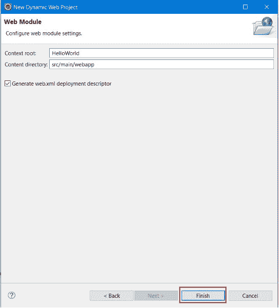

**1.4** 现在您可以在**项目浏览器工作区**中看到您的项目。

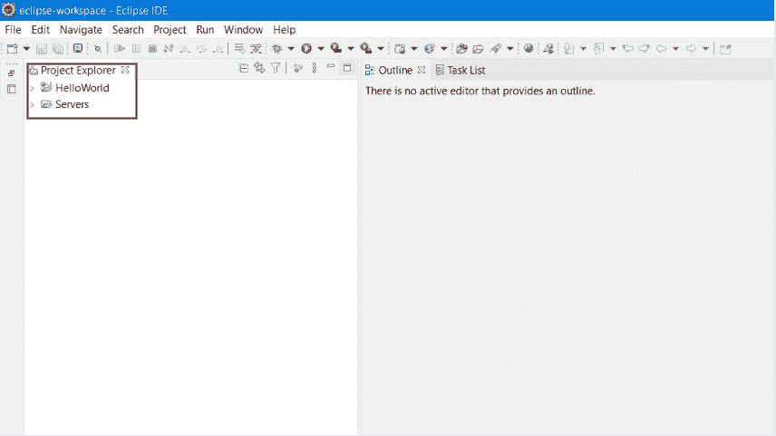

**第二步:制作一个 Java Servlet 页面**

**2.1:** 制作 JSP 文件，点击“ **>”(箭头)**。

**2.2:** 现在，右键点击 **src - > New - > JSP 文件**

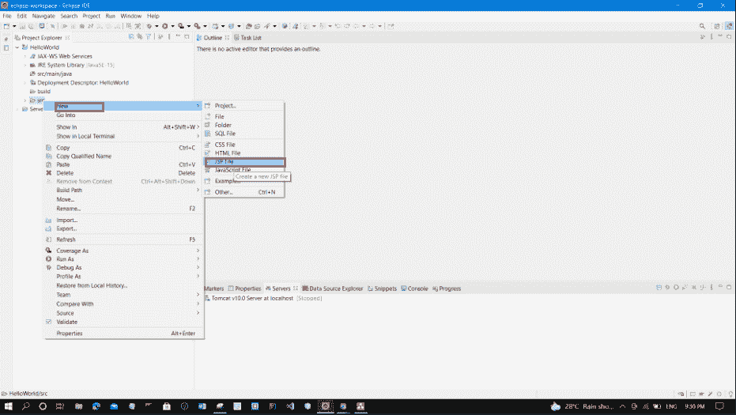

**2.3:** 现在，写**文件名，**如索引。然后点击**下一步**。

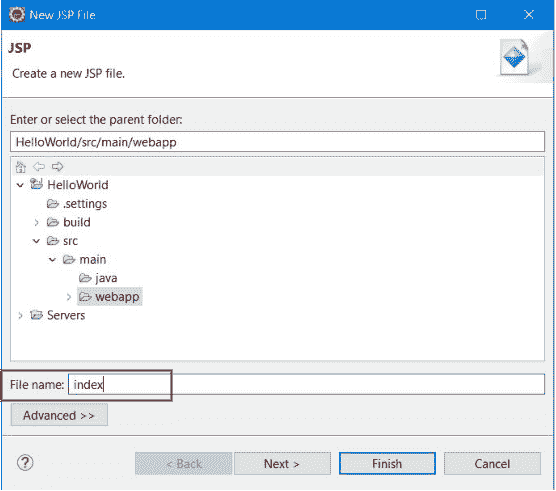

**2.4:** 然后，点击**完成**按钮。

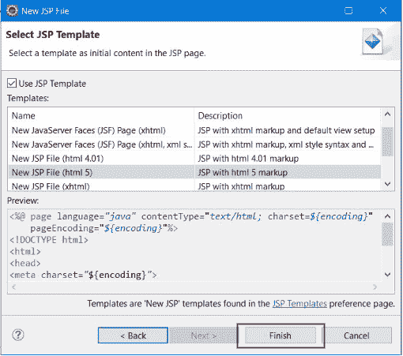

**2.5:** 现在，创建 JSP 文件。现在我们可以在这里写代码了。

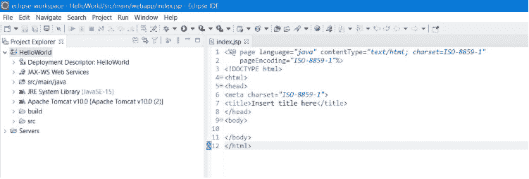

**第三步:开始 tomcat 服务器，部署项目**

**3.1:** 要开始服务器并部署项目，**右键单击项目- >运行方式- >在服务器上运行**。

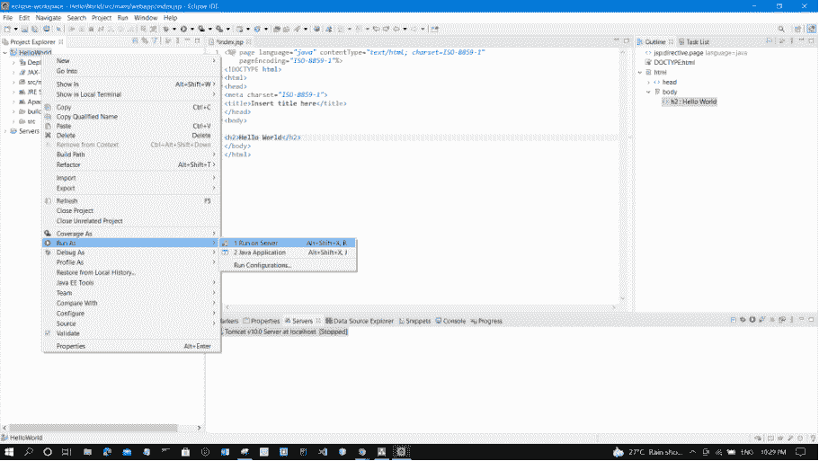

**3.2:** 选择**雄猫服务器**。然后点击**下一步**。

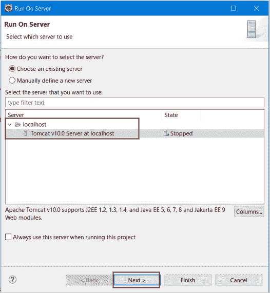

**3.3:** 点击**全部添加- >完成**。

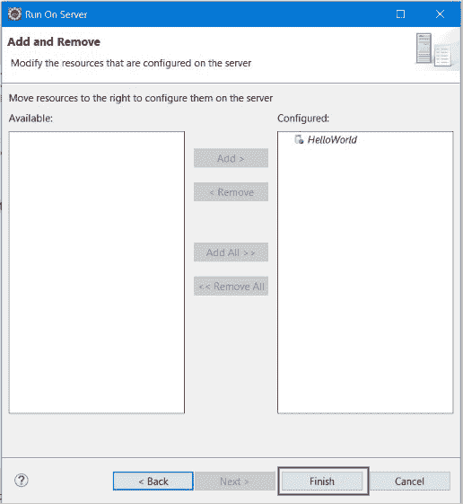

**3.4:** 现在，可以看到 Java Server Pages (JSP)运行成功，如下图所示。因此，我们能够实现在 Eclipse IDE 中用 Tomcat 服务器创建 JSP 的目标。

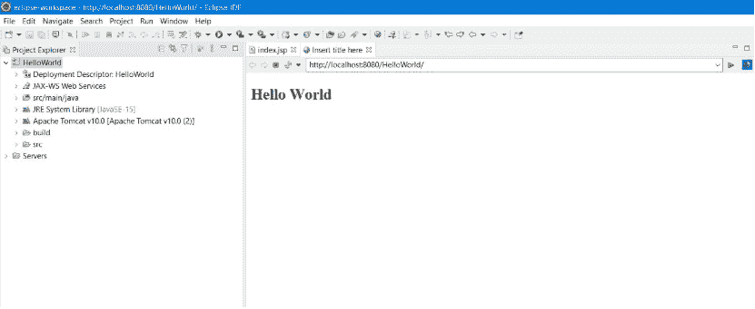