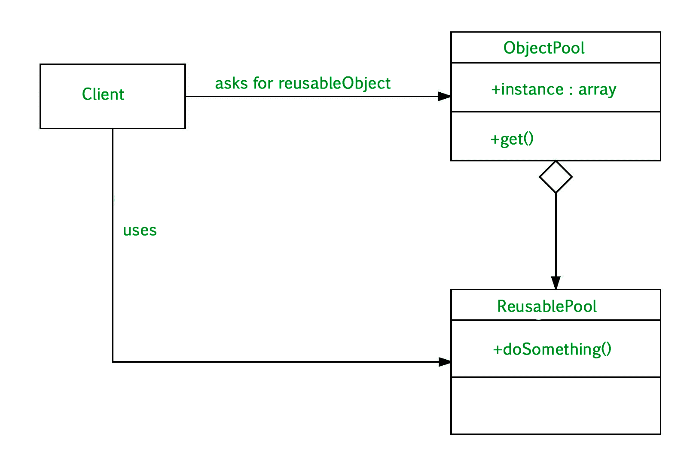

# 在 Java 中创建多个可变大小的对象池

> 原文:[https://www . geeksforgeeks . org/创建多个 java 可变大小对象池/](https://www.geeksforgeeks.org/creating-multiple-pools-of-objects-of-variable-size-in-java/)

[对象池模式](https://www.geeksforgeeks.org/object-pool-design-pattern/)是一种软件创造设计模式，用于初始化类实例的成本非常高的情况。基本上，对象池是包含一定数量对象的容器。因此，当对象从池中取出时，在放回之前，它在池中不可用。
池中的对象具有生命周期:

*   创造
*   确认
*   摧毁。

对象池可以提供很大的速度提升；当初始化一个类实例的成本很高，实例化的速度很快，并且在任何给定时刻使用的实例化数量很少时，它的效果最好。
对象池设计在对象构建成本较高且只需短时间使用时非常有用。在这个设计模式中，我们跟踪哪些实例化的对象正在使用，哪些是可访问的。

**如何创建多个对象池？**

我们都知道如何创建一个单一的对象池。但是可能需要创建多个大小可变的对象池。这意味着，我们可以有多个池，而不是创建一个固定大小的单一对象池&每个池有不同数量的总对象。



**对其实时性有什么要求？**

可以通过生成多个可变大小的内存池来完成错误处理或编程紧急情况下所需的内存分配。

有几个对象的新对象的生产成本似乎略高，因为它们不被认为是轻量级的。数据库连接对象、解析器对象、线程生成等等都是例子。在任何应用程序中，我们可能都必须构建许多这样的对象池。因为这种对象的生成是昂贵的，它将对任何程序的性能产生负面影响。我们可以再次使用同一个对象。

**实现:**
我们在这里创建一个类“线程”，它的对象在池中&另一个类“线程池”用于创建多个“线程”对象池。

在我们班线程类(1 班)

我们有数据成员:

*   “唯一标识”存储为每个线程对象生成的唯一标识。
*   “名称”保留线程对象的名称。

在我们的类 ThreadPool 类(类 2)中

我们有数据成员:

*   isFirst = true 以最初保持 true &每当池中的第一个线程对象被创建时，在第一个对象创建后，它被设置为 false。
*   线程类型的线程[]是一个数组引用，将引用线程类对象(线程池数组)
*   布尔类型的 isUsed[]是一个数组，用于跟踪当前正在使用的线程对象
*   用于记录线程池数量的线程池&是一个类级属性
*   ThreadreferenceCount 用于记录特定池中线程引用的数量
*   池编号，用于存储为每个创建的池指定的唯一编号

**例**

## Java 语言(一种计算机语言，尤用于创建网站)

```java
// Java Program to Creating Multiple Pools Of Objects of
// Variable Size

// Importing required classes
import java.io.*;
import java.util.*;

// Class 1
// Helper class
class Thread {

    // Members of this class
    private int uniqueId;
    private static int uniqueIDGen = 0;
    private String thread_name;

    // Constructor that initializes the objects of Thread
    // class
    Thread() { uniqueId = generateUniqueId(); }

    // Method 1
    // To set the value of the data member,
    // name of the Thread's Object
    public void setNameOfThread(String name)
    {
        thread_name = name;
    }

    // Method 2
    public String getNameOfThread() { return thread_name; }

    // Method 3
    // To generate a unique id for each Thread's Object
    private int generateUniqueId() { return uniqueIDGen++; }

    // Method 4
    // To Compare that the "this" reference and
    // "t1" reference refer to same object
    public boolean compare(Thread t1)
    {

        if (t1.uniqueId == this.uniqueId) {
            return true;
        }

        else {
            return false;
        }
    }
}

// Class 2
// Helper class
class ThreadPool {

    // member variables of this class

    // To keep true whenever 1st object of a pool is
    // created,
    // after 1st object creation, it is set to false
    private boolean isFirst = true;

    // Array reference of myThread (Thread Pool Array)
    private Thread myThreads[] = null;

    // Array to Keep track that which Thread's objects
    // are in use currently
    private boolean isUsed[] = null;

    private int n;

    // To keep count of no of Thread Pools and
    // is a class level Property
    private static int noOfThreadPools = 0;

    // Keeping count of no of thread references
    // in a particular pool
    private int ThreadreferenceCount = 0;

    // To Give a unique number to every Pool Created
    private int poolNum = 0;

    // Constructor of class 2
    public ThreadPool()
    {

        noOfThreadPools++;
        poolNum = noOfThreadPools;
    }

    // Method 1
    // To give "size" of each Thread pool and
    // creating size no of objects of Thread Type,
    // returning true if successful, else false
    public boolean initialize(int size)
    {

        boolean status = false;

        if (true == isFirst) {

            isFirst = false;
            n = size;

            // Assign memory of reference of array
            // using new keyword
            myThreads = new Thread[n];

            for (int i = 0; i < n; i++) {

                // Creating new object in heap of Thread
                // Class & myThread[i] reference refer it
                myThreads[i] = new Thread();

                // we are assigning thread name to each
                // thread
                String name = Integer.toString(i + 1);

                name = name.concat(
                    " is the thread number of the pool ");
                name = name.concat(
                    Integer.toString(poolNum));

                // Name assigning finishes
                myThreads[i].setNameOfThread(name);
            }

            // Creating new array of boolean type which is
            // referred by isUsed reference
            isUsed = new boolean[n];

            for (int i = 0; i < n; i++) {

                // Now making isUsed false for all the
                // references false,
                // false because when initializing, no
                // reference from outside is referring to
                // any of the objects created (from o to
                // size-1)
                isUsed[i] = false;
            }

            status = true;
        }

        return status;
    }

    // Method 2
    // To get reference of the Thread Objects Present in the
    // Pool If no object is free, it returns null
    public Thread getReference()
    {

        Thread threadToReturn = null;

        if (ThreadreferenceCount < n) {

            for (int i = 0; i < n; i++) {

                // When no reference from outside the class
                // is referring to object myThread[i],
                // isUsed[i] is false
                if (false == isUsed[i]) {

                    threadToReturn = myThreads[i];

                    // Make isUsed[i] as true because we are
                    // returning a reference to the object
                    // referred by myThread[i]
                    isUsed[i] = true;

                    // Incrementing the count because we are
                    // returning a reference to the object
                    // referred by myThread[i] to outside
                    // world now this object cant be referred
                    // by another reference from outside
                    ThreadreferenceCount++;

                    // Break keyword
                    break;
                }
            }
        }

        return threadToReturn;
    }

    // Method 3
    // To release the outside world reference;
    // Here : "thread" - passed as parameter
    public void releaseReference(Thread thread)
    {

        if (ThreadreferenceCount > 0) {

            for (int i = 0; i < n; i++) {

                // Compare the "thread" parameter with every
                // reference and release the matched one by
                // making isUsed[i] = false;
                if (true == thread.compare(myThreads[i])) {

                    // Make isUsed[i] is false to show no
                    // reference from
                    // outside the class is referring to
                    // object myThread[i]
                    isUsed[i] = false;

                    // Decrementing the count because we are
                    // releasing a reference to the object
                    // in outside world

                    ThreadreferenceCount--;

                    break;
                }
            }
        }
    }

    // Method 4
    // To make all the objects free for garbage collection
    // To restore to initial situation
    public boolean deInitialize()
    {

        boolean status = false;

        if (isFirst = false) {
            status = true;
        }

        // This condition is not required if one wants to
        // deinitialize() even if the references are present
        // outside
        else if (ThreadreferenceCount == 0) {

            for (int i = 0; i < n; i++) {
                myThreads[i] = null;
            }

            myThreads = null;
            isUsed = null;

            n = 0;
            isFirst = true;
            status = true;
        }

        return status;
    }
}

// Class 3
// Min class
public class Main {

    // Main driver method
    public static void main(String[] args)
    {

        // Display message on console for better readability
        System.out.println(
            "*****************POOL1 Of Threads Created*****************");

        // Creating object of class 2 in class 3 main()
        // method
        ThreadPool p1 = new ThreadPool();

        // Creating pool of 2 objects
        if (p1.initialize(2)) {

            System.out.println("Pool 1 initialized");
        }
        else {

            System.out.println("Pool 1 not initialized");
        }

        // Now getting 2 references to the 2 Objects from
        // this pool

        // Thread 1
        Thread t1 = p1.getReference();
        if (t1 != null) {

            System.out.println(t1.getNameOfThread());
        }
        else {

            System.out.println(
                " t1 do not refer any object");
        }

        // Thread 2
        Thread t2 = p1.getReference();
        if (t2 != null) {

            System.out.println(t2.getNameOfThread());
        }
        else {

            System.out.println(
                " t2 do not refer any object");
        }

        // Thread 3
        Thread t3 = p1.getReference();
        if (t3 != null) {

            System.out.println(t3.getNameOfThread());
        }
        else {

            System.out.println(
                " t3 do not refer any object");
        }

        // Releasing all the references of pool 1
        p1.releaseReference(t1);
        t1 = null;
        p1.releaseReference(t2);
        t2 = null;

        // As we have not used deInitialize() method, we
        // cannot initialize the pool p1 again
        if (p1.initialize(2)) {

            // Print statement
            System.out.println("Pool 1 initialized");
        }
        else {

            // Print statement
            System.out.println(
                "Pool 1 not initialized as it was already initialized\n");
        }

        // Creating pool 2

        // Display message on console for better readability
        System.out.println(
            "*****************POOL2  Of Threads Created*****************");

        ThreadPool p2 = new ThreadPool();

        // Creating pool of 3 objects
        p2.initialize(3);

        Thread tp1 = p2.getReference();

        if (tp1 != null) {

            System.out.println(tp1.getNameOfThread());
        }
        else {

            System.out.println(
                "tp1 dont refer to any object");
        }

        // Releasing references of pool 2
        p2.releaseReference(tp1);
        tp1 = null;

        // Deinitializing both the pools
        // using deInitialize() method
        p1.deInitialize();
        p2.deInitialize();
    }
}
```

**Output**

```java
*****************POOL1 Of Threads Created*****************
Pool 1 initialized
1 is the thread number of the pool 1
2 is the thread number of the pool 1
 t3 do not refer any object
Pool 1 not initialized as it was already initialized

*****************POOL2  Of Threads Created*****************
1 is the thread number of the pool 2

```

**输出解释:**

*   这里，我们通过以下方式创建两个线程对象池:

```java
ThreadPool p1 = new ThreadPool() & ThreadPool p2 = new ThreadPool() 
```

*   然后我们在 p1 和 p2 上调用 initialize()方法，给出大小(池中总的“线程”对象)–2 和 3。
*   然后创建线程类(t1 & t2)的两个引用，它们引用池 p1 中的对象(线程类型)。
*   线程类的第三个引用(t3)被创建，我们试图从池 p1 中获取对象(通过调用 p1 上的 getReference()，以便 t3 可以引用它。但是 t3 没有引用任何对象，因为 Pool p1 的大小是 2，只有 2 个来自外部世界的引用可以引用池中的 2 个对象。
*   然后我们通过调用 releaseReference()方法来释放这两个引用(t1 和 t2)。现在池中的对象是可用的&外部引用可以通过调用 p1 上的方法 getReference()来引用它们。
*   类似地，我们创建了另一个引用(tp1)，但是它引用了池 p2 中包含的 Thread 对象，因为我们在 p2 上调用了方法 getReference()。
*   然后我们通过调用 releaseReference()方法来释放引用(tp1)。
*   最后，我们调用 p1 & p2 上的方法 deInitialize()，将 p1 & p2 池恢复到调用 Initialize()之前的启动状态。