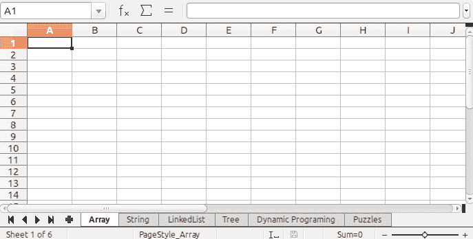

# 使用 Apache POI 在 Java 的 Excel 文件中创建工作表

> 原文:[https://www . geesforgeks . org/creating-sheets-in-excel-file-in-Java-using-Apache-poi/](https://www.geeksforgeeks.org/creating-sheets-in-excel-file-in-java-using-apache-poi/)

[Apache POI](https://www.geeksforgeeks.org/apache-poi-introduction/) 是一个开源的 java 库，基于 Microsoft Office 创建和操作各种文件格式。使用兴趣点，应该能够对以下文件格式执行创建、修改和显示/读取操作。例如，java 不提供使用 excel 文件的内置支持，所以我们需要为这项工作寻找开源 API。
Apache POI 提供了基于 Office Open XML (OOXML)标准和微软的 OLE2 标准来操作各种文件格式的 Java API。Apache POI 版本可在 Apache 许可证(V2.0)下获得。

在我们继续之前，建议极客们，你必须精通如何阅读阿帕奇兴趣点库中的文件。它包括基本界面，如工作簿、工作表、行、单元格。对于一个给定的 Excel 文件，这里说它是 *' **Geeks.xlsx '，**T3】需要在其中创建工作表，然后按照下面列出的一般步骤进行操作:*

**步骤 1:** 创建一个 JAVA [Maven 项目](https://www.geeksforgeeks.org/introduction-apache-maven-build-automation-tool-java-projects/)

**第二步:**在 pom.xml 文件中添加依赖关系。媒体文件如下所示。

**例**

## 超文本标记语言

```
<!-- https://mvnrepository.com/artifact/org.apache.poi/poi -->
<dependency>
      <groupId>org.apache.poi</groupId>
      <artifactId>poi</artifactId>
      <version>3.12</version>
    </dependency>
    <dependency>
      <groupId>org.apache.poi</groupId>
      <artifactId>poi-ooxml</artifactId>
      <version>3.12</version>
    </dependency>
```

**第三步:**在***【Java resource】***文件夹中创建一个类

## Java 语言(一种计算机语言，尤用于创建网站)

```
// Java Program to Illustrate Creating Sheets In Excel File
// Using Apache POI

// Importing required classes
import java.io.*;
import org.apache.poi.hssf.usermodel.HSSFWorkbook;
import org.apache.poi.ss.usermodel.Sheet;
import org.apache.poi.ss.usermodel.Workbook;

// Main class
// CreatingSheet
public class GFG {

    // Main driver method
    public static void main(String[] args)
        throws FileNotFoundException, IOException
    {

        // Creating Workbook instances
        Workbook wb = new HSSFWorkbook();

        // An output stream accepts output bytes and
        // sends them to sink
        OutputStream fileOut
            = new FileOutputStream("Geeks.xlsx");

        // Now creating Sheets using sheet object
        Sheet sheet1 = wb.createSheet("Array");
        Sheet sheet2 = wb.createSheet("String");
        Sheet sheet3 = wb.createSheet("LinkedList");
        Sheet sheet4 = wb.createSheet("Tree");
        Sheet sheet5 = wb.createSheet("Dynamic Programing");
        Sheet sheet6 = wb.createSheet("Puzzles");

        // Display message on console for successful
        // execution of program
        System.out.println(
            "Sheets Has been Created successfully");

        // Closing the output stream
        wb.write(fileOut);
    }
}
```

**输出:**在控制台上

```
Sheets Has been Created successfully
```

这里将在 Excel 文件中创建 6 个工作表，该文件已在上面的程序中传递，即下面提供的媒体中所示的“ *geeks.xlsx* ”

