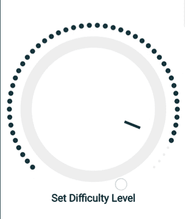

# 安卓中的 Croller

> 原文:[https://www.geeksforgeeks.org/croller-in-android/](https://www.geeksforgeeks.org/croller-in-android/)

在本文中，我们将学习如何在安卓中添加 **Croller** 。Croller 用于在安卓系统中实现循环[T3Seekbar](https://www.geeksforgeeks.org/seekbar-in-kotlin/)。Seekbar 是一种进度条。我们可以将 seekbar 从左向右拖动，反之亦然，从而改变当前进度。这就是一个**炸面包圈**的样子。


### 属性表

<figure class="table">

| **XML 属性** | **Java 设置方法** | **功能** |
| 逆时针方向 | 设置逆时针(布尔逆时针) | 设置旋转方向 |
| 进步 | 设定进度(内部进度) | 设置 seekbar 的当前进度 |
| 标签 | setLabel(字符串 str) | 设置标签 |
| 标签大小 | setLabelSize(int size) | 设置标签大小 |
| 标签颜色 | 设置标签颜色（整数颜色） | 设置标签颜色 |
| 是连续的 | setinstinuous(boolean bool) | 设置 seekbar 是连续的还是离散的 |
| 最大 | setMax（int max） | 设置 seekbar 的最大值 |
| 部 | setMin（int min） | 设置 seekbar 的最小值(默认值为 1) |
| 开始偏移量 | setStartOffset（int offset） | 设置从底部水平中心开始的 seekbar 开始偏移角度 |
| 扫描角度 | 设置扫描角度 | 设置 seekbar 覆盖的总角度 |
| 进度 _ 主要 _ 笔画 _ 宽度 | setProgressPrimaryStrokeWidth(浮动宽度) | 为连续类型设置主要进度厚度 |
| 进度 _ 次要 _ 笔画 _ 宽度 | 设定程序二次系统行程宽度(浮动宽度) | 为连续类型设置二次加工厚度 |
| 进度 _ 主要 _ 圆形 _ 大小 | setProgressPrimaryCircleSize(浮动大小) | 设置离散类型的主要进度圆大小 |
| 进度 _ 次要 _ 圆 _ 大小 | setProgressSecondaryCircleSize(浮点大小) | 为离散类型设置次要进度圆大小 |
| 指示器 _ 宽度 | setindicatorwidth(浮动宽度) | 设置进度指示器宽度 |
| 指示器颜色 | setndikulcolor(int color) | 设置进度指示器颜色 |
| 进度 _ 原色 | setProgressPrimaryColor（int color） | 设置进度主要(活动)颜色 |
| 进度 _ 次要 _ 颜色 | setProgressSecondaryColor（int color） | 设置进度辅助(非活动)颜色 |
| 进度 _ 半径 | 设置进程半径（浮子半径） | 设置进度弧的半径 |
| 主 _ 圆 _ 半径 | setMainCircleRadius（float radius） | 设置主(前)圆半径 |
| 后圆半径 | setBackCircleRadius(浮动半径) | 设置后圆半径 |
| 主 _ 圆形 _ 颜色 | setMainCircleColor（int color） | 设置主(前)圆颜色 |
| 背景 _ 圆形 _ 颜色 | setBackCircleColor（int color） | 设置背景圆颜色 |

</figure>

### 入门指南

**步骤 1:** 在 [**build.gradle**](https://www.geeksforgeeks.org/android-build-gradle/) 文件中添加支持库，并在依赖项部分添加依赖项。

```
implementation 'com.sdsmdg.harjot:croller:1.0.7'
```

**第二步:**在 **activity_main.xml** 文件中添加以下代码。在这个文件中，我们将我们的 **Croller** 添加到布局。

## activity_main.xml

```

<?xml version="1.0" encoding="utf-8"?>
<RelativeLayout 
    xmlns:android="http://schemas.android.com/apk/res/android"
    xmlns:app="http://schemas.android.com/apk/res-auto"
    xmlns:tools="http://schemas.android.com/tools"
    android:layout_width="match_parent"
    android:layout_height="match_parent"
    android:background="#FFFFFF"
    tools:context=".MainActivity">

    <com.sdsmdg.harjot.crollerTest.Croller
        android:id="@+id/croller"
        android:layout_width="match_parent"
        android:layout_height="match_parent"
        android:layout_centerInParent="true"
        app:back_circle_color="#EDEDED"
        app:indicator_color="#0B3C49"
        app:indicator_width="10"
        app:is_continuous="false"
        app:label="Set Difficulty Level"
        app:label_color="#000000"
        app:main_circle_color="#FFFFFF"
        app:max="50"
        app:progress_primary_color="#0B3C49"
        app:progress_secondary_color="#EDEDED"
        app:start_offset="45">

</RelativeLayout>
```

**第三步:**在**MainActivity.java**文件中增加以下代码。在这种情况下，我们将 **`setOnCrollerChangeListener()`** 添加到我们的 croller 中，这样每当有变化时 **`setOnCrollerChangeListener()`** 就会被自动调用。

## MainActivity.xml

```

package org.geeksforgeeks.croller

import androidx.appcompat.app.AppCompatActivity;
import android.os.Bundle;
import android.widget.Toast;
import com.sdsmdg.harjot.crollerTest.Croller;
import com.sdsmdg.harjot.crollerTest.OnCrollerChangeListener;

public class MainActivity extends AppCompatActivity {

    @Override
    protected void onCreate(Bundle savedInstanceState) {
        super.onCreate(savedInstanceState);
        setContentView(R.layout.activity_main);

        Croller croller = findViewById(R.id.croller);

        // when there is a change in the progress of croller
        // this function get invoked automatically
        croller.setOnCrollerChangeListener(
            new OnCrollerChangeListener() {
            @Override
            public void onProgressChanged(Croller croller,
                        int progress) {

            }

            // when the user is starting to change the progress
            // this function gets invoked automatically.
            @Override
            public void onStartTrackingTouch(Croller croller) {
                Toast.makeText(MainActivity.this, 
                      "Start", Toast.LENGTH_SHORT).show();
            }

            // when the user stops to change the progress
            // this function gets invoked automatically.
            @Override
            public void onStopTrackingTouch(Croller croller) {
                Toast.makeText(MainActivity.this, 
                      "Stop", Toast.LENGTH_SHORT).show();
            }
        });

    }
}
```

### 作为模拟器运行

<video class="wp-video-shortcode" id="video-458733-1" width="320" height="540" preload="metadata" controls=""><source type="video/mp4" src="https://media.geeksforgeeks.org/wp-content/uploads/20200715023056/Record_2020-07-15-02-25-47_0cc885b908a72922f1be7b6d493c5de01.mp4?_=1">[https://media.geeksforgeeks.org/wp-content/uploads/20200715023056/Record_2020-07-15-02-25-47_0cc885b908a72922f1be7b6d493c5de01.mp4](https://media.geeksforgeeks.org/wp-content/uploads/20200715023056/Record_2020-07-15-02-25-47_0cc885b908a72922f1be7b6d493c5de01.mp4)</video>