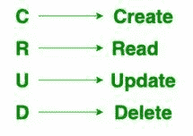

# 在 MySQL 中使用 PHP 进行 CRUD 操作，凌空安卓–插入数据

> 原文:[https://www . geesforgeks . org/crud-operation-in-MySQL-using-PHP-凌空-android-insert-data/](https://www.geeksforgeeks.org/crud-operation-in-mysql-using-php-volley-android-insert-data/)

已知我们可以使用 **MySQL** 使用结构查询语言，以 **RDBMS** 的形式存储数据。SQL 是在数据库中添加、访问和管理内容的最流行的语言。它以处理速度快、可靠性高、使用方便和灵活著称。该应用程序用于多种用途，包括数据仓库、电子商务和日志应用程序。MySQL 提供了一组基本但最重要的操作，这些操作将帮助您轻松地与 MySQL 数据库进行交互，这些操作被称为 CRUD 操作。



在前一篇文章中，我们已经看到**在 PhpMydmin 服务**中创建新的 SQL 数据库。在本文中，我们将执行插入数据操作。在执行这个操作之前，首先我们必须**创建一个新的 PHP 脚本，用于在我们的 SQL 数据库**中向该数据库添加新数据。

**先决条件:**您应该已经在系统中安装了[邮递员](https://www.geeksforgeeks.org/introduction-postman-api-development/)来测试这个 PHP 脚本。

## **创建一个新的 PHP 脚本，在我们的 SQL 数据库**中向该数据库添加新数据

我们将构建一个简单的 PHP 脚本，在这个脚本中，我们将用于向我们在上一篇文章中创建的 SQL 表中添加数据。使用这个脚本，我们将向我们的 SQL 表添加数据。

### **分步实施**

**第 1 步:启动您的 XAMPP 服务器，我们在上一篇文章**中已经看到了它的启动

在上一篇文章中，我们已经看到启动我们的 XAMPP 服务器，我们还创建了我们的数据库。在本文中，我们将创建一个向数据库添加数据的脚本。

**第二步:导航到 xampp 文件夹**

现在我们必须导航到你的电脑中的 c 盘，并在里面检查文件夹名是否为 xampp。在该文件夹中，导航到 htdocs 文件夹，并在其中创建一个新文件夹，并将其命名为 courseApp。在这个文件夹中，我们将存储所有的 PHP 脚本。现在，为了编写 PHP 脚本，我们可以使用任何简单的文本编辑器。我用的是 VS 代码。创建这个文件夹后，我们只需要在 VS 代码中打开这个文件夹。

**第三步:新建一个 PHP 文件**

在你用 VS 代码打开你的文件夹后，在那个文件夹里面我们必须按一个快捷键 **Ctrl+N** 我们的新文件将被创建。我们必须保存这个名为**addCourses.php**的文件，并添加下面的代码。代码中添加了注释，以便更详细地了解。

## 服务器端编程语言（Professional Hypertext Preprocessor 的缩写）

```
<?php

$servername = "localhost";

// for testing the user name is root.
$username = "root";

// the password for testing is "blank"
$password = "";

// below is the name for our
// database which we have added.
$dbname = "id16310745_gfgdatabase";

// Create connection
$conn = new mysqli($servername, $username, $password, $dbname);

 // an array to display response
 $response = array();
 // on below line we are checking if the body provided by user contains
 // this keys as course name,course description and course duration
 if($_POST['courseName'] && $_POST['courseDuration'] && $_POST['courseDescription']){
     // if above three parameters are present then we are extravting values
     // from it and storing it in new variables.
     $courseName = $_POST['courseName'];
     $courseDuration = $_POST['courseDuration'];
     $courseDescription = $_POST['courseDescription'];
     // after that we are writing an sql query to
     // add this data to our database.
     // on below line make sure to add your yable name
     // in previous article we have created our table name
     // as courseDb and add all column headers to it except our id.
     $stmt = $conn->prepare("INSERT INTO `courseDb`(`courseName`, `courseDuration`, `courseDescription`) VALUES (?,?,?)");
     $stmt->bind_param("sss",$courseName,$courseDuration,$courseDescription);
   // on below line we are checking if our sql query is executed successfully.
   if($stmt->execute() == TRUE){
        // if the script is executed successfully we are
        // passing data to our response object
        // with a success message.
         $response['error'] = false;
         $response['message'] = "course created successfully!";
     } else{
         // if we get any error we are passing error to our object.
         $response['error'] = true;
         $response['message'] = "failed\n ".$conn->error;
     }
 } else{
     // this msethod is called when user
     // donot enter sufficient parameters.
     $response['error'] = true;
     $response['message'] = "Insufficient parameters";
 }
 // at last we are prinintg our response which we get.
 echo json_encode($response);
 ?>
```