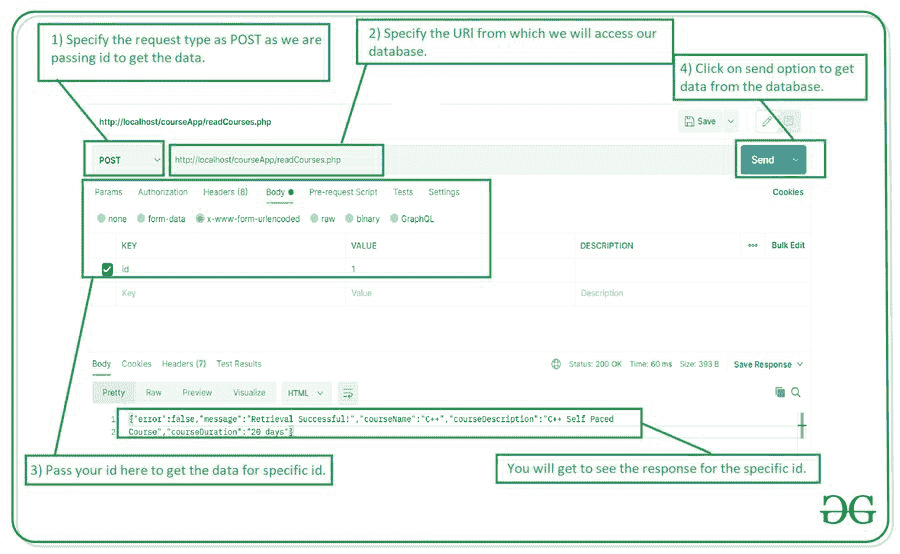

# 在 MySQL 中使用 PHP 进行 CRUD 操作，凌空安卓–读取数据

> 原文:[https://www . geesforgeks . org/crud-operation-in-MySQL-using-PHP-凌空-android-read-data/](https://www.geeksforgeeks.org/crud-operation-in-mysql-using-php-volley-android-read-data/)

在前一篇文章中，我们已经执行了**插入数据操作**。在本文中，我们将执行读取数据操作。在执行这个操作之前，首先我们必须**创建一个新的 PHP 脚本来从 SQL 数据库**中读取数据。

**先决条件:**您应该已经在系统中安装了[邮递员](https://www.geeksforgeeks.org/introduction-postman-api-development/)来测试这个 PHP 脚本。

## 创建一个从我的 SQL 数据库中读取数据的 PHP 脚本

我们将构建一个简单的 PHP 脚本，用于从我们在上一篇文章中创建的 SQL 表中读取数据。使用这个脚本，我们将从我们的 SQL 表中读取数据。

### **分步实施**

**第 1 步:启动您的 XAMPP 服务器，我们在上一篇文章**中已经看到了它的启动

在上一篇文章中，我们已经看到启动我们的 XAMPP 服务器，我们还创建了我们的数据库。在本文中，我们将创建一个向数据库添加数据的脚本。

**第二步:导航到 xampp 文件夹**

现在我们必须导航到你的电脑中的 c 盘，并在里面检查文件夹名是否为 xampp。在该文件夹中，导航到 htdocs 文件夹，并在其中创建一个新文件夹，并将其命名为 courseApp。在这个文件夹中，我们将存储所有的 PHP 脚本。现在，为了编写 PHP 脚本，我们可以使用任何简单的文本编辑器。我用的是 VS 代码。创建这个文件夹后，我们只需要在 VS 代码中打开这个文件夹。

**第三步:新建一个 PHP 文件**

在你用 VS 代码打开你的文件夹之后，在那个文件夹里面我们必须按一个快捷键，因为 Ctrl+N 我们的新文件将被创建。我们必须保存这个名为**readCourses.php**的文件，并添加下面的代码。代码中添加了注释，以便更详细地了解。

## 服务器端编程语言（Professional Hypertext Preprocessor 的缩写）

```
<?php
$servername = "localhost";
$username = "root";
$password = "";
$dbname = "id16310745_gfgdatabase";

// connect with database demo
$conn = new mysqli($servername, $username, $password, $dbname);

 // an array to display response
 $response = array();
 // on below line we are checking if the parameter send is id or not.
 if($_POST['id']){
     // if the parameter send from the user id id then
     // we will search the item for specific id.
     $id = $_POST['id'];
        //on below line we are selecting the course detail with below id.
     $stmt = $conn->prepare("SELECT courseName,courseDescription,courseDuration FROM courseDb WHERE id = ?");
     $stmt->bind_param("s",$id);
     $result = $stmt->execute();
   // on below line we are checking if our
   // table is having data with specific id.
   if($result == TRUE){
         // if we get the response then we are displaying it below.
         $response['error'] = false;
         $response['message'] = "Retrieval Successful!";
         // on below line we are getting our result.
         $stmt->store_result();
         // on below line we are passing parameters which we want to get.
         $stmt->bind_result($courseName,$courseDescription,$courseDuration);
         // on below line we are fetching the data.
         $stmt->fetch();
         // after getting all data we are passing this data in our array.
         $response['courseName'] = $courseName;
         $response['courseDescription'] = $courseDescription;
         $response['courseDuration'] = $courseDuration;
     } else{
         // if the id entered by user donot exist then
         // we are displaying the error message
         $response['error'] = true;
         $response['message'] = "Incorrect id";
     }
 } else{
      // if the user donot adds any paramter while making request
      // then we are displaying the error as insufficient parameters.
      $response['error'] = true;
      $response['message'] = "Insufficient Parameters";
 }
 // at last we are printing
 // all the data on below line.
 echo json_encode($response);
?>
```

**第四步:获取 PHP 脚本的网址**

为了获得 PHP 脚本的 URL，我们只需在浏览器中键入 localhost，然后将它附加到我们的文件夹名和文件名中。您将看到下面突出显示的网址:

```
http://localhost/courseApp/readCourses.php
```

现在我们将使用邮递员测试我们的应用编程接口。

**第五步:在 Postman** 中测试我们的 PHP 脚本

为了测试您的 PHP 脚本，请在 postman 中选择 POST 方法，因为我们将从我们的 SQL 表中获取数据，并在 URL 部分添加上面的 URL。添加网址后。现在点击下面截图中显示的 Body 选项卡，在里面选择 x-www-form-urlencoded，然后在下面的部分添加参数，如截图所示。请确保您输入的键必须与我们在 SQL 表中用于命名列的键相同。添加所有数据后。现在点击发送选项发送我们的 id 并从我们的 SQL 表接收数据。



您将在上面的屏幕上看到来自 API 的响应。

## 读取数据操作

在上面的部分，我们已经创建了一个从 SQL 表中读取数据的 PHP 脚本。在这一部分，我们将把它集成到我们的安卓应用程序中，并从我们的安卓应用程序中读取数据到我们的 SQL 表中。

### **本文我们要构建什么？**

我们将构建一个简单的应用程序，通过传递标识从我们的 SQL 表中读取数据。我们将使用之前创建的 PHP 脚本来读取这些数据。下面是视频，我们将在其中看到我们将在本文中构建的内容。

<video class="wp-video-shortcode" id="video-584491-1" width="640" height="360" preload="metadata" controls=""><source type="video/mp4" src="https://media.geeksforgeeks.org/wp-content/uploads/20210309194046/Screenrecorder-2021-03-09-19-39-47-859.mp4?_=1">[https://media.geeksforgeeks.org/wp-content/uploads/20210309194046/Screenrecorder-2021-03-09-19-39-47-859.mp4](https://media.geeksforgeeks.org/wp-content/uploads/20210309194046/Screenrecorder-2021-03-09-19-39-47-859.mp4)</video>

### **分步实施**

**第一步:创建新项目**

要在安卓工作室创建新项目，请参考[如何在安卓工作室创建/启动新项目](https://www.geeksforgeeks.org/android-how-to-create-start-a-new-project-in-android-studio/)。注意选择 **Java** 作为编程语言。

**第二步:在你的 build.gradle 文件**中添加下面的依赖项

下面是凌空的依赖，我们将使用它从应用编程接口获取数据。要添加此依赖项，请导航至**应用程序>渐变脚本> build.gradle(应用程序)**，并在依赖项部分添加以下依赖项。

```
implementation ‘com.android.volley:volley:1.1.1’
```

添加此依赖项后，同步您的项目，现在转到 AndroidManifest.xml 部分。

**第三步:在 AndroidManifest.xml 文件**中添加互联网权限

导航到**应用程序> AndroidManifest.xml** ，并添加以下代码。

## 可扩展标记语言

```
<!--permissions for INTERNET-->
<uses-permission android:name="android.permission.INTERNET"/>
```

**第 4 步:使用 activity_main.xml 文件**

导航到**应用程序> res >布局> activity_main.xml** 并将下面的代码添加到该文件中。下面是 **activity_main.xml** 文件的代码。

## 可扩展标记语言

```
<?xml version="1.0" encoding="utf-8"?>
<LinearLayout
    xmlns:android="http://schemas.android.com/apk/res/android"
    xmlns:tools="http://schemas.android.com/tools"
    android:layout_width="match_parent"
    android:layout_height="match_parent"
    android:orientation="vertical"
    tools:context=".MainActivity">

    <!--Edit text for getting course id-->
    <EditText
        android:id="@+id/idEdtCourseId"
        android:layout_width="match_parent"
        android:layout_height="wrap_content"
        android:layout_marginStart="10dp"
        android:layout_marginTop="20dp"
        android:layout_marginEnd="10dp"
        android:hint="Enter Course Id"
        android:importantForAutofill="no"
        android:inputType="number" />

    <!--Button for adding your course to Firebase-->
    <Button
        android:id="@+id/idBtnGetCourse"
        android:layout_width="match_parent"
        android:layout_height="wrap_content"
        android:layout_margin="10dp"
        android:text="Get Course Details"
        android:textAllCaps="false" />

    <androidx.cardview.widget.CardView
        xmlns:app="http://schemas.android.com/apk/res-auto"
        android:id="@+id/idCVCOurseItem"
        android:layout_width="match_parent"
        android:layout_height="wrap_content"
        android:layout_margin="5dp"
        android:visibility="gone"
        app:cardCornerRadius="6dp"
        app:cardElevation="4dp">

        <LinearLayout
            android:layout_width="match_parent"
            android:layout_height="wrap_content"
            android:layout_margin="2dp"
            android:orientation="vertical"
            android:padding="4dp">

            <!--Textview for displaying our Course Name-->
            <TextView
                android:id="@+id/idTVCourseName"
                android:layout_width="match_parent"
                android:layout_height="wrap_content"
                android:padding="2dp"
                android:text="CourseName"
                android:textColor="@color/purple_500"
                android:textSize="18sp"
                android:textStyle="bold" />

            <!--Textview for displaying our Course Duration-->
            <TextView
                android:id="@+id/idTVCourseDuration"
                android:layout_width="match_parent"
                android:layout_height="wrap_content"
                android:padding="2dp"
                android:text="Duration"
                android:textColor="@color/black" />

            <!--Textview for displaying our Course Description-->
            <TextView
                android:id="@+id/idTVCourseDescription"
                android:layout_width="match_parent"
                android:layout_height="wrap_content"
                android:padding="2dp"
                android:text="Description"
                android:textColor="@color/black" />
        </LinearLayout>

    </androidx.cardview.widget.CardView>

</LinearLayout>
```

**第五步:使用****MainActivity.java 文件**

转到**MainActivity.java**文件，参考以下代码。以下是**MainActivity.java**文件的代码。代码中添加了注释，以更详细地理解代码。

## Java 语言(一种计算机语言，尤用于创建网站)

```
import android.os.Bundle;
import android.text.TextUtils;
import android.view.View;
import android.widget.Button;
import android.widget.EditText;
import android.widget.TextView;
import android.widget.Toast;

import androidx.appcompat.app.AppCompatActivity;
import androidx.cardview.widget.CardView;

import com.android.volley.Request;
import com.android.volley.RequestQueue;
import com.android.volley.VolleyError;
import com.android.volley.toolbox.StringRequest;
import com.android.volley.toolbox.Volley;

import org.json.JSONException;
import org.json.JSONObject;

import java.util.HashMap;
import java.util.Map;

public class MainActivity extends AppCompatActivity {

    // creating variables for our edit text
    private EditText courseIDEdt;

    // creating variable for button
    private Button getCourseDetailsBtn;

    // creating variable for card view and text views.
    private CardView courseCV;
    private TextView courseNameTV, courseDescTV, courseDurationTV;

    @Override
    protected void onCreate(Bundle savedInstanceState) {
        super.onCreate(savedInstanceState);
        setContentView(R.layout.activity_main);

        // initializing all our variables.
        courseNameTV = findViewById(R.id.idTVCourseName);
        courseDescTV = findViewById(R.id.idTVCourseDescription);
        courseDurationTV = findViewById(R.id.idTVCourseDuration);
        getCourseDetailsBtn = findViewById(R.id.idBtnGetCourse);
        courseIDEdt = findViewById(R.id.idEdtCourseId);
        courseCV = findViewById(R.id.idCVCOurseItem);

        // adding click listener for our button.
        getCourseDetailsBtn.setOnClickListener(new View.OnClickListener() {
            @Override
            public void onClick(View v) {
                // checking if the id text field is empty or not.
                if (TextUtils.isEmpty(courseIDEdt.getText().toString())) {
                    Toast.makeText(MainActivity.this, "Please enter course id", Toast.LENGTH_SHORT).show();
                    return;
                }
                // calling method to load data.
                getCourseDetails(courseIDEdt.getText().toString());
            }
        });
    }

    private void getCourseDetails(String courseId) {

        // url to post our data
        String url = "http://localhost/courseApp/readCourses.php";

        // creating a new variable for our request queue
        RequestQueue queue = Volley.newRequestQueue(MainActivity.this);

        // on below line we are calling a string
        // request method to post the data to our API
        // in this we are calling a post method.
        StringRequest request = new StringRequest(Request.Method.POST, url, new com.android.volley.Response.Listener<String>() {
            @Override
            public void onResponse(String response) {
                try {
                    // on below line passing our response to json object.
                    JSONObject jsonObject = new JSONObject(response);
                    // on below line we are checking if the response is null or not.
                    if (jsonObject.getString("courseName") == null) {
                        // displaying a toast message if we get error
                        Toast.makeText(MainActivity.this, "Please enter valid id.", Toast.LENGTH_SHORT).show();
                    } else {
                        // if we get the data then we are setting it in our text views in below line.
                        courseNameTV.setText(jsonObject.getString("courseName"));
                        courseDescTV.setText(jsonObject.getString("courseDescription"));
                        courseDurationTV.setText(jsonObject.getString("courseDuration"));
                        courseCV.setVisibility(View.VISIBLE);
                    }
                    // on below line we are displaying
                    // a success toast message.
                } catch (JSONException e) {
                    e.printStackTrace();
                }
            }
        }, new com.android.volley.Response.ErrorListener() {
            @Override
            public void onErrorResponse(VolleyError error) {
                // method to handle errors.
                Toast.makeText(MainActivity.this, "Fail to get course" + error, Toast.LENGTH_SHORT).show();
            }
        }) {
            @Override
            public String getBodyContentType() {
                // as we are passing data in the form of url encoded
                // so we are passing the content type below
                return "application/x-www-form-urlencoded; charset=UTF-8";
            }

            @Override
            protected Map<String, String> getParams() {

                // below line we are creating a map for storing our values in key and value pair.
                Map<String, String> params = new HashMap<String, String>();

                // on below line we are passing our key and value pair to our parameters.
                params.put("id", courseId);

                // at last we are returning our params.
                return params;
            }
        };
        // below line is to make
        // a json object request.
        queue.add(request);
    }
}
```

现在运行你的应用程序，看看代码的输出。

**输出:**

<video class="wp-video-shortcode" id="video-584491-2" width="640" height="360" preload="metadata" controls=""><source type="video/mp4" src="https://media.geeksforgeeks.org/wp-content/uploads/20210309194046/Screenrecorder-2021-03-09-19-39-47-859.mp4?_=2">[https://media.geeksforgeeks.org/wp-content/uploads/20210309194046/Screenrecorder-2021-03-09-19-39-47-859.mp4](https://media.geeksforgeeks.org/wp-content/uploads/20210309194046/Screenrecorder-2021-03-09-19-39-47-859.mp4)</video>