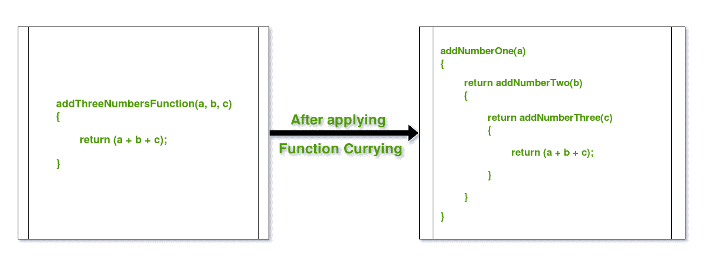
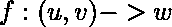
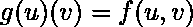
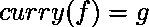

# 用示例在 Java 中实现函数

> 原文:[https://www . geeksforgeeks . org/currying-functions-in-Java-with-examples/](https://www.geeksforgeeks.org/currying-functions-in-java-with-examples/)

**函数 Currying** 是**将一个多参数的函数分解成多个单参数的函数，这样输出是一样的。**换句话说，这是一种将多值自变量函数简化为单值自变量多元函数的技术。

考虑这个例子来澄清这个概念:



Currying 将高阶函数分解成一系列较小的级联函数，这些函数接受一个参数并返回一个函数，但最后一个返回所需值的级联函数除外。

**例如:**

假设有一个函数映射为


按上述功能会产生


因此从映射到一个函数，该函数又从映射到
上述数学表达式也可以表示为:


因此，

**下面是一些用 Java 演示函数 Currying 的例子:**

**例 1:** 用函数 currency 加 2

```
// Java Program to demonstrate Function Currying

import java.util.function.Function;

public class GFG {
    public static void main(String args[])
    {

        // Using Java 8 Functions
        // to create lambda expressions for functions
        // and with this, applying Function Currying

        // Curried Function for Adding u & v
        Function<Integer,
                 Function<Integer, Integer> >
            curryAdder = u -> v -> u + v;

        // Calling the curried functions

        // Calling Curried Function for Adding u & v
        System.out.println("Add 2, 3 :"
                           + curryAdder
                                 .apply(2)
                                 .apply(3));

        }
}
```

**Output:**

```
Add 2, 3 :5

```

**例 2:** 用函数 Currying 乘以 2

```
// Java Program to demonstrate Function Currying

import java.util.function.Function;

public class GFG {
    public static void main(String args[])
    {

        // Using Java 8 Functions
        // to create lambda expressions for functions
        // and with this, applying Function Currying

        // Curried Function for Multiplying u & v
        Function<Integer,
                 Function<Integer, Integer> >
            curryMulti = u -> v -> u * v;

        // Calling the curried functions

        // Calling Curried Function for Multiplying u & v
        System.out.println("Multiply 2, 3 :"
                           + curryMulti
                                 .apply(2)
                                 .apply(3));
    }
}
```

**Output:**

```
Multiply 2, 3 :6

```

**例 3:** 用函数 currency 加 3 个数

```
// Java Program to demonstrate Function Currying

import java.util.function.Function;

public class GFG {
    public static void main(String args[])
    {

        // Using Java 8 Functions
        // to create lambda expressions for functions
        // and with this, applying Function Currying

        // Curried Function for Adding u, v & w
        Function<Integer,
                 Function<Integer,
                          Function<Integer, Integer> > >
            triadder = u -> w -> v -> u + w + v;

        // Calling the curried functions

        // Calling Curried Function for Adding u, v & w
        System.out.println("Add 2, 3, 4 :"
                           + triadder
                                 .apply(2)
                                 .apply(3)
                                 .apply(4));
    }
}
```

**Output:**

```
Add 2, 3, 4 :9

```