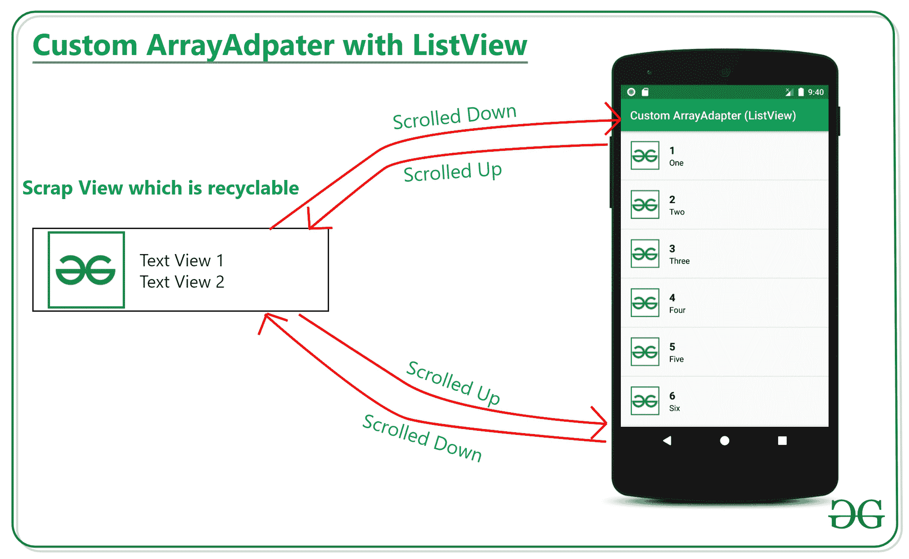
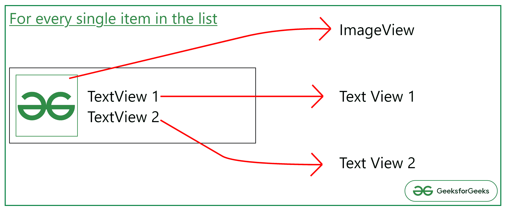

# 安卓中带 ListView 的自定义数组编辑器

> 原文:[https://www . geesforgeks . org/custom-arrayadapter-with-listview-in-Android/](https://www.geeksforgeeks.org/custom-arrayadapter-with-listview-in-android/)

在前面的文章[中，安卓中的 ArrayAdapter 用示例](https://www.geeksforgeeks.org/arrayadapter-in-android-with-example/)已经讨论了 ArrayAdapter 是如何工作的，以及可以用 ListView 附加到 ArrayAdapter 的数据源是什么。在本文中，已经讨论了如何用 ListView 实现自定义 ArrayAdapter。请看下图，其中可以自定义 ArrayAdapter 中的单个视图。



## **实施定制阵列适配器的步骤**

**步骤 1:创建一个空的活动项目**

*   创建一个空的活动安卓工作室项目。参考[安卓|如何在安卓工作室创建/启动新项目？](https://www.geeksforgeeks.org/android-how-to-create-start-a-new-project-in-android-studio/)
*   并确保选择编程为 **Java** 。

**步骤 2:使用 activity_main.xml**

*   在 **activity_main.xml** 文件中，根视图是[列表视图](https://www.geeksforgeeks.org/android-listview-in-java-with-example/)。在 activity_main.xml 文件中调用下面的代码，并为 ListView 指定适当的 ID。

## 可扩展标记语言

```java
<?xml version="1.0" encoding="utf-8"?>
<ListView 
    xmlns:android="http://schemas.android.com/apk/res/android"
    xmlns:tools="http://schemas.android.com/tools"
    android:id="@+id/listView"
    android:layout_width="match_parent"
    android:layout_height="match_parent"
    tools:context=".MainActivity">
</ListView>
```

**步骤 3:为列表视图**创建自定义视图

*   在布局下，文件夹创建一个布局为***custom _ list _ view . XML***，并调用以下代码。

## 可扩展标记语言

```java
<?xml version="1.0" encoding="utf-8"?>
<LinearLayout 
    xmlns:android="http://schemas.android.com/apk/res/android"
    xmlns:tools="http://schemas.android.com/tools"
    android:layout_width="match_parent"
    android:layout_height="wrap_content"
    android:orientation="horizontal"
    tools:ignore="UselessParent">

    <ImageView
        android:id="@+id/imageView"
        android:layout_width="84dp"
        android:layout_height="84dp"
        android:padding="16dp"
        tools:ignore="ContentDescription" />

    <LinearLayout
        android:layout_width="match_parent"
        android:layout_height="match_parent"
        android:gravity="center_vertical"
        android:orientation="vertical">

        <TextView
            android:id="@+id/textView1"
            android:layout_width="match_parent"
            android:layout_height="wrap_content"
            android:layout_marginTop="16dp"
            android:gravity="bottom|left"
            android:textColor="@android:color/black"
            android:textSize="18sp"
            android:textStyle="bold"
            tools:ignore="RtlHardcoded" />

        <TextView
            android:id="@+id/textView2"
            android:layout_width="match_parent"
            android:layout_height="wrap_content"
            android:layout_marginBottom="16dp"
            android:gravity="top|left"
            android:textColor="@android:color/black"
            android:textSize="14sp"
            tools:ignore="RtlHardcoded" />

    </LinearLayout>

</LinearLayout>
```

*   对于列表视图中的每一项，此布局都会为数组适配器中的每一项创建以下视图。



**第 4 步:为自定义布局创建自定义类**

*   通过创建这个自定义类，我们为 custom_list_view 布局手动调用 getter 和 setter。
*   在应用程序的包文件夹下创建一个名为 NumbersView 的自定义类。
*   并调用以下代码。

## Java 语言(一种计算机语言，尤用于创建网站)

```java
public class NumbersView {

    // the resource ID for the imageView
    private int ivNumbersImageId;

    // TextView 1
    private String mNumberInDigit;

    // TextView 1
    private String mNumbersInText;

    // create constructor to set the values for all the parameters of the each single view
    public NumbersView(int NumbersImageId, String NumbersInDigit, String NumbersInText) {
        ivNumbersImageId = NumbersImageId;
        mNumberInDigit = NumbersInDigit;
        mNumbersInText = NumbersInText;
    }

    // getter method for returning the ID of the imageview
    public int getNumbersImageId() {
        return ivNumbersImageId;
    }

    // getter method for returning the ID of the TextView 1
    public String getNumberInDigit() {
        return mNumberInDigit;
    }

    // getter method for returning the ID of the TextView 2
    public String getNumbersInText() {
        return mNumbersInText;
    }
}
```

**步骤 5:现在创建一个类型为 NumbersView** 的自定义 ArrayAdapter 类

*   在相同的包名下，创建一个类型为 NumbersView 的***【NumbersViewAdapter.java】***类，该类扩展了 ArrayAdapter 类。
*   并在 NumbersViewAdapter.java 文件中调用以下代码。添加注释是为了更好地理解。

## Java 语言(一种计算机语言，尤用于创建网站)

```java
import android.content.Context;
import android.view.LayoutInflater;
import android.view.View;
import android.view.ViewGroup;
import android.widget.ArrayAdapter;
import android.widget.ImageView;
import android.widget.TextView;
import androidx.annotation.NonNull;
import androidx.annotation.Nullable;
import java.util.ArrayList;

public class NumbersViewAdapter extends ArrayAdapter<NumbersView> {

    // invoke the suitable constructor of the ArrayAdapter class
    public NumbersViewAdapter(@NonNull Context context, ArrayList<NumbersView> arrayList) {

          // pass the context and arrayList for the super 
          // constructor of the ArrayAdapter class
        super(context, 0, arrayList);
    }

    @NonNull
    @Override
    public View getView(int position, @Nullable View convertView, @NonNull ViewGroup parent) {

        // convertView which is recyclable view
        View currentItemView = convertView;

        // of the recyclable view is null then inflate the custom layout for the same
        if (currentItemView == null) {
            currentItemView = LayoutInflater.from(getContext()).inflate(R.layout.custom_list_view, parent, false);
        }

        // get the position of the view from the ArrayAdapter
        NumbersView currentNumberPosition = getItem(position);

        // then according to the position of the view assign the desired image for the same
        ImageView numbersImage = currentItemView.findViewById(R.id.imageView);
        assert currentNumberPosition != null;
        numbersImage.setImageResource(currentNumberPosition.getNumbersImageId());

        // then according to the position of the view assign the desired TextView 1 for the same
        TextView textView1 = currentItemView.findViewById(R.id.textView1);
        textView1.setText(currentNumberPosition.getNumberInDigit());

        // then according to the position of the view assign the desired TextView 2 for the same
        TextView textView2 = currentItemView.findViewById(R.id.textView2);
        textView2.setText(currentNumberPosition.getNumbersInText());

        // then return the recyclable view
        return currentItemView;
    }
}
```

**步骤 6:使用 MainActivity.java 文件**

*   在这种情况下，需要创建所有项目的自定义数组列表，这些项目是[图像视图](https://www.geeksforgeeks.org/imageview-in-kotlin/)、文本视图 1 的文本、文本视图 2 的文本。

## Java 语言(一种计算机语言，尤用于创建网站)

```java
import androidx.appcompat.app.AppCompatActivity;
import android.os.Bundle;
import android.widget.ListView;
import java.util.ArrayList;

public class MainActivity extends AppCompatActivity {

    @Override
    protected void onCreate(Bundle savedInstanceState) {
        super.onCreate(savedInstanceState);
        setContentView(R.layout.activity_main);

        // create a arraylist of the type NumbersView
        final ArrayList<NumbersView> arrayList = new ArrayList<NumbersView>();

        // add all the values from 1 to 15 to the arrayList
        // the items are of the type NumbersView
        arrayList.add(new NumbersView(R.drawable.geeks_logo, "1", "One"));
        arrayList.add(new NumbersView(R.drawable.geeks_logo, "2", "Two"));
        arrayList.add(new NumbersView(R.drawable.geeks_logo, "3", "Three"));
        arrayList.add(new NumbersView(R.drawable.geeks_logo, "4", "Four"));
        arrayList.add(new NumbersView(R.drawable.geeks_logo, "5", "Five"));
        arrayList.add(new NumbersView(R.drawable.geeks_logo, "6", "Six"));
        arrayList.add(new NumbersView(R.drawable.geeks_logo, "7", "Seven"));
        arrayList.add(new NumbersView(R.drawable.geeks_logo, "8", "Eight"));
        arrayList.add(new NumbersView(R.drawable.geeks_logo, "9", "Nine"));
        arrayList.add(new NumbersView(R.drawable.geeks_logo, "10", "Ten"));
        arrayList.add(new NumbersView(R.drawable.geeks_logo, "11", "Eleven"));
        arrayList.add(new NumbersView(R.drawable.geeks_logo, "12", "Twelve"));
        arrayList.add(new NumbersView(R.drawable.geeks_logo, "13", "Thirteen"));
        arrayList.add(new NumbersView(R.drawable.geeks_logo, "14", "Fourteen"));
        arrayList.add(new NumbersView(R.drawable.geeks_logo, "15", "Fifteen"));

        // Now create the instance of the NumebrsViewAdapter and pass 
          // the context and arrayList created above
        NumbersViewAdapter numbersArrayAdapter = new NumbersViewAdapter(this, arrayList);

        // create the instance of the ListView to set the numbersViewAdapter
        ListView numbersListView = findViewById(R.id.listView);

        // set the numbersViewAdapter for ListView
        numbersListView.setAdapter(numbersArrayAdapter);
    }
}
```

### **输出:在仿真器上运行**

<video class="wp-video-shortcode" id="video-518404-1" width="640" height="360" preload="metadata" controls=""><source type="video/mp4" src="https://media.geeksforgeeks.org/wp-content/uploads/20201125093947/Untitled-Project.mp4?_=1">[https://media.geeksforgeeks.org/wp-content/uploads/20201125093947/Untitled-Project.mp4](https://media.geeksforgeeks.org/wp-content/uploads/20201125093947/Untitled-Project.mp4)</video>