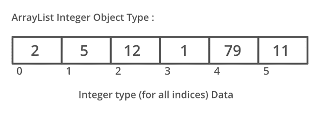
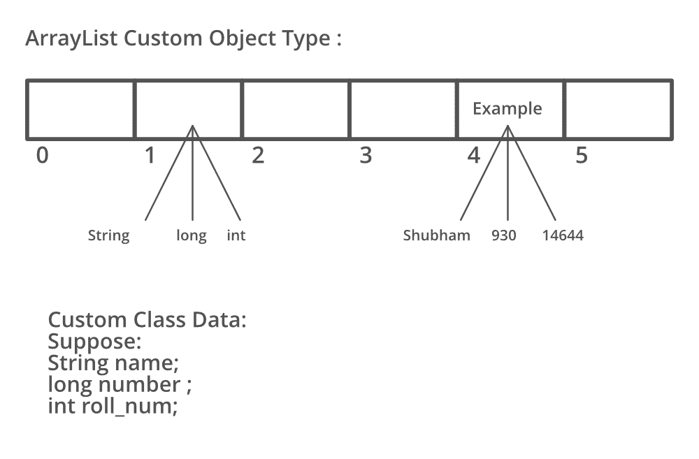

# Java 中的自定义数组列表

> 原文:[https://www.geeksforgeeks.org/custom-arraylist-java/](https://www.geeksforgeeks.org/custom-arraylist-java/)

在继续之前，让我们快速修改一下**数组**和**数组列表**的概念。所以在 java 中，我们已经看到数组是线性数据结构，提供了在内存地址空间中以连续方式添加元素的功能，而 ArrayList 是属于 Collection 框架的一个类。作为一名优秀的程序员，尽管知道数组和数组之间的区别，但已经知道在数组上使用数组列表。现在，即使使用数组列表，也有一个传递应该存储在数组列表中的元素的数据类型的功能，无论它是对象、字符串、整数、双精度、浮点等。

**语法:**

```java
Arraylist<DataType> al = new ArrayList<Datatype> ;
```

**注:**Java 中的 ArrayList(相当于 C++中的 vector)具有动态大小。它可以根据大小缩小或扩大。ArrayList 是集合框架的一部分，存在于 [java.util 包](https://www.geeksforgeeks.org/java-util-package-java/)中。

**语法:**

```java
ArrayList <E> list = new ArrayList <> ();
```

这里重要的是，这里的 E 代表一个对象数据类型，想象一下这里是**整数**。整数类将基本类型**的值包装在对象中。整数类型的对象包含一个类型为整数的字段。在继续之前，请仔细阅读 java 中[包装类](https://www.geeksforgeeks.org/wrapper-classes-java/)的概念，因为它将在后端提供服务，如果我们非常了解[自动装箱和取消装箱的概念](https://www.geeksforgeeks.org/autoboxing-unboxing-java/)，理解会更加清晰。这是因为在对列表中的元素执行操作时，它们的语法会有所不同，因此理解概念也会耗尽，假设考虑向自定义数组列表中添加元素的场景，并注意两者之间的语法差异。**

**语法:**

```java
ArrayList<Integer> al = new Arraylist<Integer>() ;
al.add(1) ;
```

**语法:**

```java
ArrayList alobj = new Arraylist() ;
alobj(new Integer(1)) ;
```

让我们举一个例子来理解如下:

插图:



在这里，我们拥有通常使用的相同类型的所有元素。现在，让我们提出相同的图形流数组列表，它简单地支持多个数据，如图所示。



在上面的 ArrayList 中，我们可以清楚地看到存储在中的元素是不同类型的。所以确实爆发出制约的概念。不仅是这个列表，我们还可以根据我们的类型灵活地制作列表，我们可以访问数组列表中的数据类型。这个列表在 java 中被称为自定义数组列表**。**自定义数组列表具有基于用户需求的属性，并且可以有多种类型的数据。该数据由自定义内部类提供，该类由各种原始对象数据类型组合而成。

**实现:**考虑一个需要输入为 **N** 的学生人数的情况，具体为:

*   **辊号**
*   **名称**
*   **标记**
*   **电话号码**

假设我们不知道 java 中自定义数组列表的概念，那么我们将生成下面列出的单个数组列表。因为我们定义了 4 个数组列表，并相应地在每个列表中保存数据。

```java
ArrayList<Integer> roll = new ArrayList<>();  // roll number
```

```java
 ArrayList<String> name = new ArrayList<>(); // name
```

```java
ArrayList<Integer> marks = new ArrayList<>(); //  marks
```

```java
ArrayList<Long> phone = new ArrayList<>();  // phone number 
```

现在，我们将对它们中的每一个进行迭代，以获取学生数据，这在更大程度上增加了我们程序的时间复杂性，如下所示。

```java
for (int i = 0; i < n; i++) 
{

    // Adding all the values to each arraylist
    // each arraylist has primitive datatypes

    roll.add(rollnum_i);
    name.add(name_i);
    marks.add(marks_i);
    phone.add(phone_i);
}
```

现在，让我们借助于上面学习的概念，通过实现相同的东西来做同样的事情。因此，为了构建我们的自定义数组列表，请执行下列步骤:

**程序:**构建自定义数组列表如下:

1.  构建一个数组列表对象，并将其类型作为类数据。
2.  定义一个类，并将所需的实体放入构造函数中。
3.  将这些实体链接到全局变量。
4.  从数组列表接收的数据属于存储多个数据的类类型。

**例**

## Java 语言(一种计算机语言，尤用于创建网站)

```java
// Java program to illustrate Custom ArrayList

// Importing ArrayList class from java.util package
import java.util.ArrayList;

// Class 1
// Outer class
// Main class
// CustomArrayList
class GFG {

    // Custom class which has data type class has
    // defined the type of data ArrayList
    // size of input 4
    int n = 4;

    // Class 2
    // Inner class
    // The custom datatype class
    class Data {

        // Global variables of the class
        int roll;
        String name;
        int marks;
        long phone;

        // Constructor has type of data that is required
        Data(int roll, String name, int marks, long phone)
        {

            // Initialize the input variable from main
            // function to the global variable of the class

            // this keyword refers to current instance
            this.roll = roll;
            this.name = name;
            this.marks = marks;
            this.phone = phone;
        }
    }

    // Method 1
    // Main driver method
    public static void main(String args[])
    {

        // Custom input data
        int roll[] = { 1, 2, 3, 4 };
        String name[]
            = { "Shubham", "Atul", "Ayush", "Rupesh" };
        int marks[] = { 100, 99, 93, 94 };
        long phone[] = { 8762357381L, 8762357382L,
                         8762357383L, 8762357384L };

        // Creating an object of the class
        GFG custom = new GFG();

        // Now calling function to add the values to the
        // arraylist
        custom.addValues(roll, name, marks, phone);
    }

    public void addValues(int roll[], String name[],
                          int marks[], long phone[])
    {
        // local custom arraylist of data type
        // Data having (int, String, int, long) type
        // from the class
        ArrayList<Data> list = new ArrayList<>();

        for (int i = 0; i < n; i++) {
            // create an object and send values to the
            // constructor to be saved in the Data class
            list.add(new Data(roll[i], name[i], marks[i],
                              phone[i]));
        }

        // after adding values printing the values to test
        // the custom arraylist
        printValues(list);
    }

    // Method 2
    // To print the values
    public void printValues(ArrayList<Data> list)
    {

        // list- the custom arraylist is sent from
        // previous function

        for (int i = 0; i < n; i++) {

            // Data received from arraylist is of Data type
            // which is custom (int, String, int, long)
            // based on class Data
            Data data = list.get(i);

            // Print and display custom ArrayList elements
            // that holds for student attribute

            // Data variable of type Data has four primitive
            // datatypes roll -int name- String marks- int
            // phone- long
            System.out.println(data.roll + " " + data.name
                               + " " + data.marks + " "
                               + data.phone);
        }
    }
}
```

**Output**

```java
1 Shubham 100 8762357381
2 Atul 99 8762357382
3 Ayush 93 8762357383
4 Rupesh 94 8762357384
```

本文由 **Shubham Saxena** 供稿。如果你喜欢 GeeksforGeeks 并想投稿，你也可以使用[write.geeksforgeeks.org](https://write.geeksforgeeks.org)写一篇文章或者把你的文章邮寄到 review-team@geeksforgeeks.org。看到你的文章出现在极客博客主页上，帮助其他极客。如果你发现任何不正确的地方，或者你想分享更多关于上面讨论的话题的信息，请写评论。