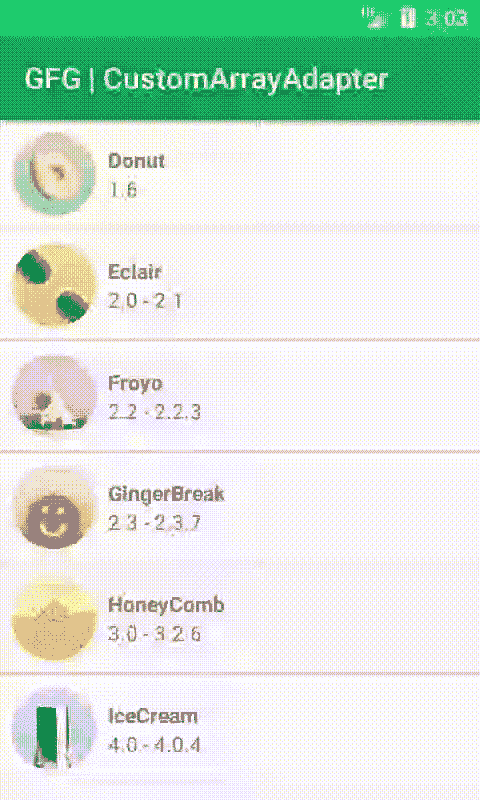

# 安卓中的习惯性适配器，示例

> 原文:[https://www . geeksforgeeks . org/habitrayadapter-in-Android-with-example/](https://www.geeksforgeeks.org/customarrayadapter-in-android-with-example/)

在 Android 中， [ArrayAdapters](https://www.geeksforgeeks.org/arrayadapter-in-android-with-example/) 用于填充和控制 [ListView](https://www.geeksforgeeks.org/android-listview-in-java-with-example/) 和 [Spinners](https://www.geeksforgeeks.org/spinner-in-android-using-java-with-example/) 。默认情况下，ArrayAdapter 提供仅包含单个信息或单个[文本视图](https://www.geeksforgeeks.org/textview-widget-in-android-using-java-with-examples/)的列表项。为了有一个更复杂的布局，在一个列表项中包含多个信息，如图像、文本等。我们使用**习惯上的适配器**。像 Instagram、WhatsApp 等应用程序都在使用如此复杂的布局。

## **例**

在这个例子中，我们将为不同版本的安卓操作系统制作一个应用程序，它有一个[图像视图](https://www.geeksforgeeks.org/imageview-in-kotlin/)和一个显示版本名称的文本视图。下面给出了一个示例 GIF，以了解我们将在本文中做什么。请注意，我们将使用 **Java** 语言来实现这个项目。



### **分步实施**

**第一步:创建新项目**

要在安卓工作室创建新项目，请参考[如何在安卓工作室创建/启动新项目](https://www.geeksforgeeks.org/android-how-to-create-start-a-new-project-in-android-studio/)。。注意选择 **Java** 作为编程语言。

**步骤 2:使用 activity_main.xml 文件**

在这一步中，我们将向我们的 activity_main.xml 文件添加一个 ListView，用于显示 listItems 的数据。转到**应用程序> res >布局> activity_main.xml** 和以下代码片段。

## 可扩展标记语言

```
<?xml version="1.0" encoding="utf-8"?>
<RelativeLayout 
    xmlns:android="http://schemas.android.com/apk/res/android"
    xmlns:app="http://schemas.android.com/apk/res-auto"
    xmlns:tools="http://schemas.android.com/tools"
    android:layout_width="match_parent"
    android:layout_height="match_parent"
    tools:context=".MainActivity">

    <ListView
        android:id="@+id/listView"
        android:layout_width="match_parent"
        android:layout_height="wrap_content"
        android:dividerHeight="2dp" />

</RelativeLayout>
```

在进一步移动之前，让我们添加一些颜色属性，以增强应用程序栏。转到**应用程序> res >值> colors.xml** 并添加以下颜色属性。

## 可扩展标记语言

```
<resources> 
    <color name="colorPrimary">#0F9D58</color> 
    <color name="colorPrimaryDark">#16E37F</color> 
    <color name="colorAccent">#03DAC5</color> 
</resources> 
```

**第三步:新建布局文件 list_item.xml**

在这一步中，我们将为单个列表项视图创建一个布局文件。转到 **app > res >布局>右键>新建>布局资源文件**并将其命名为**列表 _ 项**。**列表项 xml** 包含一个图像视图和一个文本视图，用于填充列表视图。

## 可扩展标记语言

```
<?xml version="1.0" encoding="utf-8"?>
<LinearLayout 
    xmlns:android="http://schemas.android.com/apk/res/android"
    android:layout_width="match_parent"
    android:layout_height="wrap_content"
    android:orientation="horizontal">

    <!--For image src we have used ic_launcher
        and for text "GeeksForGeeks" and "gfg" 
        they are used only for reference how it will looks"-->
    <ImageView
        android:id="@+id/androidVersionImage"
        android:layout_width="72dp"
        android:layout_height="72dp"
        android:padding="8dp"
        android:src="@mipmap/ic_launcher_round" />

    <LinearLayout
        android:layout_width="wrap_content"
        android:layout_height="wrap_content"
        android:layout_gravity="center"
        android:orientation="vertical">

        <TextView
            android:id="@+id/androidVersionName"
            android:layout_width="wrap_content"
            android:layout_height="wrap_content"
            android:text="GeeksForGeeks"
            android:textStyle="bold" />

        <TextView
            android:id="@+id/androidVersionNumber"
            android:layout_width="wrap_content"
            android:layout_height="wrap_content"
            android:text="gfg" />
    </LinearLayout>

</LinearLayout>
```

**第 4 步:创建一个新的 Java 类 Item.java**

我们将创建一个新的 java 类，并将其命名为**项**。Item.java 包含三个私有成员变量 androidVersionImage、androidVersionName 和 androidVersionNumber。稍后，我们将创建这种项目类型的数组列表。进入 **app > java >包>右键>新建 java 类**。

## Java 语言(一种计算机语言，尤用于创建网站)

```
public class Item {

    private int androidVersionImage;
    private String androidVersionName;
    private String androidVersionNumber;

    // Constructor
    public Item(int androidVersionImage, String androidVersionName, String androidVersionNumber) {
        this.androidVersionImage = androidVersionImage;
        this.androidVersionName = androidVersionName;
        this.androidVersionNumber = androidVersionNumber;

    }

    // Getters and Setters method
    public int getAndroidVersionImage() {
        return androidVersionImage;
    }

    public void setAndroidVersionImage(int androidVersionImage) {
        this.androidVersionImage = androidVersionImage;
    }

    public String getAndroidVersionName() {
        return androidVersionName;
    }

    public void setAndroidVersionName(String androidVersionName) {
        this.androidVersionName = androidVersionName;
    }

    public String getAndroidVersionNumber() {
        return androidVersionNumber;
    }

    public void setAndroidVersionNumber(String androidVersionNumber) {
        this.androidVersionNumber = androidVersionNumber;
    }
}
```

**步骤 5:创建适配器类**

现在，我们将创建一个适配器类，作为用户界面组件和数据源之间的桥梁。进入 **app > java >包>右键创建一个新的 java 类**并命名为 Adapter。下面是给出的代码片段。

## Java 语言(一种计算机语言，尤用于创建网站)

```
import android.content.Context;
import android.view.LayoutInflater;
import android.view.View;
import android.view.ViewGroup;
import android.widget.ArrayAdapter;
import android.widget.ImageView;
import android.widget.TextView;
import java.util.ArrayList;

public class Adapter extends ArrayAdapter <Item> {

    ImageView imageView;
    TextView textView1, textView2;
    ArrayList <Item> androidVersionList = new ArrayList <>();

    public Adapter(Context context, int textViewResourceId, ArrayList <Item> objects) {
        super(context, textViewResourceId, objects);
        androidVersionList = objects;
    }

    // Returns total number of items to be displayed in the list.
    // It counts the value from the arraylist size
    @Override
    public int getCount() {
        return super.getCount();
    }

    // This function implicitly gets called when the listItem view is ready
    // to be displayed. Here we set the layout and add data to the views
    @Override
    public View getView(int position, View convertView, ViewGroup viewGroup) {
        View view = convertView;

          // Setting layout
        LayoutInflater layoutInflater = (LayoutInflater) getContext().getSystemService(Context.LAYOUT_INFLATER_SERVICE);
        view = layoutInflater.inflate(R.layout.list_item, null);
        imageView = (ImageView) view.findViewById(R.id.androidVersionImage);
        textView1 = (TextView) view.findViewById(R.id.androidVersionName);
        textView2 = (TextView) view.findViewById(R.id.androidVersionNumber);

           // Adding data to the Views
        imageView.setImageResource(androidVersionList.get(position).getAndroidVersionImage());
        textView1.setText(androidVersionList.get(position).getAndroidVersionName());
        textView2.setText(androidVersionList.get(position).getAndroidVersionNumber());
        return view;
    }
}
```

**步骤 6:使用 MainActivity.java 文件**

在 MainActivity.java 课上，我们创建了一个数组列表来存储图像和文本。这些图像被放置在可绘制文件夹(**应用程序> res >可绘制**)中。你可以用任何图像来代替它。我们获取列表视图的引用，并在列表视图上设置适配器。

## Java 语言(一种计算机语言，尤用于创建网站)

```
import androidx.appcompat.app.AppCompatActivity;
import android.os.Bundle;
import android.widget.ListView;
import java.util.ArrayList;

public class MainActivity extends AppCompatActivity {

    ListView listView;
    ArrayList <Item> androidVersionList = new ArrayList <>();

    @Override
    protected void onCreate(Bundle savedInstanceState) {
        super.onCreate(savedInstanceState);
        setContentView(R.layout.activity_main);

          // Getting the reference of listView
        listView = (ListView) findViewById(R.id.listView);

          // Adding image and texts to list
        androidVersionList.add(new Item(R.drawable.donut, "Donut", "1.6"));
        androidVersionList.add(new Item(R.drawable.eclair, "Eclair", "2.0 - 2.1"));
        androidVersionList.add(new Item(R.drawable.froyo, "Froyo", "2.2 - 2.2.3"));
        androidVersionList.add(new Item(R.drawable.gingerbread, "GingerBreak", "2.3 - 2.3.7"));
        androidVersionList.add(new Item(R.drawable.honeycomb, "HoneyComb", "3.0 - 3.2.6"));
        androidVersionList.add(new Item(R.drawable.icecream, "IceCream", "4.0 - 4.0.4"));
        androidVersionList.add(new Item(R.drawable.jellybean, "JellyBean", "4.1 - 4.3.1"));
        androidVersionList.add(new Item(R.drawable.kitkat, "KitKat", "4.4 - 4.4.4"));
        androidVersionList.add(new Item(R.drawable.lollipop, "Lollipop", "5.0 - 5.1.1"));
        androidVersionList.add(new Item(R.drawable.marshmallow, "Marshmallow", "6.0 - 6.0.1"));

        Adapter adapter = new Adapter(this, R.layout.list_item, androidVersionList);

          // Setting the adapter to list
        listView.setAdapter(adapter);
    }
}
```

### **输出:在仿真器上运行**

