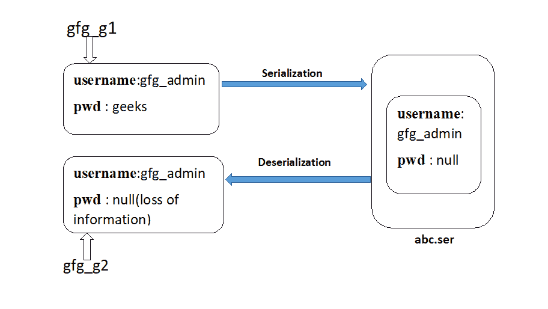
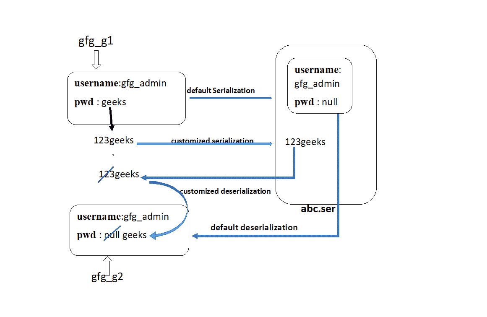

# Java 中定制的序列化和反序列化

> 原文:[https://www . geesforgeks . org/customized-序列化和反序列化-in-java/](https://www.geeksforgeeks.org/customized-serialization-and-deserialization-in-java/)

[序列化](https://www.geeksforgeeks.org/serialization-in-java/)是一种将对象状态转换为字节流的机制。反序列化是相反的过程，字节流用于在内存中重新创建实际的 Java 对象。这种机制用于持久化对象。

**为什么需要自定义序列化？**

在序列化过程中，如果我们使用“transient”关键字，可能会丢失数据。Transient 关键字用于我们不想序列化的变量。但是有时，需要以不同于默认序列化的方式序列化它们(例如在序列化之前加密等)。)，在这种情况下，我们必须使用自定义序列化和反序列化。

下面的程序说明了上述数据丢失的情况:

```java
// Java program to illustrate loss of information
// because of transient keyword.
import java.io.*;

class GfgAccount implements Serializable {

    String username = "gfg_admin";

    transient String pwd = "geeks";

}

class CustomizedSerializationDemo {
    public static void main(String[] args) throws Exception
    {
        GfgAccount gfg_g1 = new GfgAccount();

        System.out.println("Username : " + gfg_g1.username + 
                                 "    Password : " + gfg_g1.pwd);

        FileOutputStream fos = new FileOutputStream("abc.ser");

        ObjectOutputStream oos = new ObjectOutputStream(fos);

        // writeObject() method present in GfgAccount class
        // will be automatically called by jvm
        oos.writeObject(gfg_g1);

        FileInputStream fis = new FileInputStream("abc.ser");

        ObjectInputStream ois = new ObjectInputStream(fis);

        // readObject() method present GfgAccount class
        // will be automatically called by jvm
        GfgAccount gfg_g2 = (GfgAccount)ois.readObject();

        System.out.println("Username : " + gfg_g2.username + 
                               "      Password : " + gfg_g2.pwd);
    }
}
```

**输出**:

```java
Username : gfg_admin    Password : geeks
Username : gfg_admin    Password : null

```


在上面的图像示例中，在序列化之前，Account 对象可以提供正确的用户名和密码，但是 Account 对象的反序列化只提供用户名而不提供密码。这是由于将密码变量声明为瞬态的。

因此，在默认序列化期间，可能会因为 transient 关键字而丢失信息。为了弥补这一损失，我们将不得不使用**定制序列化。**

可以使用以下两种方法实现自定义序列化:

*   **private void writeObject(ObjectOutputStream oos) throws Exception: This method will be executed automatically by the jvm(also known as Callback Methods) at the time of serialization. Hence to perform any activity during serialization, it must be defined only in this method.***   ****private void readObject(ObjectInputStream ois) throws Exception: This method will be executed automatically by the jvm(also known as Callback Methods) at the time of deserialization. Hence to perform any activity during deserialization, it must be defined only in this method.

    **注意:**在执行对象序列化时，我们必须在那个类中定义上面两个方法。

    ```java
    // Java program to illustrate customized serialization
    import java.io.*;

    class GfgAccount implements Serializable {

        String username = "gfg_admin";

        transient String pwd = "geeks";

        // Performing customized serialization using the below two methods:
        // this method is executed by jvm when writeObject() on
        // Account object reference in main method is
        // executed by jvm.
        private void writeObject(ObjectOutputStream oos) throws Exception
        {
            // to perform default serialization of Account object.
            oos.defaultWriteObject();

            // epwd (encrypted password)
            String epwd = "123" + pwd;

            // writing encrypted password to the file
            oos.writeObject(epwd);
        }

        // this method is executed by jvm when readObject() on
        // Account object reference in main method is executed by jvm.
        private void readObject(ObjectInputStream ois) throws Exception
        {
            // performing default deserialization of Account object
            ois.defaultReadObject();

            // deserializing the encrypted password from the file
            String epwd = (String)ois.readObject();

            // decrypting it and saving it to the original password
            // string starting from 3rd  index till the last index
            pwd = epwd.substring(3);
        }
    }

    class CustomizedSerializationDemo {
        public static void main(String[] args) throws Exception
        {
            GfgAccount gfg_g1 = new GfgAccount();

            System.out.println("Username :" + gfg_g1.username +
                               "       Password :" + gfg_g1.pwd);

            FileOutputStream fos = new FileOutputStream("abc.ser");

            ObjectOutputStream oos = new ObjectOutputStream(fos);

            // writeObject() method on Account class will
            // be automatically called by jvm
            oos.writeObject(gfg_g1);

            FileInputStream fis = new FileInputStream("abc.ser");

            ObjectInputStream ois = new ObjectInputStream(fis);

            GfgAccount gfg_g2 = (GfgAccount)ois.readObject();

            System.out.println("Username :" + gfg_g2.username + 
                                 "       Password :" + gfg_g2.pwd);
        }
    }
    ```

    **输出**:

    ```java
    Username :gfg_admin    Password :geeks
    Username :gfg_admin    Password :geeks

    ```

    ****