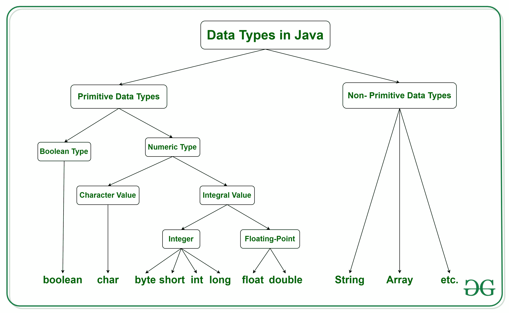
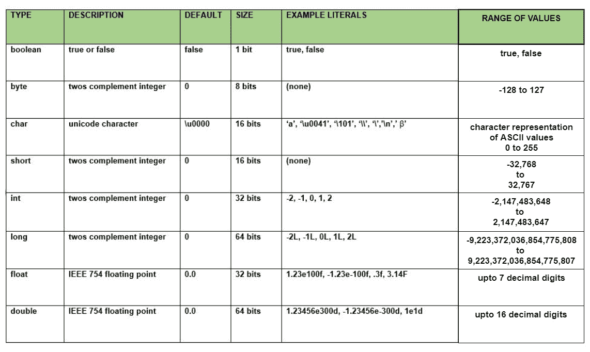

# Java 中的数据类型

> 原文:[https://www.geeksforgeeks.org/data-types-in-java/](https://www.geeksforgeeks.org/data-types-in-java/)

主要有两种语言。

*   首先，一种是**静态类型语言**，其中每个变量和表达式类型在编译时都是已知的。一旦变量被声明为某个数据类型，它就不能保存其他数据类型的值。
    **示例:** C，C++，Java。
*   另一种是**动态类型语言。**随着时间的推移，这些语言可以接收不同的数据类型。
    T3】例:红宝石，蟒蛇

Java 是**静态类型的，也是强类型语言**，因为在 Java 中，每种类型的数据(如整数、字符、十六进制、打包十进制等)都是作为编程语言的一部分预定义的，为给定程序定义的所有常量或变量都必须用其中一种数据类型来描述。
**Java 中的数据类型**



Java 有两类数据:

*   **基本数据类型:**如布尔、字符、整数、短、字节、长、浮点和双精度
*   **非原始数据类型或对象数据类型:**如字符串、数组等。

**原始数据类型**

原始数据只是单个值，没有特殊功能。



有 **8 种原始数据类型** :

**<u>1。布尔:</u>** 布尔数据类型只代表一位信息**非真即假**，但是布尔数据类型的大小是**虚拟机相关的**。布尔类型的值不会隐式或显式(通过强制转换)转换为任何其他类型。但是程序员可以轻松编写转换代码。

*   **语法:**

```java
boolean booleanVar;

```

*   **大小:**T2】

```java
virtual machine dependent

```

*   **价值观:**

```java
true, false

```

*   **默认值:**

```java
false

```

## Java 语言(一种计算机语言，尤用于创建网站)

```java
// Java program to demonstrate boolean data type

class GeeksforGeeks {
    public static void main(String args[])
    {
        boolean b = true;
        if (b == true)
            System.out.println("Hi Geek");
    }
}
```

**Output:** 

```java
Hi Geek

```

**<u>2。字节:</u>** 字节数据类型是一个 8 位有符号二进制补码整数。字节数据类型对于在大型数组中节省内存很有用。

*   **语法:**

```java
byte byteVar;

```

*   **大小:**T2】

```java
1 byte ( 8 bits )

```

*   **价值观:**

```java
-128 to 127

```

*   **默认值:**

```java
0

```

## Java 语言(一种计算机语言，尤用于创建网站)

```java
// Java program to demonstrate byte data type in Java

class GeeksforGeeks {
    public static void main(String args[])
    {
        byte a = 126;

        // byte is 8 bit value
        System.out.println(a);

        a++;
        System.out.println(a);

        // It overflows here because
        // byte can hold values from -128 to 127
        a++;
        System.out.println(a);

        // Looping back within the range
        a++;
        System.out.println(a);
    }
}
```

**Output:** 

```java
126
127
-128
-127

```

**<u>3。短:</u>** 短数据类型是 16 位有符号二进制补码整数。与 byte 类似，在内存节省非常重要的情况下，使用 short 来节省大型数组中的内存。

*   **语法:**

```java
short shortVar;

```

*   **大小:**T2】

```java
2 byte ( 16 bits )

```

*   **价值观:**

```java
-32, 768 to 32, 767 (inclusive)

```

*   **默认值:**

```java
0

```

**<u>4。int</u>** <u>:</u> 这是一个 32 位有符号二进制补码整数。

*   **语法:**

```java
int intVar;

```

*   **大小:**T2】

```java
4 byte ( 32 bits )

```

*   **价值观:**

```java
-2, 147, 483, 648 to 2, 147, 483, 647 (inclusive)

```

*   **默认值:**

```java
0

```

*   **注意:**在 Java SE 8 及更高版本中，我们可以使用 int 数据类型来表示无符号的 32 位整数，其值在[0，2]<sup>32</sup>-1]的范围内。使用 Integer 类将 int 数据类型用作无符号整数。

**<u>5。long:</u>** 长数据类型是 64 位二进制补码整数。

*   **语法:**

```java
long longVar;

```

*   **大小:**T2】

```java
8 byte ( 64 bits )

```

*   **值:**

```java
-9, 223, 372, 036, 854, 775, 808 
          to 
9, 223, 372, 036, 854, 775, 807
      (inclusive)

```

*   **默认值:**

```java
0

```

*   **注意:**在 Java SE 8 及更高版本中，可以使用 long 数据类型表示无符号的 64 位长，最小值为 0，最大值为 2 <sup>64</sup> -1。long 类还包含比较无符号、除无符号等方法，以支持无符号 Long 的算术运算。

**<u>6。浮点:</u>** 浮点数据类型是单精度 32 位 [IEEE 754](https://en.wikipedia.org/wiki/IEEE_floating_point) 浮点。如果需要在大型浮点数数组中节省内存，请使用浮点数(而不是双精度浮点数)。

*   **语法:**

```java
float floatVar;

```

*   **大小:**T2】

```java
4 byte ( 32 bits )

```

*   **价值观:**

```java
upto 7 decimal digits

```

*   **默认值:**

```java
0.0

```

**<u>7。double:</u>**double 数据类型是双精度 64 位 IEEE 754 浮点。对于十进制值，这种数据类型通常是默认选择。

*   **语法:**

```java
double doubleVar;

```

*   **大小:**T2】

```java
8 byte ( 64 bits )

```

*   **价值观:**

```java
upto 16 decimal digits

```

*   **默认值:**

```java
0.0

```

*   **注:**浮点和双精度数据类型都是专为科学计算设计的，在这种情况下，近似误差是可以接受的。如果准确性是最优先考虑的问题，建议不要使用这些数据类型，而是使用[大十进制](http://docs.oracle.com/javase/1.5.0/docs/api/java/math/BigDecimal.html)类。
    详情请见此:[*Java 中的舍入误差*](https://www.geeksforgeeks.org/rounding-off-errors-java/)

**<u>8。char</u>**<u>:char 数据类型为单个 16 位 Unicode 字符。</u> 

*   **语法:**

```java
char charVar;

```

*   **大小:**T2】

```java
2 byte ( 16 bits )

```

*   **价值观:**

```java
'\u0000' (0) to '\uffff' (65535)

```

*   **默认值:**

```java
'\u0000'

```

**为什么在 java 中 char 的大小是 2 字节..？**
在其他语言中，如 C/C++只使用 ASCII 字符，用 8 位来表示所有的 ASCII 字符就足够了，
但是 java 使用的是 Unicode 系统而不是 ASCII 代码系统，用 8 位来表示 Unicode 系统不足以表示所有的字符，所以 java 使用 2 字节来表示字符。
***Unicode** 定义了一个完全国际化的字符集，可以代表世界上大多数的书面语言。它是几十种字符集的统一，如拉丁语、希腊语、* *西里尔语、片假名、阿拉伯语*、*等等。*

## Java 语言(一种计算机语言，尤用于创建网站)

```java
// Java program to demonstrate
// primitive data types in Java

class GeeksforGeeks {
    public static void main(String args[])
    {
        // declaring character
        char a = 'G';

        // Integer data type is generally
        // used for numeric values
        int i = 89;

        // use byte and short
        // if memory is a constraint
        byte b = 4;

        // this will give error as number is
        // larger than byte range
        // byte b1 = 7888888955;

        short s = 56;

        // this will give error as number is
        // larger than short range
        // short s1 = 87878787878;

        // by default fraction value
        // is double in java
        double d = 4.355453532;

        // for float use 'f' as suffix
        float f = 4.7333434f;

        System.out.println("char: " + a);
        System.out.println("integer: " + i);
        System.out.println("byte: " + b);
        System.out.println("short: " + s);
        System.out.println("float: " + f);
        System.out.println("double: " + d);
    }
}
```

**Output:** 

```java
char: G
integer: 89
byte: 4
short: 56
float: 4.7333436
double: 4.355453532

```

**非原始数据类型或参考数据类型**

**引用数据类型**将包含变量值的内存地址，因为引用类型不会将变量值直接存储在内存中。分别是 [**弦**](https://www.geeksforgeeks.org/strings-in-java/)[**物**](https://www.geeksforgeeks.org/classes-objects-java/)[阵](https://www.geeksforgeeks.org/arrays-in-java/)等。

*   [**字符串**](https://www.geeksforgeeks.org/strings-in-java/) :字符串定义为字符数组。在 Java 中，字符数组和字符串的区别在于，字符串被设计为在单个变量中保存一系列字符，而字符数组是独立字符类型实体的集合。
*   与 C/C++不同，Java 字符串不以空字符结尾。
    下面是用 Java 编程语言声明字符串的基本语法。
    **语法:**

```java
<String_Type> <string_variable> = “<sequence_of_string>”;

```

*   **例:**

```java
// Declare String without using new operator 
String s = "GeeksforGeeks"; 

// Declare String using new operator 
String s1 = new String("GeeksforGeeks"); 

```

*   [**类**](https://www.geeksforgeeks.org/classes-objects-java/) :类是用户自定义的蓝图或原型，从中创建对象。它表示一种类型的所有对象共有的一组属性或方法。一般来说，类声明可以包含这些组件，顺序如下:
    1.  **修饰符**:类可以是公共的，也可以是默认访问的(详见[本](https://www.geeksforgeeks.org/access-specifiers-for-classes-or-interfaces-in-java/))。
    2.  **类名:**名称应以首字母(按惯例大写)开头。
    3.  **超类(如果有的话):**类的父类(超类)的名称，如果有的话，前面加关键字 extends。一个类只能扩展(子类)一个父类。
    4.  **接口(如果有):**类实现的以逗号分隔的接口列表(如果有)，前面有关键字 implements。一个类可以实现多个接口。
    5.  **Body:** 大括号包围的类体，{ }。
*   [**Object**](https://www.geeksforgeeks.org/classes-objects-java/) :是面向对象编程的基本单元，代表现实生活中的实体。一个典型的 Java 程序会创建许多对象，正如您所知，这些对象通过调用方法进行交互。一个对象包括:
    1.  **状态**:用一个对象的属性来表示。它还反映了对象的属性。
    2.  **行为**:用一个对象的方法来表示。它还反映了一个对象与其他对象的反应。
    3.  **身份**:为一个对象赋予唯一的名称，使一个对象能够与其他对象进行交互。
*   [**接口**](https://www.geeksforgeeks.org/interfaces-in-java/) **:** 像类一样，接口可以有方法和变量，但是接口中声明的方法默认是抽象的(只有方法签名，没有人)。
    *   接口指定类必须做什么，而不是如何做。它是班级的蓝图。
    *   接口是关于功能的，比如玩家可以是一个接口，任何实现玩家的类都必须能够(或者必须实现)移动()。所以它指定了类必须实现的一组方法。
    *   如果一个类实现了一个接口，并且没有为接口中指定的所有函数提供方法体，那么这个类必须被声明为抽象的。
    *   一个 Java 库的例子是，[比较器接口](https://www.geeksforgeeks.org/comparator-interface-java/)。如果一个类实现了这个接口，那么它可以用来对集合进行排序。
*   [**数组**](https://www.geeksforgeeks.org/arrays-in-java/) **:** 数组是一组相似类型的变量，用一个共同的名字来指代。Java 中的数组与 C/C++中的不同。以下是关于 Java 数组的一些要点。
    *   在 Java 中，所有数组都是动态分配的。(下面讨论)

    *   因为数组在 Java 中是对象，所以我们可以使用成员长度来找到它们的长度。这与 C/C++不同，在 C/c++中，我们使用大小来查找长度。
    *   Java 数组变量也可以像其他变量一样，在数据类型后用[]声明。
    *   数组中的变量是有序的，每个变量都有一个从 0 开始的索引。
    *   Java 数组也可以用作静态字段、局部变量或方法参数。
    *   数组的**大小**必须由一个 int 值指定，不能是长的或短的。
    *   数组类型的直接超类是[对象](https://www.geeksforgeeks.org/object-class-in-java/)。

    *   每个数组类型都实现了接口[可克隆](https://www.geeksforgeeks.org/marker-interface-java/)和 [java.io.Serializable](https://www.geeksforgeeks.org/serialization-in-java/) 。

[Java 中的数据类型测验](https://www.geeksforgeeks.org/java-gq/data-types-2-gq/)
本文由 **Shubham Agrawal** 供稿。如果你喜欢 GeeksforGeeks 并想投稿，你也可以使用[contribute.geeksforgeeks.org](http://www.contribute.geeksforgeeks.org)写一篇文章或者把你的文章邮寄到 contribute@geeksforgeeks.org。看到你的文章出现在极客博客主页上，帮助其他极客。
如果发现有不正确的地方，或者想分享更多关于上述话题的信息，请写评论。