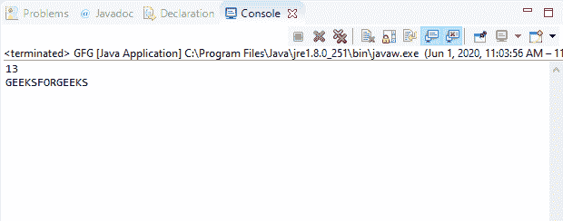
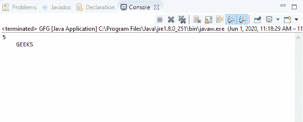

# Java 中的 DataInputStream read()方法，带示例

> 原文:[https://www . geesforgeks . org/datainputstream-read-method-in-Java-with-examples/](https://www.geeksforgeeks.org/datainputstream-read-method-in-java-with-examples/)

Java 中**数据输入流**类的 **read()** 方法有两种类型:

1.  **read(byte[] b)** method of **DataInputStream** class in Java is used to read bytes from the input stream and store them into the buffer byte array.This read() method returns the number of bytes actually read as an integer type. This method returns -1 if the input stream is ended and no more data is available to read. This method throws an exception if the byte array is null.

    **语法:**

    ```
    public final int read(byte[] b)
                   throws IOException

    ```

    **覆盖:**该方法覆盖 **FilterInputStream** 类的 read()方法。

    **参数:**该方法接受一个参数 b，该参数代表数据要读入的字节数组。

    **返回值:**此方法返回实际读取的字节数。如果输入流结束并且没有更多数据可供读取，则返回-1。

    **异常:**

    *   **空指针异常**–如果字节数组为空，它会抛出**空指针异常**。
    *   **IOException**–如果流关闭或发生其他输入/输出错误，该方法将抛出 **IOException** 。

    下面的程序说明了 IO 包中 DataInputStream 类的 read(byte[])方法:

    **程序:**假设存在文件“c:/demo.txt”。

    ```
    // Java program to illustrate
    // DataInputStream read(byte[]) method
    import java.io.*;
    public class GFG {
        public static void main(String[] args)
            throws IOException
        {

            // Create input stream 'demo.txt'
            // for reading containing
            // text "GEEKSFORGEEKS"
            FileInputStream inputStream
                = new FileInputStream(
                    "c:/demo.txt");

            // Convert inputStream to
            // DataInputStream
            DataInputStream dataInputStr
                = new DataInputStream(
                    inputStream);

            // Count the total bytes
            // form the input stream
            int count = inputStream.available();

            // Create byte array
            byte[] b = new byte[count];

            // Read data into byte array
            int bytes = dataInputStr.read(b);

            // Print number of bytes
            // actually read
            System.out.println(bytes);

            for (byte by : b) {
                // Print the character
                System.out.print((char)by);
            }
        }
    }
    ```

    **Input:**[](https://media.geeksforgeeks.org/wp-content/uploads/20200601110642/INPUT_GEEKSFORGEEKS8.png)**Output:**[](https://media.geeksforgeeks.org/wp-content/uploads/20200601110711/data_read-1.png)
2.  **read(byte[] b, int offset, int length)** method of **DataInputStream** class in Java is used to read specified number of bytes from the input stream and store them into the buffer byte array.This read() method returns the number of bytes actually read as an integer type. This method returns -1 if the input stream is ended and no more data is available to read. This method throws an exception if the byte array is null.

    **语法:**

    ```
    public final int read(byte[] b,
                          int offset,
                          int length)
                   throws IOException

    ```

    **覆盖:**该方法覆盖 **FilterInputStream** 类的 read()方法。

    **参数:**该方法接受三个参数:

    *   **b**–表示数据要读入的字节数组。
    *   **偏移量**–表示字节数组中的起始索引。
    *   **长度**–表示要读取的字节总数。

    **返回值:**此方法返回实际读取的字节数。如果输入流结束并且没有更多数据可供读取，则返回-1。

    **异常:**

    *   **空指针异常**–如果字节数组为空，它会抛出**空指针异常**。
    *   如果偏移量为负或长度为负或长度大于字节数组长度和偏移量之差，则抛出**索引。**
    *   **IOException**–如果流关闭或发生其他输入/输出错误，该方法将抛出 **IOException** 。

    下面的程序说明了 IO 包中 DataInputStream 类的 read(byte[]，int，int)方法:

    **程序:**假设存在文件“c:/demo.txt”。

    ```
    // Java program to illustrate
    // DataInputStream read(byte[], int, int) method
    import java.io.*;
    public class GFG {
        public static void main(String[] args)
            throws IOException
        {

            // Create input stream 'demo.txt'
            // for reading containing
            // text "GEEKSFORGEEKS"
            FileInputStream inputStream
                = new FileInputStream(
                    "c:/demo.txt");

            // Convert inputStream to
            // DataInputStream
            DataInputStream dataInputStr
                = new DataInputStream(
                    inputStream);

            // Count the total bytes
            // form the input stream
            int count = inputStream.available();

            // Create byte array
            byte[] b = new byte[count];

            // Read data into byte array
            int bytes = dataInputStr.read(b, 4, 5);

            // Print number of bytes
            // actually read
            System.out.println(bytes);

            for (byte by : b) {
                // Print the character
                System.out.print((char)by);
            }
        }
    }
    ```

    **Input:**[](https://media.geeksforgeeks.org/wp-content/uploads/20200601110642/INPUT_GEEKSFORGEEKS8.png)**Output:**[](https://media.geeksforgeeks.org/wp-content/uploads/20200601112039/data_read-2.png)

**参考资料:**
1。[https://docs . Oracle . com/javae/10/docs/API/Java/io/datainputstream . html # read(字节% 5b % 5d)](https://docs.oracle.com/javase/10/docs/api/java/io/DataInputStream.html#read(byte%5B%5D))T2。[https://docs . Oracle . com/javae/10/docs/API/Java/io/datainputstream . html # read(字节%5B%5D，int，int)](https://docs.oracle.com/javase/10/docs/api/java/io/DataInputStream.html#read(byte%5B%5D, int, int))