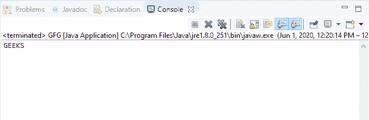
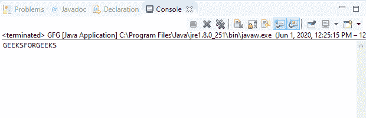

# Java 中的 DataInputStream readChar()方法，带示例

> 原文:[https://www . geesforgeks . org/datainputstream-readchar-method-in-Java-with-examples/](https://www.geeksforgeeks.org/datainputstream-readchar-method-in-java-with-examples/)

Java 中 **DataInputStream** 类的 **readChar()** 方法用于读取两个输入字节并返回一个 Char 值。这个方法基本上是以字符的形式读取由 DataOutputStream 类的 writechar()方法写入的字节。

**语法:**

```
public final char readChar()
          throws IOException

```

**指定者:**该方法由**数据输入**界面的 readChar()方法指定。

**参数:**此方法不接受任何参数。

**返回值:**这个方法返回输入流的两个字节解释的字符值。

**异常:**

*   **eofeexception**–如果输入流在读取两个字节之前结束，它将抛出**eofeexception**。
*   **IOException**–如果流关闭或发生其他输入/输出错误，该方法将抛出 **IOException** 。

下面的程序说明了 IO 包中 DataInputStream 类中的 readChar()方法:

**程序 1:** 假设存在文件“demo.txt”。

```
// Java program to illustrate
// DataInputStream readChar() method
import java.io.*;
public class GFG {
    public static void main(String[] args)
        throws IOException
    {

        // Create byte array
        byte[] buf = { 71, 69, 69, 75, 83 };

        // Create file output stream
        FileOutputStream outputStream
            = new FileOutputStream("c:\\demo.txt");

        // Create data output stream
        DataOutputStream dataOutputStr
            = new DataOutputStream(outputStream);

        for (byte b : buf) {
            // Write character to
            // the dataOutputStream
            dataOutputStr.writeChar(b);
        }

        dataOutputStr.flush();

        // Create file input stream
        FileInputStream inputStream
            = new FileInputStream("c:\\demo.txt");

        // Create data input stream
        DataInputStream dataInputStr
            = new DataInputStream(inputStream);

        while (dataInputStr.available() > 0) {
            // Print character
            System.out.print(
                dataInputStr.readChar());
        }
    }
}
```

**Output:**[](https://media.geeksforgeeks.org/wp-content/uploads/20200601123031/data_char-1.png)

**程序 2:** 假设文件“demo.txt”的存在。

```
// Java program to illustrate
// DataInputStream readChar() method
import java.io.*;
public class GFG {
    public static void main(String[] args)
        throws IOException
    {

        // Create byte array
        byte[] buf = { 71, 69, 69, 75, 83,
                       70, 79, 82, 71, 69,
                       69, 75, 83 };
        // Create file output stream
        FileOutputStream outputStream
            = new FileOutputStream("c:\\demo.txt");

        // Create data output stream
        DataOutputStream dataOutputStr
            = new DataOutputStream(outputStream);

        for (byte b : buf) {
            // Write character to
            // the dataOutputStream
            dataOutputStr.writeChar(b);
        }

        dataOutputStr.flush();

        // Create file input stream
        FileInputStream inputStream
            = new FileInputStream("c:\\demo.txt");

        // Create data input stream
        DataInputStream dataInputStr
            = new DataInputStream(inputStream);

        while (dataInputStr.available() > 0) {
            // Print character
            System.out.print(
                dataInputStr.readChar());
        }
    }
}
```

**Output:**[](https://media.geeksforgeeks.org/wp-content/uploads/20200601123102/data_char-2.png)

**参考资料:**
[https://docs . Oracle . com/javae/10/docs/API/Java/io/datainputstream . html # read char()](https://docs.oracle.com/javase/10/docs/api/java/io/DataInputStream.html#readChar())