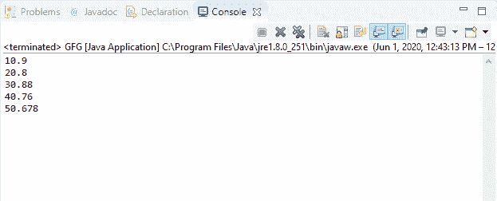

# Java 中的 DataInputStream readDouble()方法，带示例

> 原文:[https://www . geesforgeks . org/datainputstream-readdouble-method-in-Java-with-examples/](https://www.geeksforgeeks.org/datainputstream-readdouble-method-in-java-with-examples/)

Java 中 **DataInputStream** 类的 **readDouble()** 方法用于读取 8 个输入字节并返回一个 Double 值。此方法从输入流中读取接下来的八个字节，并将其解释为 double 类型，然后返回。

**语法:**

```java
public final double readDouble()
                  throws IOException

```

**指定者:**该方法由**数据输入**界面的 readDouble()方法指定。

**参数:**此方法不接受任何参数。

**返回值:**该方法返回输入流的下八个字节解释的双精度值。

**异常:**

*   **eofeexception**–如果输入流在读取 8 个字节之前结束，它将抛出**eofeexception**。
*   **IOException**–如果流关闭或发生其他输入/输出错误，该方法将抛出 **IOException** 。

下面的程序说明了 IO 包中 DataInputStream 类的 readDouble()方法:

**程序 1:** 假设存在文件“demo.txt”。

```java
// Java program to illustrate
// DataInputStream readDouble() method
import java.io.*;
public class GFG {
    public static void main(String[] args)
        throws IOException
    {

        // Create double array
        double[] buf = { 10, 20, 30, 40, 50 };

        // Create file output stream
        FileOutputStream outputStream
            = new FileOutputStream("c:\\demo.txt");

        // Create data output stream
        DataOutputStream dataOutputStr
            = new DataOutputStream(outputStream);

        for (double b : buf) {
            // Write double value to
            // the dataOutputStream
            dataOutputStr.writeDouble(b);
        }

        dataOutputStr.flush();

        // Create file input stream
        FileInputStream inputStream
            = new FileInputStream("c:\\demo.txt");

        // Create data input stream
        DataInputStream dataInputStr
            = new DataInputStream(inputStream);

        while (dataInputStr.available() > 0) {
            // Print double values
            System.out.println(
                dataInputStr.readDouble());
        }
    }
}
```

**Output:**[](https://media.geeksforgeeks.org/wp-content/uploads/20200601125308/data_double-1.png)

**程序 2:** 假设文件“demo.txt”的存在。

```java
// Java program to illustrate
// DataInputStream readDouble() method
import java.io.*;
public class GFG {
    public static void main(String[] args)
        throws IOException
    {

        // Create double array
        double[] buf = { 10.9, 20.8,
                         30.88, 40.76,
                         50.678 };

        // Create file output stream
        FileOutputStream outputStream
            = new FileOutputStream("c:\\demo.txt");

        // Create data output stream
        DataOutputStream dataOutputStr
            = new DataOutputStream(outputStream);

        for (double b : buf) {
            // Write double value to
            // the dataOutputStream
            dataOutputStr.writeDouble(b);
        }

        dataOutputStr.flush();

        // Create file input stream
        FileInputStream inputStream
            = new FileInputStream("c:\\demo.txt");

        // Create data input stream
        DataInputStream dataInputStr
            = new DataInputStream(inputStream);

        while (dataInputStr.available() > 0) {
            // Print double values
            System.out.println(
                dataInputStr.readDouble());
        }
    }
}
```

**Output:**

[](https://media.geeksforgeeks.org/wp-content/uploads/20200601125334/data_double-2.png)

**参考文献:**
[https://docs . Oracle . com/javase/10/docs/API/Java/io/datainputstream . html # readDouble()](https://docs.oracle.com/javase/10/docs/api/java/io/DataInputStream.html#readDouble())