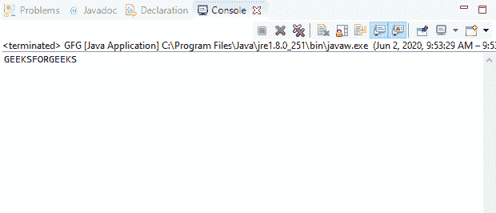
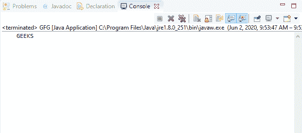

# Java 中的 DataInputStream readFully()方法，带示例

> 原文:[https://www . geesforgeks . org/datainputstream-readfully-method-in-Java-with-examples/](https://www.geeksforgeeks.org/datainputstream-readfully-method-in-java-with-examples/)

Java 中 **DataInputStream** 类的 **readFully()** 方法有两种类型:

1.  **readFully(byte[] b)** method of **DataInputStream** class in Java is used to read bytes equal to the length of byte array b from an input stream and store them into the byte array b.

    **总承包:**
    出现下列情况之一时，readFully(byte[] b)方法被阻塞:

    *   输入数据可用，并恢复正常。
    *   文件结束，并引发 EOFException。
    *   出现输入/输出错误，并引发 IOException。

    **语法:**

    ```java
    public final void readFully(byte[] b)
                      throws IOException

    ```

    **指定者:**该方法由**数据输入**界面的 readFully()方法指定。

    **参数:**该方法接受一个参数 b，该参数代表数据要读入的字节数组。

    **返回值:**此方法不返回值。

    **异常:**

    *   **空指针异常**–如果字节数组为空，它会抛出**空指针异常**。
    *   **EOFException**–如果文件结束，它会抛出 **EOFException** 。
    *   **IOException**–如果流关闭或发生其他输入/输出错误，该方法将抛出 **IOException** 。

    下面的程序说明了 IO 包中 DataInputStream 类的 readFully(byte[])方法:

    **程序:**假设存在文件“c:/demo.txt”。

    ```java
    // Java program to illustrate
    // DataInputStream readFully(byte[]) method
    import java.io.*;
    public class GFG {
        public static void main(String[] args)
            throws IOException
        {

            // Create input stream 'demo.txt'
            // for reading containing
            // text "GEEKSFORGEEKS"
            FileInputStream inputStream
                = new FileInputStream(
                    "c:/demo.txt");

            // Convert inputStream to
            // DataInputStream
            DataInputStream dataInputStr
                = new DataInputStream(
                    inputStream);

            // Count the total bytes
            int count = dataInputStr.available();

            // Create byte array
            byte[] b = new byte[count];

            // Read full data into byte array
            dataInputStr.readFully(b);

            for (byte by : b) {
                // Print the character
                System.out.print((char)by);
            }
        }
    }
    ```

    **Input:**[](https://media.geeksforgeeks.org/wp-content/uploads/20200601110642/INPUT_GEEKSFORGEEKS8.png)**Output:**[](https://media.geeksforgeeks.org/wp-content/uploads/20200602095738/1406-5.png)
2.  **readFully(byte[] b, int offset, int length)** method of **DataInputStream** class in Java is used to read bytes equal to the parameter passed ‘length’ from an input stream and store them into the byte array b.

    **总承包:**
    出现下列情况之一时，readFully(byte[]，int，int)方法被阻塞:

    *   输入数据可用，并恢复正常。
    *   文件结束，并引发一个 EOFException。
    *   出现输入/输出错误，并引发 IOException。

    **语法:**

    ```java
    public final void readFully(byte[] b,
                                int offset,
                                int length)
                         throws IOException

    ```

    **指定者:**该方法由**数据输入**界面的 readFully()方法指定。

    **参数:**该方法接受三个参数:

    *   **b**–表示数据要读入的字节数组。
    *   **偏移量**–表示字节数组中的起始索引。
    *   **长度**–表示要读取的字节总数。

    **返回值:**此方法不返回值。

    **异常:**

    *   **空指针异常**–如果字节数组为空，它会抛出**空指针异常**。
    *   **indexout of boundsexception**–如果偏移量为负或长度为负或长度大于字节数组长度与偏移量之差，则抛出**indexout of boundsexception**。
    *   **EOFException**–如果文件结束，它会抛出 **EOFException** 。
    *   **IOException**–如果流关闭或发生其他输入/输出错误，该方法将抛出 **IOException** 。

    下面的程序说明了 IO 包中 DataInputStream 类的 readFully(byte[]，int，int)方法:

    **程序:**假设存在文件“c:/demo.txt”。

    ```java
    // Java program to illustrate
    // DataInputStream readFully(byte[], int, int) method
    import java.io.*;
    public class GFG {
        public static void main(String[] args)
            throws IOException
        {

            // Create input stream 'demo.txt'
            // for reading containing
            // text "GEEKSFORGEEKS"
            FileInputStream inputStream
                = new FileInputStream(
                    "c:/demo.txt");

            // Convert inputStream to
            // DataInputStream
            DataInputStream dataInputStr
                = new DataInputStream(
                    inputStream);

            // Count the total bytes
            int count = dataInputStr.available();

            // Create byte array
            byte[] b = new byte[count];

            // Read full data into byte array
            dataInputStr.readFully(b, 4, 5);

            for (byte by : b) {
                // Print the character
                System.out.print((char)by);
            }
        }
    }
    ```

    **Input:**[](https://media.geeksforgeeks.org/wp-content/uploads/20200601110642/INPUT_GEEKSFORGEEKS8.png)**Output:**[](https://media.geeksforgeeks.org/wp-content/uploads/20200602095825/223-1.png)

**参考文献:**
1。[https://docs . Oracle . com/javase/10/docs/API/Java/io/datainputstream . html # readFully(字节%5B%5D)](https://docs.oracle.com/javase/10/docs/api/java/io/DataInputStream.html#readFully(byte%5B%5D))
2。[https://docs . Oracle . com/javase/10/docs/API/Java/io/datainputstream . html # readFully(字节%5B%5D，int，int)](https://docs.oracle.com/javase/10/docs/api/java/io/DataInputStream.html#readFully(byte%5B%5D, int, int))