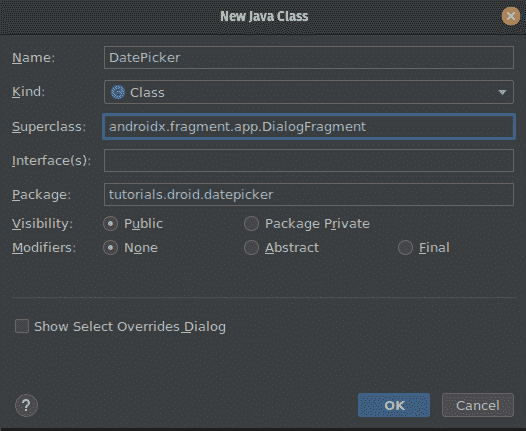

# Android 中的 datepickerdialog 对话框

> 原文:[https://www.geeksforgeeks.org/datepickerdialog-in-android/](https://www.geeksforgeeks.org/datepickerdialog-in-android/)

安卓**日期选择器**是一个用户界面控件，用于在[安卓应用](https://www.geeksforgeeks.org/android-app-development-fundamentals-for-beginners/)中按日、月、年选择日期。日期选择器用于确保用户选择有效的日期。在具有两种**模式的安卓日期选择器中，第一种显示完整的日历，第二种显示微调视图中的日期。您可以通过两种方式创建日期选择器控件，要么在 XML 文件中手动创建，要么以编程方式在活动文件中创建。我们将使用 [Java](https://www.geeksforgeeks.org/java/) 通过编程来实现。**

> **注意:**使用[科特林](https://www.geeksforgeeks.org/kotlin-programming-language/)实现日期选择器，请参考[本](https://www.geeksforgeeks.org/datepicker-in-kotlin/)。


### 方法

**第一步:创建新项目**

在安卓工作室创建新项目请参考 [**【如何在安卓工作室创建/启动新项目】**](https://www.geeksforgeeks.org/android-how-to-create-start-a-new-project-in-android-studio/) 。**注意，选择** [**Java**](https://www.geeksforgeeks.org/java/) **作为编程语言。**

**第二步:使用 activity_main.xml 文件**

在 **activity_main.xml** 文件中，仅添加一个[文本视图](https://www.geeksforgeeks.org/textview-widget-in-android-using-java-with-examples/)以显示所选日期，并添加一个[按钮](https://www.geeksforgeeks.org/button-in-kotlin/)以从**日期选择日志**中选择日期。下面是 **activity_main.xml** 文件的完整代码。

## 可扩展标记语言

```
<?xml version="1.0" encoding="utf-8"?>
<RelativeLayout
    xmlns:android="http://schemas.android.com/apk/res/android"
    xmlns:tools="http://schemas.android.com/tools"
    android:layout_width="match_parent"
    android:layout_height="match_parent"
    tools:context=".MainActivity">

    <TextView
        android:id="@+id/tvDate"
        android:layout_width="wrap_content"
        android:layout_height="wrap_content"
        android:layout_centerInParent="true"
        android:text="Date" />

    <Button
        android:id="@+id/btPickDate"
        android:layout_width="wrap_content"
        android:layout_height="wrap_content"
        android:layout_below="@+id/tvDate"
        android:layout_centerInParent="true"
        android:text="Pick Date" />

</RelativeLayout>
```

**第三步:创建一个新的类并命名为日期选择器**

现在创建一个新的类，方法是转到该包，右键单击它，选择新建，然后选择 Java 类。将类命名为**日期选择器**，将其超类命名为**对话片段**(androidx . fragment . app . DialogFragment)，然后单击确定。



现在覆盖一个方法 **onCreateDialog** ，而不是返回 super.onCreateDialog，返回一个 **DatePickerDialog** 的实例。

> @祖父 Null
> 
> @覆盖
> 
> 公共对话框 onCreateDialog(@可空包 savedInstanceState){ 0
> 
> 返回 new datepicker dialog()；
> 
> }

现在将参数传递给 DatePickerDialog 的构造函数，该构造函数需要上下文、日期设置侦听器、年、月、日。

*   传递上下文的 getActivity 方法。
*   对于 OnDateSetListener，请将 getActivity 方法类型转换为 OnDateSetListener。
*   对于年、月和日月，创建一个日历类的实例，并将年、月和日月分配给 int 类型的变量。
*   传递年、月和日期月，以便当日期选择日志打开时，它具有当前日期。

> @祖父 Null
> 
> @覆盖
> 
> 公共对话
> 
> oncreatedialog(@ null bundle savedinstancestate)
> 
> {
> 
> calendar = calendar . getinstance()；
> 
> int year = mCalendar.get(Calendar。年份)；
> 
> int month = Mcalendar . get(Calendar。MONTH)；
> 
> int dayOfMonth = Mcalendar . get(Calendar。月日)；
> 
> 返回新日期选择器对话框(
> 
> getActivity()，
> 
> （DatePickerDialog.OnDateSetListener）getActivity（），
> 
> 年、月、日；
> 
> }

**DatePicker.java**级的完整代码如下。

## Java 语言(一种计算机语言，尤用于创建网站)

```
package tutorials.droid.datepicker;

import android.app.DatePickerDialog;
import android.app.Dialog;
import android.os.Bundle;
import androidx.annotation.NonNull;
import androidx.annotation.Nullable;
import androidx.fragment.app.DialogFragment;
import java.util.Calendar;

public class DatePicker extends DialogFragment {
    @NonNull
    @Override
    public Dialog onCreateDialog(@Nullable Bundle savedInstanceState) {
        Calendar mCalendar = Calendar.getInstance();
        int year = mCalendar.get(Calendar.YEAR);
        int month = mCalendar.get(Calendar.MONTH);
        int dayOfMonth = mCalendar.get(Calendar.DAY_OF_MONTH);
        return new DatePickerDialog(getActivity(), (DatePickerDialog.OnDateSetListener)
                getActivity(), year, month, dayOfMonth);
    }
}
```

**第四步:使用 MainActivity.java 文件**

现在在**MainActivity.java**文件中，创建一个文本视图和按钮的对象，并用它们的 id 映射组件(文本视图和按钮)。

> 文本视图 tvdate
> 
> 按钮 btpickdate
> 
> tvdate = findviewbyid(r . id . tvdate)：
> 
> btpick date = findviewbyid(r . id . btpick date)；

实现 DatePickerDialog 类的 **OnDateSetListener** ，并覆盖 **onDateSet()** 方法。 **onDateSet()** 方法将在电视日期文本视图中设置选择后的日期。

> @覆盖
> 
> 公共无效日期集(日期选择器视图，年内、月内、月内)
> 
> {
> 
> //创建日历实例
> 
> calendar = calendar . getinstance()；
> 
> //设置日历实例的静态变量
> 
> 日历集。年份，年份)；
> 
> 日历集。月，月)；
> 
> 日历集。年月日；
> 
> //获取字符串形式的日期
> 
> string selected data = date format . get file instance(date format)。(已满)。格式(MC lendar . gettime())；
> 
> //将文本视图设置为选定的日期字符串
> 
> tvDate.setText(已选取)：
> 
> }

在 **onClick()** 方法中实现**设置 btPickDate 的**。创建一个日期选择器的实例(我们的类)。使用实例的显示方法，并传递**getSupportfragmentManager()**和一个**标记。**MainActivity.java**文件的完整代码如下。**

## **Java 语言(一种计算机语言，尤用于创建网站)**

```
package tutorials.droid.datepicker;

import android.app.DatePickerDialog;
import android.os.Bundle;
import android.view.View;
import android.widget.Button;
import android.widget.DatePicker;
import android.widget.TextView;
import androidx.appcompat.app.AppCompatActivity;
import java.text.DateFormat;
import java.util.Calendar;

public class MainActivity extends AppCompatActivity implements DatePickerDialog.OnDateSetListener {
    TextView tvDate;
    Button btPickDate;

    @Override
    protected void onCreate(Bundle savedInstanceState) {
        super.onCreate(savedInstanceState);
        setContentView(R.layout.activity_main);
        tvDate = findViewById(R.id.tvDate);
        btPickDate = findViewById(R.id.btPickDate);
        btPickDate.setOnClickListener(new View.OnClickListener() {
            @Override
            public void onClick(View v) {
                // Please note that use your package name here
                tutorials.droid.datepicker.DatePicker mDatePickerDialogFragment;
                mDatePickerDialogFragment = new tutorials.droid.datepicker.DatePicker();
                mDatePickerDialogFragment.show(getSupportFragmentManager(), "DATE PICK");
            }
        });
    }

    @Override
    public void onDateSet(DatePicker view, int year, int month, int dayOfMonth) {
        Calendar mCalendar = Calendar.getInstance();
        mCalendar.set(Calendar.YEAR, year);
        mCalendar.set(Calendar.MONTH, month);
        mCalendar.set(Calendar.DAY_OF_MONTH, dayOfMonth);
        String selectedDate = DateFormat.getDateInstance(DateFormat.FULL).format(mCalendar.getTime());
        tvDate.setText(selectedDate);
    }
}
```

****输出:**在仿真器上运行**

**<video class="wp-video-shortcode" id="video-477909-1" width="640" height="360" preload="metadata" controls=""><source type="video/mp4" src="https://media.geeksforgeeks.org/wp-content/uploads/20200901000219/date-picker.mp4?_=1">[https://media.geeksforgeeks.org/wp-content/uploads/20200901000219/date-picker.mp4](https://media.geeksforgeeks.org/wp-content/uploads/20200901000219/date-picker.mp4)</video>**