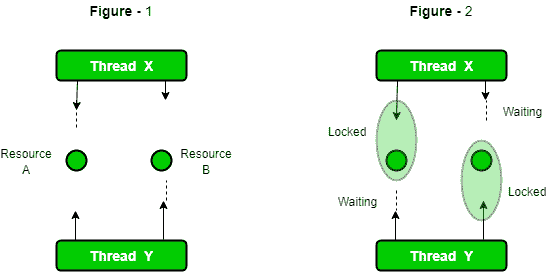

# Java 多线程中的死锁

> 原文:[https://www . geesforgeks . org/Java 死锁-多线程/](https://www.geeksforgeeks.org/deadlock-in-java-multithreading/)

[**【synchronized】**](https://www.geeksforgeeks.org/synchronized-in-java/)关键字用于使类或方法线程安全，这意味着只有一个线程可以拥有 synchronized 方法的锁并使用它，其他线程必须等到锁释放并且其中任何一个线程都获得该锁。
如果我们的程序运行在多线程环境中，其中两个或多个线程同时执行，那么使用它非常重要。但有时候也会引起一个问题，叫做 [**【死锁】**](https://www.geeksforgeeks.org/introduction-of-deadlock-in-operating-system/) 。下面是死锁条件的一个简单例子。



## Java 语言(一种计算机语言，尤用于创建网站)

```java
// Java program to illustrate Deadlock
// in multithreading.
class Util
{
    // Util class to sleep a thread
    static void sleep(long millis)
    {
        try
        {
            Thread.sleep(millis);
        }
        catch (InterruptedException e)
        {
            e.printStackTrace();
        }
    }
}

// This class is shared by both threads
class Shared
{
    // first synchronized method
    synchronized void test1(Shared s2)
    {
        System.out.println("test1-begin");
        Util.sleep(1000);

        // taking object lock of s2 enters
        // into test2 method
        s2.test2();
        System.out.println("test1-end");
    }

    // second synchronized method
    synchronized void test2()
    {
        System.out.println("test2-begin");
        Util.sleep(1000);
        // taking object lock of s1 enters
        // into test1 method
        System.out.println("test2-end");
    }
}

class Thread1 extends Thread
{
    private Shared s1;
    private Shared s2;

    // constructor to initialize fields
    public Thread1(Shared s1, Shared s2)
    {
        this.s1 = s1;
        this.s2 = s2;
    }

    // run method to start a thread
    @Override
    public void run()
    {
        // taking object lock of s1 enters
        // into test1 method
        s1.test1(s2);
    }
}

class Thread2 extends Thread
{
    private Shared s1;
    private Shared s2;

    // constructor to initialize fields
    public Thread2(Shared s1, Shared s2)
    {
        this.s1 = s1;
        this.s2 = s2;
    }

    // run method to start a thread
    @Override
    public void run()
    {
        // taking object lock of s2
        // enters into test2 method
        s2.test1(s1);
    }
}

public class Deadlock
{
    public static void main(String[] args)
    {
        // creating one object
        Shared s1 = new Shared();

        // creating second object
        Shared s2 = new Shared();

        // creating first thread and starting it
        Thread1 t1 = new Thread1(s1, s2);
        t1.start();

        // creating second thread and starting it
        Thread2 t2 = new Thread2(s1, s2);
        t2.start();

        // sleeping main thread
        Util.sleep(2000);
    }
}
```

```java
Output : test1-begin
test2-begin
```

不建议使用在线 IDE 运行上述程序。我们可以复制源代码并在本地机器上运行。我们可以看到它无限期运行，因为线程处于死锁状态，不让代码执行。现在让我们一步一步地看看那里正在发生什么。

1.  线程 t1 通过获取 s1 的对象锁来启动和调用 test1 方法。
2.  线程 t2 通过获取 s2 的对象锁启动并调用 test1 方法。
3.  t1 打印 test1-begin，t2 打印 test-2 begin，两者都等待 1 秒钟，这样，如果其中任何一个线程没有启动，两个线程都可以启动。
4.  t1 尝试获取 s2 的对象锁并调用方法 test2，但是由于 t2 已经获取了它，所以它会一直等待，直到它变得空闲。在锁定 s2 之前，它不会释放 s1 的锁定。
5.  t2 也是如此。它试图获取 s1 的对象锁并调用方法 test1，但是它已经被 t1 获取，所以它必须等到 t1 释放锁。t2 也不会释放 s2 的锁定，直到它锁定 s1。
6.  现在，两个线程都处于等待状态，等待对方释放锁。现在有一个竞争的条件，谁将首先释放锁。
7.  由于它们都没有准备好释放锁，所以这是死锁状态。
8.  当你运行这个程序时，它看起来像是暂停执行。

**检测死锁状态**

我们也可以通过在 cmd 上运行这个程序来检测死锁。我们必须收集线程转储。要收集的命令取决于操作系统类型。如果我们使用的是 Windows 和 Java 8，命令是 jcmd $PID Thread.print
我们可以通过运行 jps 命令得到 PID。上述程序的线程转储如下:

```java
jcmd 18692 Thread.print
18692:
2020-06-08 19:03:10
Full thread dump OpenJDK 64-Bit Server VM (11.0.4+10-b304.69 mixed mode, sharing):

Threads class SMR info:
_java_thread_list=0x0000017f44b69f20, length=13, elements={
0x0000017f43f77000, 0x0000017f43f79800, 0x0000017f43f90000, 0x0000017f43f91000,
0x0000017f43f95000, 0x0000017f43fa5000, 0x0000017f43fb0800, 0x0000017f43f5b800,
0x0000017f44bc9000, 0x0000017f44afb000, 0x0000017f44bd7800, 0x0000017f44bd8800,
0x0000017f298c9000
}

"Reference Handler" #2 daemon prio=10 os_prio=2 cpu=0.00ms elapsed=57.48s tid=0x0000017f43f77000 nid=0x6050 waiting on condition  [0x0000005f800ff000]
   java.lang.Thread.State: RUNNABLE
        at java.lang.ref.Reference.waitForReferencePendingList(java.base@11.0.4/Native Method)
        at java.lang.ref.Reference.processPendingReferences(java.base@11.0.4/Reference.java:241)
        at java.lang.ref.Reference$ReferenceHandler.run(java.base@11.0.4/Reference.java:213)

"Finalizer" #3 daemon prio=8 os_prio=1 cpu=0.00ms elapsed=57.48s tid=0x0000017f43f79800 nid=0x2824 in Object.wait()  [0x0000005f801fe000]
   java.lang.Thread.State: WAITING (on object monitor)
        at java.lang.Object.wait(java.base@11.0.4/Native Method)
        - waiting on  (a java.lang.ref.ReferenceQueue$Lock)
        at java.lang.ref.ReferenceQueue.remove(java.base@11.0.4/ReferenceQueue.java:155)
        - waiting to re-lock in wait()  (a java.lang.ref.ReferenceQueue$Lock)
        at java.lang.ref.ReferenceQueue.remove(java.base@11.0.4/ReferenceQueue.java:176)
        at java.lang.ref.Finalizer$FinalizerThread.run(java.base@11.0.4/Finalizer.java:170)

"Signal Dispatcher" #4 daemon prio=9 os_prio=2 cpu=0.00ms elapsed=57.47s tid=0x0000017f43f90000 nid=0x1710 runnable  [0x0000000000000000]
   java.lang.Thread.State: RUNNABLE

"Attach Listener" #5 daemon prio=5 os_prio=2 cpu=31.25ms elapsed=57.47s tid=0x0000017f43f91000 nid=0x4ff4 waiting on condition  [0x0000000000000000]
   java.lang.Thread.State: RUNNABLE

"C2 CompilerThread0" #6 daemon prio=9 os_prio=2 cpu=46.88ms elapsed=57.47s tid=0x0000017f43f95000 nid=0x350c waiting on condition  [0x0000000000000000]
   java.lang.Thread.State: RUNNABLE
   No compile task

"C1 CompilerThread0" #9 daemon prio=9 os_prio=2 cpu=93.75ms elapsed=57.47s tid=0x0000017f43fa5000 nid=0x4900 waiting on condition  [0x0000000000000000]
   java.lang.Thread.State: RUNNABLE
   No compile task

"Sweeper thread" #10 daemon prio=9 os_prio=2 cpu=0.00ms elapsed=57.47s tid=0x0000017f43fb0800 nid=0x6120 runnable  [0x0000000000000000]
   java.lang.Thread.State: RUNNABLE

"Common-Cleaner" #11 daemon prio=8 os_prio=1 cpu=0.00ms elapsed=57.44s tid=0x0000017f43f5b800 nid=0x5a4 in Object.wait()  [0x0000005f807fe000]
   java.lang.Thread.State: TIMED_WAITING (on object monitor)
        at java.lang.Object.wait(java.base@11.0.4/Native Method)
        - waiting on  (a java.lang.ref.ReferenceQueue$Lock)
        at java.lang.ref.ReferenceQueue.remove(java.base@11.0.4/ReferenceQueue.java:155)
        - waiting to re-lock in wait()  (a java.lang.ref.ReferenceQueue$Lock)
        at jdk.internal.ref.CleanerImpl.run(java.base@11.0.4/CleanerImpl.java:148)
        at java.lang.Thread.run(java.base@11.0.4/Thread.java:834)
        at jdk.internal.misc.InnocuousThread.run(java.base@11.0.4/InnocuousThread.java:134)

"Monitor Ctrl-Break" #12 daemon prio=5 os_prio=0 cpu=15.63ms elapsed=57.36s tid=0x0000017f44bc9000 nid=0x5954 runnable  [0x0000005f809fe000]
   java.lang.Thread.State: RUNNABLE
        at java.net.SocketInputStream.socketRead0(java.base@11.0.4/Native Method)
        at java.net.SocketInputStream.socketRead(java.base@11.0.4/SocketInputStream.java:115)
        at java.net.SocketInputStream.read(java.base@11.0.4/SocketInputStream.java:168)
        at java.net.SocketInputStream.read(java.base@11.0.4/SocketInputStream.java:140)
        at sun.nio.cs.StreamDecoder.readBytes(java.base@11.0.4/StreamDecoder.java:284)
        at sun.nio.cs.StreamDecoder.implRead(java.base@11.0.4/StreamDecoder.java:326)
        at sun.nio.cs.StreamDecoder.read(java.base@11.0.4/StreamDecoder.java:178)
        - locked  (a java.io.InputStreamReader)
        at java.io.InputStreamReader.read(java.base@11.0.4/InputStreamReader.java:185)
        at java.io.BufferedReader.fill(java.base@11.0.4/BufferedReader.java:161)
        at java.io.BufferedReader.readLine(java.base@11.0.4/BufferedReader.java:326)
        - locked  (a java.io.InputStreamReader)
        at java.io.BufferedReader.readLine(java.base@11.0.4/BufferedReader.java:392)
        at com.intellij.rt.execution.application.AppMainV2$1.run(AppMainV2.java:64)

"Service Thread" #13 daemon prio=9 os_prio=0 cpu=0.00ms elapsed=57.36s tid=0x0000017f44afb000 nid=0x6394 runnable  [0x0000000000000000]
   java.lang.Thread.State: RUNNABLE

"Thread-0" #14 prio=5 os_prio=0 cpu=0.00ms elapsed=57.35s tid=0x0000017f44bd7800 nid=0x5304 waiting for monitor entry  [0x0000005f80cfe000]
   java.lang.Thread.State: BLOCKED (on object monitor)
        at com.company.threads.Shared.test2(Deadlock.java:40)
        - waiting to lock  (a com.company.threads.Shared)
        at com.company.threads.Shared.test1(Deadlock.java:33)
        - locked  (a com.company.threads.Shared)
        at com.company.threads.Thread1.run(Deadlock.java:67)

"Thread-1" #15 prio=5 os_prio=0 cpu=0.00ms elapsed=57.35s tid=0x0000017f44bd8800 nid=0xfa4 waiting for monitor entry  [0x0000005f80dfe000]
   java.lang.Thread.State: BLOCKED (on object monitor)
        at com.company.threads.Shared.test2(Deadlock.java:40)
        - waiting to lock  (a com.company.threads.Shared)
        at com.company.threads.Shared.test1(Deadlock.java:33)
        - locked  (a com.company.threads.Shared)
        at com.company.threads.Thread2.run(Deadlock.java:90)

"DestroyJavaVM" #16 prio=5 os_prio=0 cpu=171.88ms elapsed=55.35s tid=0x0000017f298c9000 nid=0x38ec waiting on condition  [0x0000000000000000]
   java.lang.Thread.State: RUNNABLE

"VM Thread" os_prio=2 cpu=0.00ms elapsed=57.49s tid=0x0000017f43f73800 nid=0x52c4 runnable

"GC Thread#0" os_prio=2 cpu=0.00ms elapsed=57.51s tid=0x0000017f298e1000 nid=0x47dc runnable

"G1 Main Marker" os_prio=2 cpu=0.00ms elapsed=57.51s tid=0x0000017f29911000 nid=0x61c4 runnable

"G1 Conc#0" os_prio=2 cpu=0.00ms elapsed=57.51s tid=0x0000017f29912000 nid=0x61c0 runnable

"G1 Refine#0" os_prio=2 cpu=0.00ms elapsed=57.50s tid=0x0000017f43e0a800 nid=0x1fa8 runnable

"G1 Young RemSet Sampling" os_prio=2 cpu=0.00ms elapsed=57.50s tid=0x0000017f43e0b000 nid=0x47a4 runnable
"VM Periodic Task Thread" os_prio=2 cpu=0.00ms elapsed=57.36s tid=0x0000017f44b03800 nid=0x2408 waiting on condition

JNI global refs: 15, weak refs: 0

Found one Java-level deadlock:
=============================
"Thread-0":
  waiting to lock monitor 0x0000017f43f87980 (object 0x000000008a2e9ce0, a com.company.threads.Shared),
  which is held by "Thread-1"
"Thread-1":
  waiting to lock monitor 0x0000017f43f87780 (object 0x000000008a2e9cd0, a com.company.threads.Shared),
  which is held by "Thread-0"

Java stack information for the threads listed above:
===================================================
"Thread-0":
        at com.company.threads.Shared.test2(Deadlock.java:40)
        - waiting to lock  (a com.company.threads.Shared)
        at com.company.threads.Shared.test1(Deadlock.java:33)
        - locked  (a com.company.threads.Shared)
        at com.company.threads.Thread1.run(Deadlock.java:67)
"Thread-1":
        at com.company.threads.Shared.test2(Deadlock.java:40)
        - waiting to lock  (a com.company.threads.Shared)
        at com.company.threads.Shared.test1(Deadlock.java:33)
        - locked  (a com.company.threads.Shared)
        at com.company.threads.Thread2.run(Deadlock.java:90)

Found 1 deadlock.
```

我们可以看到有明确提到发现 1 死锁。当您在机器上尝试时，可能会出现相同的消息。

**避免死锁状态**

我们可以通过了解它的可能性来避免死锁情况。这是一个非常复杂的过程，不容易抓住。但如果我们努力，我们还是可以避免这种情况。有一些方法可以避免这种情况。我们不能完全消除它的可能性，但我们可以减少。

*   **避免嵌套锁:**这是死锁的主要原因。死锁主要发生在我们给多线程加锁的时候。如果我们已经给了一个线程，避免给多个线程加锁。
*   **避免不必要的锁定:**我们应该只锁定那些需要的成员。不必要地打开锁会导致死锁。
*   **使用线程连接:**当一个线程正在等待另一个线程完成时，出现死锁情况。如果出现这种情况，我们可以使用 Thread.join，使用您认为最长的执行时间。

**要点:**

*   如果线程正在等待对方完成，那么这种情况称为死锁。
*   死锁条件是一种复杂的条件，只在多线程的情况下出现。
*   死锁条件会在运行时破坏我们的代码，并破坏业务逻辑。
*   我们应该尽可能避免这种情况。

本文由**维沙尔·加尔格**供稿。如果你喜欢 GeeksforGeeks 并想投稿，你也可以使用[write.geeksforgeeks.org](https://write.geeksforgeeks.org)写一篇文章或者把你的文章邮寄到 review-team@geeksforgeeks.org。看到你的文章出现在极客博客主页上，帮助其他极客。
如果你发现任何不正确的地方，或者你想分享更多关于上面讨论的话题的信息，请写评论。