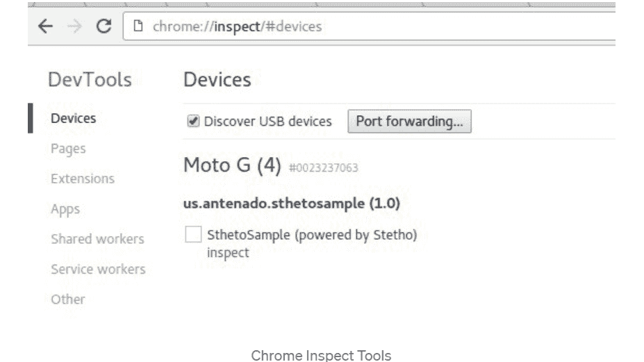
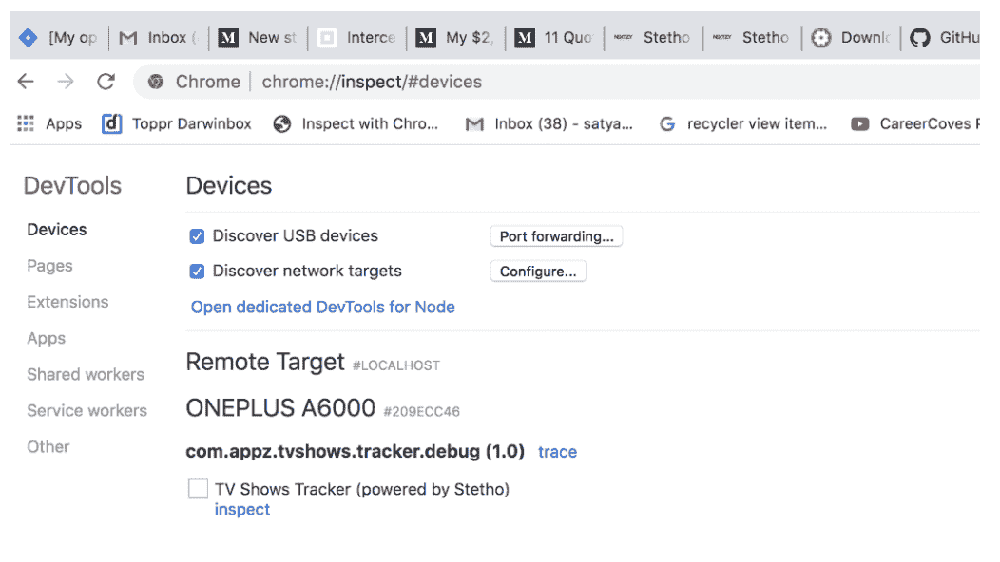
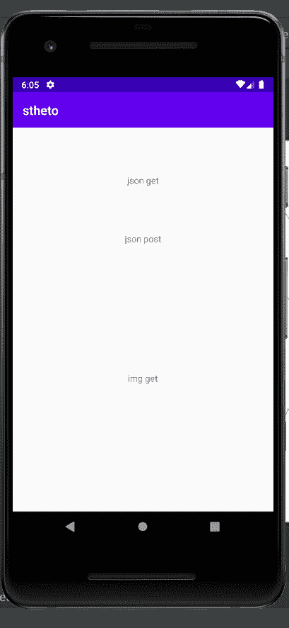
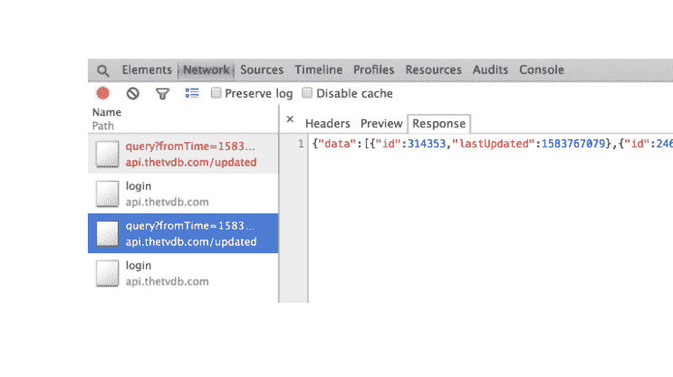

# 安卓中使用 Stetho 进行调试

> 原文:[https://www . geesforgeks . org/debug-with-stetho-in-Android/](https://www.geeksforgeeks.org/debugging-with-stetho-in-android/)

Stetho 是脸书开发的开源调试库。它允许您使用 chrome 调试工具对网络流量进行故障排除。，从而为安卓开发者提供了丰富的交互调试体验。Stetho 轻松流畅地调试网络呼叫。它**是安卓应用的复杂调试桥梁。** 启用后，开发人员有了一条通往 **Chrome 开发工具** 功能的路径，该功能是 Chrome 桌面浏览器的一部分。开发人员也可以选择允许可选的 **dumpapp** 工具，该工具允许应用程序内部的强大命令行界面。而不仅仅局限于网络检查、JavaScript 控制台、数据库检查等功能。

### 斯特托的特点

1.  Stetho 是一个开源调试平台。
2.  它提供了丰富且高度互动的体验。
3.  借助 Stetho 原生应用程序调试非常简单。
4.  它提供你使用谷歌 Chrome 调试工具进行各种活动。
5.  它在调试期间提供层次检查。
6.  此外，Stetho 允许网络、数据库管理和更多交互功能。
7.  Stetho 使用 HTTP 网络套接字发送数据。

### 问题

在开发安卓应用程序时调试网络流量的问题，调试器面临的传统调试工具的问题变得混乱，在切换设备时检查变得非常复杂。

### 斯特托提供的解决方案

使用 Stetho 库调试更加可靠和容易，因为它使用了支持 web-socket 的 chrome 调试工具，并将其用于网络调试。Stetho 自动化了调用检查，因此它对安卓开发者来说变得更加重要。

### 如何使用 Chrome 开发工具？

Stetho 使用 HTTP web Socket 服务器，将所有调试信息发送到浏览器。可通过以下途径访问:

> 镀铬://检查

 

### 逐步实施

**步骤 1:** 在 build.gradle 文件中添加以下依赖项。

> 实现' com . Facebook . ste tho:ste tho-okhttp3:1 . 5 . 1 '

**第二步:**在 AndroidManifest.xml 中注册你的类，并在应用程序中初始化它。

## Java 语言(一种计算机语言，尤用于创建网站)

```
import android.app.Application;
import android.content.Context;
import com.facebook.stetho.InspectorModulesProvider;
import com.facebook.stetho.Stetho;
import com.facebook.stetho.inspector.protocol.ChromeDevtoolsDomain;
import com.facebook.stetho.okhttp3.StethoInterceptor;
import com.facebook.stetho.rhino.JsRuntimeReplFactoryBuilder;
import com.jakewharton.caso.OkHttp3Downloader;
import com.squareup.caso.Caso;
import okhttp3.OkHttpClient;

public class Stetho extends Application {
    public OkHttpClient httpClient;
    @Override
    public void onCreate() {
        super.onCreate();
        final Context context = this;
        if (BuildConfig.DEBUG) {

              // Create an InitializerBuilder 
            Stetho.InitializerBuilder initializerBuilder = Stetho.newInitializerBuilder(this);

              // Enable Chrome DevTools  
            initializerBuilder.enableWebKitInspector(new InspectorModulesProvider() {
                @Override
                public Iterable<ChromeDevtoolsDomain> get() {

                    // Enable command line interface
                    return new Stetho.DefaultInspectorModulesBuilder(context).runtimeRepl(
                            new JsRuntimeReplFactoryBuilder(context)
                                    .addVariable("foo", "bar")
                                    .build()
                    ).finish();
                }
            });

              // Use the  InitializerBuilder to generate  an Initializer
            Stetho.Initializer initializer = initializerBuilder.build();

              // Initialize Stetho with the Initializer
            Stetho.initialize(initializer);

              // Add Stetho interceptor
            httpClient = new OkHttpClient.Builder().addNetworkInterceptor(new StethoInterceptor()).build();
        } else {
            httpClient = new OkHttpClient();
        }
        Caso caso = new Caso.Builder(this).downloader(new OkHttp3Downloader(httpClient)).build();
        Caso.setSingletonInstance(caso);
    }
}
```

或者

用一行代码初始化您的库(例如):

## Java 语言(一种计算机语言，尤用于创建网站)

```
public class Applicationstetho extends Application {
  public void onCreate() {
    super.onCreate();
    if(BuildConfig.DEBUG ){
      Stetho.initializeWithDefault(this)
      }
  }
}
```

更新 android 项目中的清单文件:

## 可扩展标记语言

```
<?xml version="1.0" encoding="utf-8"?>
<manifest xmlns:android="http://geeksforgeeks.com/apk/res/android"
    package="com.geeksforgeeks.sthetosample">

    <uses-permission android:name="android.permission.INTERNET"/>

    <application
        android:allowBackup="true"
        android:icon="@mipmap/ic_launcher"
        android:label="@string/app_name"
        android:supportsRtl="true"
        android:theme="@style/AppTheme"
        android:name=".StethoSample">

      ...
    </application>

</manifest>
```



**步骤 3:** 启用网络检查。

在构造 okHttpClient 实例时，下面的方法是启用网络检查最简单的方法:

> ok http 客户端。Builder()
> 
> 。addNetworkInterceptor(Stethointerceptor())
> 
> 。构建()

**怎么查？**

在设备上启动仿真器。然后在 chrome 上打开 **chrome://inspect** ，你的模拟器设备应该会出现，之后点击 inspects 启动一个新的窗口，点击 network 标签来观察网络流量。

