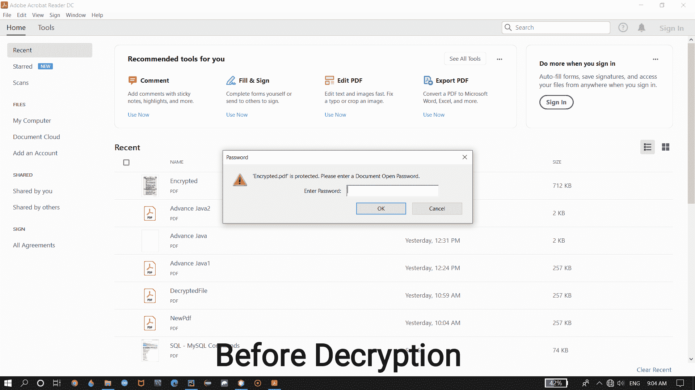
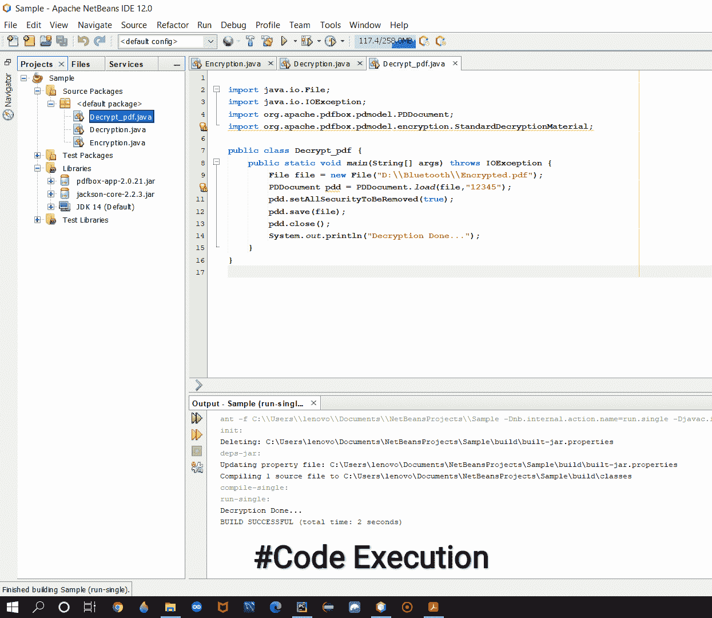
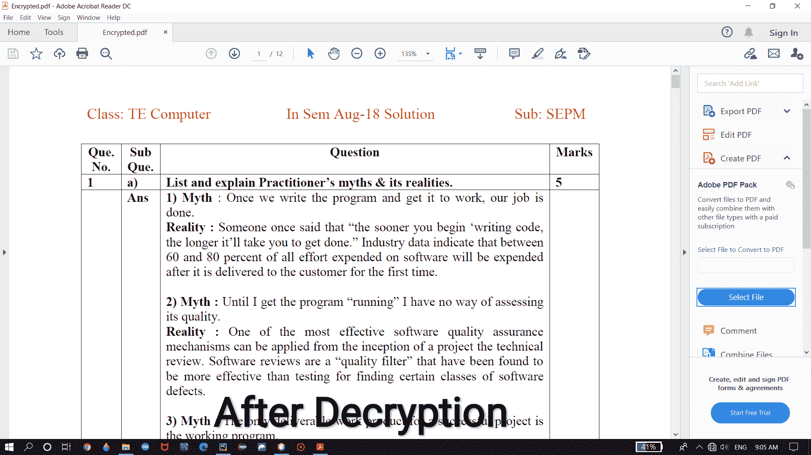

# 用 Java 解密 PDF

> 原文:[https://www.geeksforgeeks.org/decrypt-pdf-using-java/](https://www.geeksforgeeks.org/decrypt-pdf-using-java/)

我们可以使用外部库 [PDFBox，使用 Java 解密任何 PDF。](https://pdfbox.apache.org/download.cgi)我们可以使用 JAVA 解密并移除任何 PDF 中的**访问权限**，但是我们必须记住 PDF 的**所有者密码**才能解密，否则我们无法解密。

**进场:**

在这个程序中，您将看到如何将加密的 PDF 文件作为输入，以及如何解密它以访问或读取 PDF 文件。您将看到用于以下过程的 PDFBox 库。

```java
Input : Encrypted PDF file
Output : Decrypted PDF file 

```

**PDFBox 的 Maven 依赖关系:**

```java
<dependency>
<groupId>org.apache.pdfbox</groupId>
<artifactId>pdfbox</artifactId>
<version>2.0.21</version>
</dependency>

```

### **解密 PDF 的步骤**

**1。加载 PDF 文档**

使用类**的 **load()** 静态方法(我们可以使用类名访问)加载 PDF 文件**。**加载()**方法将接受 PDF 文件作为参数。这里**所有者密码**是强制的，否则我们无法解密。

```java
File f = new File("path_of_PDFfile");
PDDocument pdd = PDDocument.load("object_of_file","Owner_password");

```

**2。调用“setAllSecurityToBeRemoved(bool)”方法**

加载 PDF 文件后，使用 **PDDocument** 类的对象调用**setall securitytoreberemoved(bool)**方法。它将从 PDF 中删除**访问权限**，并允许所有用户访问。在**设置中，将**布尔(真/假)**作为参数传递。如果要进行解密操作，则通过**为真**，否则通过**为假**。**

```java
PDDocument_object.setAllSecurityToBeRemoved(true);

```

**3。保存并关闭文件**

解密 PDF 后**保存****关闭**文件进行修改。

```java
PDDocument_object.save("path_of_PDFfile");
PDDocument_object.close();

```

**解密 PDF 的可执行代码:**

## Java 语言(一种计算机语言，尤用于创建网站)

```java
import java.io.File;
import java.io.IOException;
import org.apache.pdfbox.pdmodel.PDDocument;
import org.apache.pdfbox.pdmodel.encryption.StandardDecryptionMaterial;

public class Decrypt_pdf {
    public static void main(String[] args)
        throws IOException
    {

        // select a file for Decryption operation
        File file = new File("D:\\Bluetooth\\Encrypted.pdf");

        // Load the PDF file
        PDDocument pdd = PDDocument.load(file, "12345");

        // removing all security from PDF file
        pdd.setAllSecurityToBeRemoved(true);

        // Save the PDF file
        pdd.save(file);

        // Close the PDF file
        pdd.close();
        System.out.println("Decryption Done...");
    }
}
```

**输出:**

```java
Decryption Done...
```

让我们看看下面给出的截图，以便更好地理解，您将看到如何解密给定的 PDF 文件以及如何访问和阅读它。在此截图中，您将看到一个受密码保护的 PDF 加密文件，这意味着您只需要权限或密码来授予对该 PDF 文件的访问权限。



#解密前

输入正确的密码后，您就可以访问和阅读 PDF 文件。现在，如果您想使用 Java 代码解密它，那么您需要编写如图所示的代码，并需要执行如下截图所示的程序。



#代码片段

现在，成功执行上述程序后，您就不需要任何密码来访问 PDF 文件，这意味着您的 PDF 文件现在已被解密，您可以直接访问和读取它。



#解密后

这是视频，你会看到解密过程，你会看到它将如何工作。因此，通过这种方式，您可以更改任何 PDF 的访问权限，这将允许所有用户轻松访问它。

<video class="wp-video-shortcode" id="video-492172-1" width="640" height="360" preload="metadata" controls=""><source type="video/mp4" src="https://media.geeksforgeeks.org/wp-content/uploads/20200919104206/as.mp4?_=1">[https://media.geeksforgeeks.org/wp-content/uploads/20200919104206/as.mp4](https://media.geeksforgeeks.org/wp-content/uploads/20200919104206/as.mp4)</video>