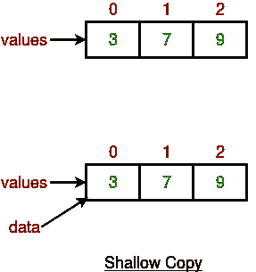
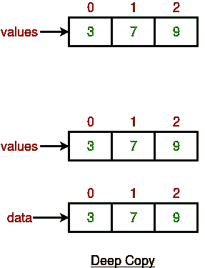

# 深度、浅度和懒度用 Java 复制示例

> 原文:[https://www . geesforgeks . org/deep-浅层-lazy-copy-java-examples/](https://www.geeksforgeeks.org/deep-shallow-lazy-copy-java-examples/)

在面向对象编程中，对象复制是创建一个现有对象的副本，产生的对象称为对象副本或简单的原始对象副本。复制对象有几种方法，最常见的是通过[复制构造函数](https://www.geeksforgeeks.org/copy-constructor-in-java/)或[克隆](https://www.geeksforgeeks.org/clone-method-in-java-2/)。
我们可以将克隆定义为**“创建对象的副本”。**浅、深、懒复制与克隆过程有关。
这其实是创建复制对象的三种方式。
**浅抄**

*   每当我们使用 clone 方法的默认实现时，我们都会得到对象的浅层副本，这意味着它会创建一个新实例，并将对象的所有字段复制到该新实例中，并将其作为对象类型返回，我们需要显式地将其转换回原始对象。这是对象的浅拷贝。
*   对象类的 clone()方法支持对象的浅拷贝。如果对象在浅拷贝中包含基元以及非基元或引用类型变量，则克隆的对象也引用原始对象引用的同一对象，因为只有对象引用被拷贝，而不是被引用的对象本身。
*   这就是为什么在 Java 中浅拷贝或浅克隆这个名字。如果只有基本类型字段或不可变对象，那么在 Java 中浅拷贝和深拷贝没有区别。

## Java 语言(一种计算机语言，尤用于创建网站)

```java
//code illustrating shallow copy
public class Ex {

    private int[] data;

    // makes a shallow copy of values
    public Ex(int[] values) {
        data = values;
    }

    public void showData() {
        System.out.println( Arrays.toString(data) );
    }
}
```

上面的代码显示了浅层复制。数据只是指与 val 相同的数组。



如果通过其他引用改变了值的元素，这可能会导致不愉快的副作用。

## Java 语言(一种计算机语言，尤用于创建网站)

```java
public class UsesEx{

    public static void main(String[] args) {
        int[] vals = {3, 7, 9};
        Ex e = new Ex(vals);
        e.showData(); // prints out [3, 7, 9]
        vals[0] = 13;
        e.showData(); // prints out [13, 7, 9]

        // Very confusing, because we didn't
        // intentionally change anything about
        // the object e refers to.
    }
}
```

```java
Output 1 : [3, 7, 9]
Output 2 : [13, 7, 9]
```

**深度复制**

*   每当我们需要自己的副本而不使用默认实现时，我们称之为深度副本，每当我们需要对象的深度副本时，我们需要根据我们的需要来实现。
*   因此，对于深度复制，我们需要确保所有成员类也实现可克隆接口，并覆盖对象类的 clone()方法。

深度复制实际上意味着创建一个新数组并复制这些值。

## Java 语言(一种计算机语言，尤用于创建网站)

```java
// Code explaining deep copy
public class Ex {

    private int[] data;

    // altered to make a deep copy of values
    public Ex(int[] values) {
        data = new int[values.length];
        for (int i = 0; i < data.length; i++) {
            data[i] = values[i];
        }
    }

    public void showData() {
        System.out.println(Arrays.toString(data));
    }
}
```



## Java 语言(一种计算机语言，尤用于创建网站)

```java
public class UsesEx{

    public static void main(String[] args) {
        int[] vals = {3, 7, 9};
        Ex e = new Ex(vals);
        e.showData(); // prints out [3, 7, 9]
        vals[0] = 13;
        e.showData(); // prints out [3, 7, 9]

       // changes in array values will not be
       // shown in data values.
    }
}
```

```java
Output 1 : [3, 7, 9]
Output 2 : [3, 7, 9]
```

**对阵列 val 的更改不会导致阵列数据的更改。**
**什么时候用什么**
在浅拷贝和深拷贝之间没有硬性的选择规则，但是通常我们应该记住，如果一个对象只有原语字段，那么显然我们应该选择浅拷贝，但是如果该对象有对其他对象的引用，那么根据需求，应该进行浅拷贝或深拷贝。如果引用没有更新，那么就没有必要启动深度复制。
**【懒复制】**
懒复制可以定义为浅复制和深复制的组合。该机制遵循一个简单的方法——在初始状态下，使用浅拷贝方法。计数器还用于跟踪有多少对象共享数据。当程序想要修改原始对象时，它会检查该对象是否被共享。如果对象是共享的，则启动深度复制机制。
**汇总**
在浅层复制中，只复制基本数据类型的字段，不复制对象引用。深度复制包括原始数据类型和对象引用的复制。没有硬性规定什么时候做浅抄，什么时候做深抄。懒惰复制是这两种方法的结合。
本文由 **Abhishek Gupta** 供稿。如果你喜欢 GeeksforGeeks 并想投稿，你也可以使用[write.geeksforgeeks.org](http://www.write.geeksforgeeks.org)写一篇文章或者把你的文章邮寄到 review-team@geeksforgeeks.org。看到你的文章出现在极客博客主页上，帮助其他极客。
如果发现有不正确的地方，或者想分享更多关于上述话题的信息，请写评论。