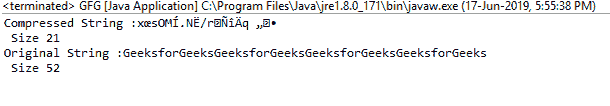
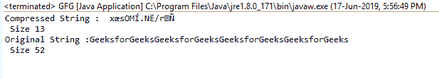
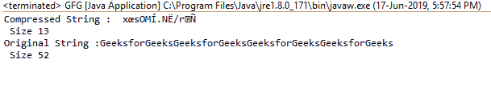

# Java 中的通缩器 deflate()函数，示例

> 原文:[https://www . geesforgeks . org/pincher-deflate-function-in-Java-with-examples/](https://www.geeksforgeeks.org/deflater-deflate-function-in-java-with-examples/)

在 **java.util.zip** 中**紧缩器类**的**紧缩()**功能用于压缩输入数据，并用压缩的数据填充给定的缓冲区。函数返回压缩数据的字节数。

**功能签名:**

```
public int deflate(byte[] b)
public int deflate(byte[] b, int offset, int length, int flush)
public int deflate(byte[] b, int offset, int length)

```

**语法:**

```
d.deflate(byte[])
d.deflate(byte[], int, int, int)
d.deflate(byte[], int, int )

```

**参数:**这些重载函数接受的各种参数有:

*   **字节[] b** :这是要放气的输入数组
*   **int offset** :这是给定数组中读取值的起始偏移量
*   **int length** :这是从起始偏移量开始压缩的最大长度。
*   **int flush** :这是作为参数传递的 flush 模式

**返回类型:**该函数返回一个**整数值**，即压缩数据的大小。

**异常:**如果冲洗模式无效，该功能将抛出 **IllegalArgumentException** 。有三种有效的冲洗模式，即**无冲洗、同步冲洗、全冲洗**。

以下示例演示了上述函数的使用:

**示例 1:** 演示 deflate(字节[] b)函数的使用

```
// Java program to demonstrate
// the use of deflate(byte[] b) function

import java.util.zip.*;
import java.io.UnsupportedEncodingException;

class GFG {
    public static void main(String args[])
        throws UnsupportedEncodingException
    {
        // deflater
        Deflater d = new Deflater();

        // get the text
        String pattern = "GeeksforGeeks", text = "";

        // generate the text
        for (int i = 0; i < 4; i++)
            text += pattern;

        // set the input for deflator
        d.setInput(text.getBytes("UTF-8"));

        // finish
        d.finish();

        // output bytes
        byte output[] = new byte[1024];

        // compress the data
        int size = d.deflate(output);

        // compressed String
        System.out.println("Compressed String :"
                           + new String(output)
                           + "\n Size " + size);

        // original String
        System.out.println("Original String :"
                           + text + "\n Size "
                           + text.length());

        // end
        d.end();
    }
}
```

**输出:**

```
Compressed String :x?sOM?.N?/r???q??
 Size 21
Original String :GeeksforGeeksGeeksforGeeksGeeksforGeeksGeeksforGeeks
 Size 52

```



**示例 2:** 演示 deflate(字节[] b，int 偏移量，int 长度)函数的使用

```
// Java program to demonstrate the use
// of deflate(byte[] b, int offset, int length) function

import java.util.zip.*;
import java.io.UnsupportedEncodingException;

class GFG {
    public static void main(String args[])
        throws UnsupportedEncodingException
    {
        // deflater
        Deflater d = new Deflater();

        // get the text
        String pattern = "GeeksforGeeks", text = "";

        // generate the text
        for (int i = 0; i < 4; i++)
            text += pattern;

        // set the input for deflator
        d.setInput(text.getBytes("UTF-8"));

        // finish
        d.finish();

        // output bytes
        byte output[] = new byte[1024];

        // compress the data, with given offset and
        // set maximum size of compressed string
        int size = d.deflate(output, 2, 13);

        // compressed String
        System.out.println("Compressed String :"
                           + new String(output)
                           + "\n Size " + size);

        // original String
        System.out.println("Original String :"
                           + text + "\n Size "
                           + text.length());

        // end
        d.end();
    }
}
```

**输出:**

```
Compressed String :x?sOM?.N?/r?
 Size 13
Original String :GeeksforGeeksGeeksforGeeksGeeksforGeeksGeeksforGeeks
 Size 52

```



**示例 3:** 演示 deflate(byte[] b，int offset，int length，int flush)函数的使用

```
// Java program to demonstrate the use of
// deflate(byte[] b, int offset, int length, int flush) function

import java.util.zip.*;
import java.io.UnsupportedEncodingException;

class GFG {
    public static void main(String args[])
        throws UnsupportedEncodingException
    {
        // deflater
        Deflater d = new Deflater();

        // get the text
        String pattern = "GeeksforGeeks", text = "";

        // generate the text
        for (int i = 0; i < 4; i++)
            text += pattern;

        // set the input for deflator
        d.setInput(text.getBytes("UTF-8"));

        // finish
        d.finish();

        // output bytes
        byte output[] = new byte[1024];

        // compress the data, with given offset and
        // set maximum size of compressed string
        // and specified Flush
        int size = d.deflate(output, 2, 13, Deflater.FULL_FLUSH);

        // compressed String
        System.out.println("Compressed String :"
                           + new String(output)
                           + "\n Size " + size);

        // original String
        System.out.println("Original String :" + text
                           + "\n Size " + text.length());

        // end
        d.end();
    }
}
```

**输出:**

```
Compressed String :x?sOM?.N?/r?
 Size 13
Original String :GeeksforGeeksGeeksforGeeksGeeksforGeeksGeeksforGeeks
 Size 52

```



**参考:**

*   [https://docs . Oracle . com/javae/9/docs/API/Java/util/zip/deflate . html # deflate 位元组:A-](https://docs.oracle.com/javase/9/docs/api/java/util/zip/Deflater.html#deflate-byte:A-)
*   [https://docs . Oracle . com/javae/9/docs/API/Java/util/zip/deflate . html # deflate 位元组:a-int-](https://docs.oracle.com/javase/9/docs/api/java/util/zip/Deflater.html#deflate-byte:A-int-int-)
*   [https://docs . Oracle . com/javae/9/docs/API/Java/util/zip/deflate . html # deflate 位元组:a-int-int-](https://docs.oracle.com/javase/9/docs/api/java/util/zip/Deflater.html#deflate-byte:A-int-int-int-)