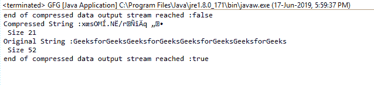

# 平减器用 Java 完成了()函数，示例

> 原文:[https://www . geesforgeks . org/pincher-finished-function-in-Java-with-examples/](https://www.geeksforgeeks.org/deflater-finished-function-in-java-with-examples/)

**Java . util . zip**中**平减器类**的 **finished()** 函数在压缩数据输出流结束时返回 true。

**功能签名:**

```java
public boolean finished()

```

**语法:**

```java
d.finished();

```

**参数:**函数不需要参数

**返回类型:**该函数返回**布尔值**，即如果所有输入都被压缩并存储在给定的缓冲区中，则为真，否则为假。

**异常:**函数不抛出任何异常

**示例 1:** 演示成品()功能的使用

```java
// Java program to demonstrate
// the use of finished() function

import java.util.zip.*;
import java.io.UnsupportedEncodingException;

class GFG {
    public static void main(String args[])
        throws UnsupportedEncodingException
    {
        // deflater
        Deflater d = new Deflater();

        // get the text
        String pattern = "GeeksforGeeks", text = "";

        // generate the text
        for (int i = 0; i < 4; i++)
            text += pattern;

        // set the input for deflator
        d.setInput(text.getBytes("UTF-8"));

        // finish
        d.finish();

        // output of finished function
        System.out.println("end of compressed data "
                           + "output stream reached :"
                           + d.finished());

        // output bytes
        byte output[] = new byte[1024];

        // compress the data
        int size = d.deflate(output);

        // compressed String
        System.out.println("Compressed String :"
                           + new String(output)
                           + "\n Size " + size);

        // original String
        System.out.println("Original String :" + text
                           + "\n Size " + text.length());

        // output of finished function
        System.out.println("end of compressed data "
                           + "output stream reached :"
                           + d.finished());

        // end
        d.end();
    }
}
```

**输出:**

```java
end of compressed data output stream reached :false
Compressed String :x?sOM?.N?/r???q??
 Size 21
Original String :GeeksforGeeksGeeksforGeeksGeeksforGeeksGeeksforGeeks
 Size 52
end of compressed data output stream reached :true

```



**参考:**[https://docs . Oracle . com/javase/7/docs/API/Java/util/zip/平减器. html#finished()](https://docs.oracle.com/javase/7/docs/api/java/util/zip/Deflater.html#finished())