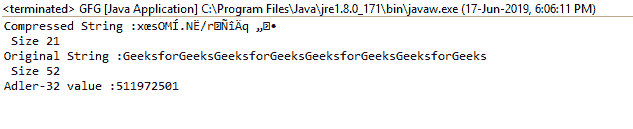

# Java 中的平减器 getAdler()函数，带示例

> 原文:[https://www . geesforgeks . org/pincer-getadler-function-in-Java-with-examples/](https://www.geeksforgeeks.org/deflater-getadler-function-in-java-with-examples/)

在 **java.util.zip** 中**平减器类**的 **getAdler()** 函数返回未压缩数据的 Adler-32 值。 [Adler-32](https://en.wikipedia.org/wiki/Adler-32) 是 zlib 压缩库中广泛使用的校验和算法。

**功能签名:**

```
public int getAdler()

```

**语法:**

```
d.getAdler();

```

**参数:**函数不需要参数

**返回类型:**该函数返回一个**整数值**，它是未压缩数据的**阿德勒-32 值**。

**异常:**函数不抛出任何异常

**例 1:**

```
// Java program to describe the use
// of finished() function

import java.util.zip.*;
import java.io.UnsupportedEncodingException;

class GFG {
    public static void main(String args[])
        throws UnsupportedEncodingException
    {
        // deflater
        Deflater d = new Deflater();

        // get the text
        String pattern = "GeeksforGeeks", text = "";

        // generate the text
        for (int i = 0; i < 4; i++)
            text += pattern;

        // set the input for deflator
        d.setInput(text.getBytes("UTF-8"));

        // finish
        d.finish();

        // output bytes
        byte output[] = new byte[1024];

        // compress the data
        int size = d.deflate(output);

        // compressed String
        System.out.println("Compressed String :"
                           + new String(output)
                           + "\n Size " + size);

        // original String
        System.out.println("Original String :" + text
                           + "\n Size " + text.length());

        // get Adler-32 value
        System.out.println("Adler-32 value :"
                           + d.getAdler());

        // end
        d.end();
    }
}
```

**输出:**

```
Compressed String :x?sOM?.N?/r???q??
 Size 21
Original String :GeeksforGeeksGeeksforGeeksGeeksforGeeksGeeksforGeeks
 Size 52
Adler-32 value :511972501

```



**参考:**[https://docs . Oracle . com/javase/7/docs/API/Java/util/zip/pincher . html # getAdler()](https://docs.oracle.com/javase/7/docs/api/java/util/zip/Deflater.html#getAdler())