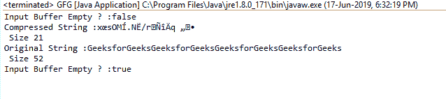

# Pinterest needsInput()函数在 Java 中的示例

> 原文:[https://www . geesforgeks . org/pincher-needsinput-function-in-Java-with-examples/](https://www.geeksforgeeks.org/deflater-needsinput-function-in-java-with-examples/)

在 **java.util.zip** 中**平减器类**的 **needsInput()** 功能用于检查输入数据缓冲区是否为空。如果输入数据缓冲区为空，则调用**设置输入()**函数来提供输入

**功能签名:**

```java
public boolean needsInput()

```

**语法:**

```java
d.needsInput();

```

**参数:**函数不需要参数

**返回类型:**该函数返回一个**布尔值**，即如果输入缓冲区为空则返回真，否则返回假。

**异常:**函数不抛出任何异常

**例 1:**

```java
// Java program to describe the use
// of needsInput() function

import java.util.zip.*;
import java.io.UnsupportedEncodingException;

class GFG {
    public static void main(String args[])
        throws UnsupportedEncodingException
    {
        // deflater
        Deflater d = new Deflater();

        // get the text
        String pattern = "GeeksforGeeks", text = "";

        // generate the text
        for (int i = 0; i < 4; i++)
            text += pattern;

        // set the Input for deflator
        d.setInput(text.getBytes("UTF-8"));

        // finish
        d.finish();

        // output bytes
        byte output[] = new byte[1024];

        // does the deflater need input
        System.out.println("Input Buffer Empty ? :"
                           + d.needsInput());

        // compress the data
        int size = d.deflate(output);

        // compressed String
        System.out.println("Compressed String :"
                           + new String(output)
                           + "\n Size " + size);

        // original String
        System.out.println("Original String :"
                           + text + "\n Size "
                           + text.length());

        // does the deflater need input
        System.out.println("Input Buffer Empty ? :"
                           + d.needsInput());

        // end
        d.end();
    }
}
```

**输出:**

```java
Input Buffer Empty ? :false
Compressed String :x?sOM?.N?/r???q??
 Size 21
Original String :GeeksforGeeksGeeksforGeeksGeeksforGeeksGeeksforGeeks
 Size 52
Input Buffer Empty ? :true

```



**参考:**[https://docs . Oracle . com/javase/7/docs/API/Java/util/zip/平减器. html#needsInput()](https://docs.oracle.com/javase/7/docs/api/java/util/zip/Deflater.html#needsInput())