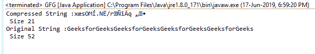
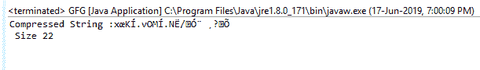

# Java 中的平减器 setInput()函数，示例

> 原文:[https://www . geesforgeks . org/pincher-set input-function-in-Java-with-examples/](https://www.geeksforgeeks.org/deflater-setinput-function-in-java-with-examples/)

在 **java.util.zip** 中**平减器类**的 **setInput()** 功能用于设置输入数据进行压缩。当 **needsInput()** 返回 true 表示输入缓冲区为空时，应调用该函数。

**功能签名:**

```
public void setInput(byte[] b)
public void setInput(byte[] b, int offset, int len)

```

**语法:**

```
d.setInput(byte[]);
d.setInput(byte[], int, int);

```

**参数:**这些重载函数接受的各种参数有:

*   **字节[] b** :这是要放气的输入数组
*   **int offset** :这是给定数组中读取值的起始偏移量
*   **int length** :这是从起始偏移量开始压缩的最大长度。

**返回类型:**函数有不返回任何内容。

**异常:**函数不抛出任何异常

**例 1:**

```
// Java program to describe the use
// of setInput(byte[] b) function

import java.util.zip.*;
import java.io.UnsupportedEncodingException;

class GFG {
    public static void main(String args[])
        throws UnsupportedEncodingException
    {
        // deflater
        Deflater d = new Deflater();

        // get the text
        String pattern = "GeeksforGeeks", text = "";

        // generate the text
        for (int i = 0; i < 4; i++)
            text += pattern;

        // set the Input for deflator
        d.setInput(text.getBytes("UTF-8"));

        // finish
        d.finish();

        // output bytes
        byte output[] = new byte[1024];

        // compress the data
        int size = d.deflate(output);

        // compressed String
        System.out.println("Compressed String :"
                           + new String(output)
                           + "\n Size " + size);

        // original String
        System.out.println("Original String :" + text
                           + "\n Size " + text.length());

        // end
        d.end();
    }
}
```

**输出:**

```
Compressed String :x?sOM?.N?/r???q??
 Size 21
Original String :GeeksforGeeksGeeksforGeeksGeeksforGeeksGeeksforGeeks
 Size 52

```



**例 2:**

```
// Java program to describe the use
// of setInput(byte[] b, int offset, int len) function

import java.util.zip.*;
import java.io.UnsupportedEncodingException;

class GFG {
    public static void main(String args[])
        throws UnsupportedEncodingException
    {
        // deflater
        Deflater d = new Deflater();

        // get the text
        String pattern = "GeeksforGeeks", text = "";

        // generate the text
        for (int i = 0; i < 4; i++)
            text += pattern;

        // set the Input for deflator
        d.setInput(text.getBytes("UTF-8"), 10, 30);

        // finish
        d.finish();

        // output bytes
        byte output[] = new byte[1024];

        // compress the data
        int size = d.deflate(output);

        // compressed String
        System.out.println("Compressed String :"
                           + new String(output)
                           + "\n Size " + size);

        // end
        d.end();
    }
}
```

**输出:**

```
Compressed String :x?K?.vOM?.N?/????
 Size 22

```



**参考:**[https://docs . Oracle . com/javase/7/docs/API/Java/util/zip/pincher . html # setInput()](https://docs.oracle.com/javase/7/docs/api/java/util/zip/Deflater.html#setInput())