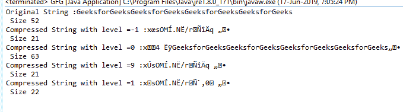

# Java 中的平减器 setLevel()函数，示例

> 原文:[https://www . geesforgeks . org/pincer-set level-function-in-Java-with-examples/](https://www.geeksforgeeks.org/deflater-setlevel-function-in-java-with-examples/)

在 **java.util.zip** 中**缩减器类**的 **setLevel()** 功能将当前压缩级别设置为指定值。压缩级别是从 0 到 9 的整数值。
**功能签名:**

```
public void setLevel(int level)

```

**语法:**

```
d.setLevel(int);

```

**参数:**该函数需要一个**整数值**，它是指定的压缩值

**返回类型:**函数不返回值。

**异常:**如果压缩级别无效，函数抛出 IllegalArgumentException。
 **通货紧缩水平的一些恒定值:**

*   **最佳 _ 压缩**:最佳压缩的压缩级别*   **最佳 _ 速度**:最快压缩的压缩级别。*   **DEFAULT_COMPRESSION** :默认压缩级别。*   **NO_COMPRESSION** : Compression level for no compression.

    **例 1:**

    ```
    // Java program to describe the use
    // of setLevel() function

    import java.util.zip.*;
    import java.io.UnsupportedEncodingException;

    class GFG {

        // Function to compress the string to the given level
        static void compression(int level, String text)
            throws UnsupportedEncodingException
        {
            // deflater
            Deflater d = new Deflater(level);

            // set the Input for deflator
            d.setInput(text.getBytes("UTF-8"));

            // finish
            d.finish();

            // output bytes
            byte output[] = new byte[1024];

            // compress the data
            int size = d.deflate(output);

            // compressed String
            System.out.println("Compressed String with level ="
                               + level + " :"
                               + new String(output)
                               + "\n Size " + size);

            d.end();
        }

        // Driver code
        public static void main(String args[])
            throws UnsupportedEncodingException
        {

            // get the text
            String pattern = "GeeksforGeeks", text = "";

            // generate the text
            for (int i = 0; i < 4; i++)
                text += pattern;

            // original String
            System.out.println("Original String :" + text
                               + "\n Size " + text.length());

            // default
            compression(Deflater.DEFAULT_COMPRESSION, text);

            // no compression
            compression(Deflater.NO_COMPRESSION, text);

            // Best compression
            compression(Deflater.BEST_COMPRESSION, text);

            // Best Speed
            compression(Deflater.BEST_SPEED, text);
        }
    }
    ```

    **输出:**

    ```
    Original String :GeeksforGeeksGeeksforGeeksGeeksforGeeksGeeksforGeeks
     Size 52
    Compressed String with level =-1 :x?sOM?.N?/r???q??
     Size 21
    Compressed String with level =0 :x4??GeeksforGeeksGeeksforGeeksGeeksforGeeksGeeksforGeeks??
     Size 63
    Compressed String with level =9 :x?sOM?.N?/r???q??
     Size 21
    Compressed String with level =1 :xsOM?.N?/r?`?0??
     Size 22

    ```

    

    **参考:**[https://docs . Oracle . com/javase/7/docs/API/Java/util/zip/平减器. html#setLevel()](https://docs.oracle.com/javase/7/docs/api/java/util/zip/Deflater.html#needsInput())