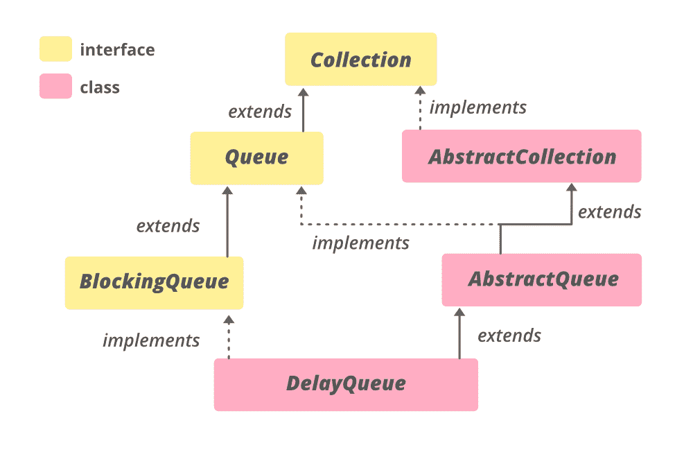

# 用示例在 Java 中延迟队列类

> 原文:[https://www . geeksforgeeks . org/delay queue-in-Java-class-with-example/](https://www.geeksforgeeks.org/delayqueue-class-in-java-with-example/)

**延迟队列**类是 [Java 集合框架的成员。](https://www.geeksforgeeks.org/collections-in-java-2/)属于 **java.util.concurrent** 包。延迟队列实现[阻塞队列](https://www.geeksforgeeks.org/blockingqueue-interface-in-java/)接口。延迟队列是一个专门的[优先级队列](https://www.geeksforgeeks.org/priority-queue-class-in-java-2/)，它根据元素的延迟时间对元素进行排序。这意味着只有那些元素可以从已经过期的队列中取出。
DelayQueue 头包含在最短时间内过期的元素。如果没有延迟过期，则没有 head，轮询将返回 null。DelayQueue 只接受属于类型**delay**类的元素，或者实现**Java . util . concurrent . delay**接口的元素。延迟队列在内部阻塞元素，直到某个延迟过期。延迟队列实现了获取延迟(时间单位。方法返回剩余的延迟时间。传递给 getDelay()方法的时间单位实例是一个枚举，它告诉延迟应该以哪个时间单位返回。时间单位枚举可能需要天、小时、分钟、秒、毫秒、微秒、纳秒。此队列不允许空元素。这个类及其迭代器实现了**集合**和**迭代器**接口的所有可选方法。方法[迭代器()](https://www.google.com/url?client=internal-element-cse&cx=009682134359037907028:tj6eafkv_be&q=https://www.geeksforgeeks.org/delayqueue-iterator-method-in-java-with-examples/&sa=U&ved=2ahUKEwjV9JDj-_vrAhVFjuYKHb0uA84QFjAIegQIBRAC&usg=AOvVaw1DjM9nWHanh-0xEmlF4gt2)中提供的迭代器不能保证以任何特定的顺序遍历延迟队列的元素。

> //延迟接口的声明
> 
> 公共接口延迟扩展可比<delayed></delayed>
> 
> {
> 
> /**
> 
> *返回与此对象相关联的剩余延迟，以
> 
> *给定时间单位。
> 
> *
> 
> * @param 单位时间单位
> 
> *
> 
> * @返回剩余延迟；零值或负值表示
> 
> *延迟已经过去
> 
> */
> 
> long getDelay(时间单位)：
> 
> }

**延迟队列的层次结构**



它实现了**可迭代<E>T1、**集合<E>T3、[阻塞队列<E>T5、](https://www.geeksforgeeks.org/blockingqueue-interface-in-java/)[队列<E>T7】接口。](https://www.geeksforgeeks.org/queue-interface-java/)****

**类别申报:**

> 公共类延迟队列<e extends="" delayed="">扩展抽象队列<e>实现阻塞队列<e>T3</e></e></e>

这里， **E** 是这个集合维护的元素类型。

### 延迟队列的构造函数

要构建一个 DelayQueue，我们需要从**Java . util . concurrent . delay queue**导入。

**1。DelayQueue()** :这个构造函数用来构造一个空的 DelayQueue。

> 延迟队列 <e>dq =新延迟队列<e>()；</e></e>

**2。延迟队列(集合< E > c)** :这个构造函数用来构造一个延迟队列，将**延迟**实例集合的元素作为参数传递。

> 延迟队列 <e>dq =新延迟队列(集合<e>c)；</e></e>

下面是一个用 Java 说明延迟队列的示例程序:

## Java 语言(一种计算机语言，尤用于创建网站)

```java
// Java Program Demonstrate DelayQueue

import java.util.concurrent.*;
import java.util.*;

// The DelayObject for DelayQueue
// It must implement Delayed and
// its getDelay() and compareTo() method
class DelayObject implements Delayed {

    private String name;
    private long time;

    // Constructor of DelayObject
    public DelayObject(String name, long delayTime)
    {
        this.name = name;
        this.time = System.currentTimeMillis()
                    + delayTime;
    }

    // Implementing getDelay() method of Delayed
    @Override
    public long getDelay(TimeUnit unit)
    {
        long diff = time - System.currentTimeMillis();
        return unit.convert(diff, TimeUnit.MILLISECONDS);
    }

    // Implementing compareTo() method of Delayed
    @Override
    public int compareTo(Delayed obj)
    {
        if (this.time < ((DelayObject)obj).time) {
            return -1;
        }
        if (this.time > ((DelayObject)obj).time) {
            return 1;
        }
        return 0;
    }

    // Implementing toString() method of Delayed
    @Override
    public String toString()
    {
        return "\n{"
            + "name=" + name
            + ", time=" + time
            + "}";
    }
}

// Driver Class
public class GFG {
    public static void main(String[] args)
        throws InterruptedException
    {

        // create object of DelayQueue
        // using DelayQueue() constructor
        BlockingQueue<DelayObject> DQ
            = new DelayQueue<DelayObject>();

        // Add numbers to end of DelayQueue
        DQ.add(new DelayObject("A", 1));
        DQ.add(new DelayObject("B", 2));
        DQ.add(new DelayObject("C", 3));
        DQ.add(new DelayObject("D", 4));

        // print DelayQueue
        System.out.println("DelayQueue: "
                           + DQ);

        // create object of DelayQueue
        // using DelayQueue(Collection c)
        // constructor
        BlockingQueue<DelayObject> DQ2
            = new DelayQueue<DelayObject>(DQ);

        // print DelayQueue
        System.out.println("DelayQueue: "
                           + DQ2);
    }
}
```

**Output:** 

```java
DelayQueue: [
{name=A, time=1543472836003}, 
{name=B, time=1543472836004}, 
{name=C, time=1543472836005}, 
{name=D, time=1543472836006}]
DelayQueue: [
{name=A, time=1543472836003}, 
{name=B, time=1543472836004}, 
{name=C, time=1543472836005}, 
{name=D, time=1543472836006}]
```

下面是一个用 Java 说明延迟队列方法的示例程序:

## Java 语言(一种计算机语言，尤用于创建网站)

```java
// Java Program Demonstrate DelayQueue methods

import java.util.concurrent.*;
import java.util.*;

// The DelayObject for DelayQueue
// It must implement Delayed and
// its getDelay() and compareTo() method
class DelayObject implements Delayed {

    private String name;
    private long time;

    // Constructor of DelayObject
    public DelayObject(String name, long delayTime)
    {
        this.name = name;
        this.time = System.currentTimeMillis()
                    + delayTime;
    }

    // Implementing getDelay() method of Delayed
    @Override
    public long getDelay(TimeUnit unit)
    {
        long diff = time - System.currentTimeMillis();
        return unit.convert(diff, TimeUnit.MILLISECONDS);
    }

    // Implementing compareTo() method of Delayed
    @Override
    public int compareTo(Delayed obj)
    {
        if (this.time < ((DelayObject)obj).time) {
            return -1;
        }
        if (this.time > ((DelayObject)obj).time) {
            return 1;
        }
        return 0;
    }

    // Implementing toString()
      // method of Delayed
    @Override
    public String toString()
    {
        return "\n{"
            + "name=" + name
            + ", time=" + time
            + "}";
    }
}

// Driver Class
public class GFG {
    public static void main(String[] args)
        throws InterruptedException
    {

        // create object of DelayQueue
        // using DelayQueue() constructor
        BlockingQueue<DelayObject> DQ
            = new DelayQueue<DelayObject>();

        // Add numbers to end of DelayQueue
        // using add() method
        DQ.add(new DelayObject("A", 1));
        DQ.add(new DelayObject("B", 2));
        DQ.add(new DelayObject("C", 3));
        DQ.add(new DelayObject("D", 4));

        // print queue
        System.out.println("DelayQueue: "
                           + DQ);

        // print the head using peek() method
        System.out.println("Head of DelayQueue: "
                           + DQ.peek());

        // print the size using size() method
        System.out.println("Size of DelayQueue: "
                           + DQ.size());

        // remove the head using poll() method
        System.out.println("Head of DelayQueue: "
                           + DQ.poll());

        // print the size using size() method
        System.out.println("Size of DelayQueue: "
                           + DQ.size());

        // clear the DelayQueue using clear() method
        DQ.clear();
        System.out.println("Size of DelayQueue"
                           + " after clear: "
                           + DQ.size());
    }
}
```

**Output:** 

```java
DelayQueue: [
{name=A, time=1543472845012}, 
{name=B, time=1543472845013}, 
{name=C, time=1543472845014}, 
{name=D, time=1543472845015}]

Head of DelayQueue: 
{name=A, time=1543472845012}

Size of DelayQueue: 4

Head of DelayQueue: 
{name=A, time=1543472845012}

Size of DelayQueue: 3

Size of DelayQueue after clear: 0
```

### 基本操作

**1。添加元素**

Java 中 DelayQueue 类的 [add(E e)](https://www.geeksforgeeks.org/delayqueue-add-method-in-java-with-examples/) 方法用于将给定元素插入延迟队列，如果元素已经成功插入，则返回 true。

## Java 语言(一种计算机语言，尤用于创建网站)

```java
// Java program to illustrate the adding
// elements to the DelayQueue

import java.util.concurrent.DelayQueue;
import java.util.concurrent.Delayed;
import java.util.concurrent.TimeUnit;

public class AddingElementsExample {
    public static void main(String args[])
    {
        // Create a DelayQueue instance
        DelayQueue<Delayed> queue
            = new DelayQueue<Delayed>();

        // Create an instance of Delayed
        Delayed obj = new Delayed() {
            public long getDelay(TimeUnit unit)
            {
                return 24; // some value is returned
            }

            public int compareTo(Delayed o)
            {
                if (o.getDelay(TimeUnit.DAYS)
                    > this.getDelay(TimeUnit.DAYS))
                    return 1;
                else if (o.getDelay(TimeUnit.DAYS)
                         == this.getDelay(TimeUnit.DAYS))
                    return 0;
                return -1;
            }
        };

        // Use the add() method to add obj to
        // the empty DelayQueue instance
        queue.add(obj);

        // printing size of the queue to the console
        System.out.println("Size of the queue : "
                           + queue.size());
    }
}
```

**Output**

```java
Size of the queue : 1
```

**2。拆卸元件**

Java 中 DelayQueue 类的 [remove()](https://www.geeksforgeeks.org/delayqueue-remove-method-in-java/) 方法用于从这个 DelayQueue 中移除给定对象的单个实例，比如 obj(如果它存在的话)。如果给定元素被成功移除，则返回 true，否则返回 false。**T3】**

## Java 语言(一种计算机语言，尤用于创建网站)

```java
// Java Program to illustrate the removing
// elements of DelayQueue class

import java.util.concurrent.DelayQueue;
import java.util.concurrent.Delayed;
import java.util.concurrent.TimeUnit;

public class RemovingElementsExample {
    public static void main(String args[])
    {
        // Create a DelayQueue instance
        DelayQueue<Delayed> queue = new DelayQueue<Delayed>();

        // Create an object of type Delayed
        Delayed ob = new Delayed() {
            public long getDelay(TimeUnit unit)
            {
                return 24; // some value is returned
            }

            public int compareTo(Delayed o)
            {
                if (o.getDelay(TimeUnit.DAYS)
                    > this.getDelay(TimeUnit.DAYS))
                    return 1;
                else if (o.getDelay(TimeUnit.DAYS)
                         == this.getDelay(TimeUnit.DAYS))
                    return 0;
                return -1;
            }
        };

        // Add the object to DelayQueue
        queue.add(ob);

        // Print initial size of Queue
        System.out.println("Initial Size : " + queue.size());

        // Remove the object ob from
        // this DelayQueue
        queue.remove(ob);

        // Print the final size of the DelayQueue
        System.out.println("Size after removing : " + queue.size());
    }
}
```

**Output**

```java
Initial Size : 1
Size after removing : 0
```

**3。访问元素**

DelayQueue 的 [peek()](https://www.geeksforgeeks.org/delayqueue-peak-method-in-java-with-examples/) 方法用于检索 DelayQueue 的头部，但不会将其移除，就像从 DelayQueue 移除头部的 [poll()](https://www.geeksforgeeks.org/delayqueue-poll-method-in-java-with-examples/) 方法的情况一样。

## Java 语言(一种计算机语言，尤用于创建网站)

```java
// Java Program Demonstrate accessing
// elements of DelayQueue

import java.util.concurrent.*;
import java.util.*;

// The DelayObject for DelayQueue
// It must implement Delayed and
// its getDelay() and compareTo() method
class DelayObject implements Delayed {

    private String name;
    private long time;

    // Constructor of DelayObject
    public DelayObject(String name, long delayTime)
    {
        this.name = name;
        this.time = System.currentTimeMillis() + delayTime;
    }

    // Implementing getDelay() method of Delayed
    @Override public long getDelay(TimeUnit unit)
    {
        long diff = time - System.currentTimeMillis();
        return unit.convert(diff, TimeUnit.MILLISECONDS);
    }

    // Implementing compareTo() method of Delayed
    @Override public int compareTo(Delayed obj)
    {
        if (this.time < ((DelayObject)obj).time) {
            return -1;
        }
        if (this.time > ((DelayObject)obj).time) {
            return 1;
        }
        return 0;
    }

    // Implementing toString() method of Delayed
    @Override public String toString()
    {
        return "\n{"
            + " " + name + ", time=" + time + "}";
    }
}

// Driver Class
public class AccessingElementsExample {
    public static void main(String[] args)
        throws InterruptedException
    {

        // create object of DelayQueue
        // using DelayQueue() constructor
        BlockingQueue<DelayObject> DQ = new DelayQueue<DelayObject>();

        // Add numbers to end of DelayQueue
        // using add() method
        DQ.add(new DelayObject("A", 1));
        DQ.add(new DelayObject("B", 2));

        // Print delayqueue
        System.out.println("Original DelayQueue: " + DQ + "\n");

        // removing all elements
        DQ.clear();

        // peek() method for returning head of the
        // DelayQueue
        System.out.println("Head of the DelayQueue: " + DQ.peek());
    }
}
```

**Output**

```java
Original DelayQueue: [
{ A, time=1600770273132}, 
{ B, time=1600770273134}]

Head of the DelayQueue: null
```

**4。穿越**

DelayQueue 的[迭代器()](https://www.geeksforgeeks.org/delayqueue-iterator-method-in-java-with-examples/)方法用于返回 DelayQueue 中所有元素的迭代器。

## Java 语言(一种计算机语言，尤用于创建网站)

```java
// Java Program Demonstrate iterating
// over DelayQueue

import java.util.concurrent.*;
import java.util.*;

// The DelayObject for DelayQueue
// It must implement Delayed and
// its getDelay() and compareTo() method
class DelayObject implements Delayed {

    private String name;
    private long time;

    // Constructor of DelayObject
    public DelayObject(String name, long delayTime)
    {
        this.name = name;
        this.time = System.currentTimeMillis() + delayTime;
    }

    // Implementing getDelay() method of Delayed
    @Override public long getDelay(TimeUnit unit)
    {
        long diff = time - System.currentTimeMillis();
        return unit.convert(diff, TimeUnit.MILLISECONDS);
    }

    // Implementing compareTo() method of Delayed
    @Override public int compareTo(Delayed obj)
    {
        if (this.time < ((DelayObject)obj).time) {
            return -1;
        }
        if (this.time > ((DelayObject)obj).time) {
            return 1;
        }
        return 0;
    }

    // Implementing toString() method of Delayed
    @Override public String toString()
    {
        return "\n{"
            + " " + name + ", time=" + time + "}";
    }
}

// Driver Class
public class IteratingExample {
    public static void main(String[] args)
        throws InterruptedException
    {

        // create object of DelayQueue
        // using DelayQueue() constructor
        BlockingQueue<DelayObject> DQ = new DelayQueue<DelayObject>();

        // Add numbers to end of DelayQueue
        // using add() method
        DQ.add(new DelayObject("A", 1));
        DQ.add(new DelayObject("B", 2));
        DQ.add(new DelayObject("C", 3));
        DQ.add(new DelayObject("D", 4));

        // Creating an iterator
        Iterator val = DQ.iterator();

        // print the value after iterating DelayQueue
        System.out.println("The iterator values are: ");
        while (val.hasNext()) {
            System.out.println(val.next());
        }
    }
}
```

**Output**

```java
The iterator values are: 

{ A, time=1600770415898}

{ B, time=1600770415900}

{ C, time=1600770415901}

{ D, time=1600770415902}
```

### 延迟排队的方法

<figure class="table">

| 

方法

 | 

描述

 |
| --- | --- |
| [加(E e)](https://www.google.com/url?client=internal-element-cse&cx=009682134359037907028:tj6eafkv_be&q=https://www.geeksforgeeks.org/delayqueue-add-method-in-java-with-examples/&sa=U&ved=2ahUKEwjV9JDj-_vrAhVFjuYKHb0uA84QFjADegQICRAC&usg=AOvVaw0kOXPgzZbcG3tBkRDZRB9C) | 将指定的元素插入这个延迟队列。 |
| [晴()](https://www.geeksforgeeks.org/delayqueue-clear-method-in-java/#:~:text=The%20clear()%20method%20of,after%20this%20call%20is%20returned.) | 从这个延迟队列中自动移除所有元素。 |
| [沥水图(收藏<？超 E > c)](https://www.google.com/url?client=internal-element-cse&cx=009682134359037907028:tj6eafkv_be&q=https://www.geeksforgeeks.org/delayqueue-drainto-method-in-java-with-examples/&sa=U&ved=2ahUKEwjV9JDj-_vrAhVFjuYKHb0uA84QFjACegQIBxAC&usg=AOvVaw3NAiE9KS7xxoiIG4YA7xyn) | 从此队列中移除所有可用元素，并将它们添加到给定集合中。 |
| [沥水图(收藏<？超 E > c，int maxElements)](https://www.google.com/url?client=internal-element-cse&cx=009682134359037907028:tj6eafkv_be&q=https://www.geeksforgeeks.org/delayqueue-drainto-method-in-java-with-examples/&sa=U&ved=2ahUKEwjV9JDj-_vrAhVFjuYKHb0uA84QFjACegQIBxAC&usg=AOvVaw3NAiE9KS7xxoiIG4YA7xyn) | 从该队列中最多移除给定数量的可用元素，并将它们添加到给定集合中。 |
| [迭代器()](https://www.google.com/url?client=internal-element-cse&cx=009682134359037907028:tj6eafkv_be&q=https://www.geeksforgeeks.org/delayqueue-iterator-method-in-java-with-examples/&sa=U&ved=2ahUKEwjV9JDj-_vrAhVFjuYKHb0uA84QFjAIegQIBRAC&usg=AOvVaw1DjM9nWHanh-0xEmlF4gt2) | 返回该队列中所有元素(过期和未过期)的迭代器。 |
| [报价(E e)](https://www.google.com/url?client=internal-element-cse&cx=009682134359037907028:tj6eafkv_be&q=https://www.geeksforgeeks.org/delayqueue-offer-method-in-java-with-examples/&sa=U&ved=2ahUKEwjV9JDj-_vrAhVFjuYKHb0uA84QFjAHegQIAhAC&usg=AOvVaw0mkCYjX6fKDBbAoJXZuTBJ) | 将指定的元素插入这个延迟队列。 |
| 报价(长时间超时，时间单位单位) | 将指定的元素插入这个延迟队列。 |
| [peek()](https://www.google.com/url?client=internal-element-cse&cx=009682134359037907028:tj6eafkv_be&q=https://www.geeksforgeeks.org/delayqueue-peak-method-in-java-with-examples/&sa=U&ved=2ahUKEwiT7-WW_PvrAhVN63MBHdG8A684ChAWMAJ6BAgIEAI&usg=AOvVaw2Vtl1dsEibE0gJzmZ3piZT) | 检索但不移除该队列的头，如果该队列为空，则返回 null。 |
| [投票()](https://www.geeksforgeeks.org/delayqueue-poll-method-in-java-with-examples/) | 检索并移除该队列的头，或者如果该队列没有具有过期延迟的元素，则返回 null。 |
| 轮询(长超时，时间单位单位) | 检索并删除该队列的头，如有必要，等待直到具有过期延迟的元素在该队列中可用，或者指定的等待时间过期。 |
| [放(E e)](https://www.google.com/url?client=internal-element-cse&cx=009682134359037907028:tj6eafkv_be&q=https://www.geeksforgeeks.org/delayqueue-put-method-in-java-with-examples/&sa=U&ved=2ahUKEwjV9JDj-_vrAhVFjuYKHb0uA84QFjAGegQIARAC&usg=AOvVaw1Zw0Eunud0Zthn3ZiQyhVO) | 将指定的元素插入这个延迟队列。 |
| [剩余容量()](https://www.google.com/url?client=internal-element-cse&cx=009682134359037907028:tj6eafkv_be&q=https://www.geeksforgeeks.org/delayqueue-remainingcapacity-method-in-java-with-examples/&sa=U&ved=2ahUKEwiT7-WW_PvrAhVN63MBHdG8A684ChAWMAB6BAgAEAI&usg=AOvVaw3XnICzSRZNdNBQgF8Zw7a3) | 总是返回整数。最大值，因为延迟队列不受容量限制。 |
| [移除(物体 o)](https://www.google.com/url?client=internal-element-cse&cx=009682134359037907028:tj6eafkv_be&q=https://www.geeksforgeeks.org/delayqueue-remove-method-in-java/&sa=U&ved=2ahUKEwjV9JDj-_vrAhVFjuYKHb0uA84QFjAEegQIBBAC&usg=AOvVaw040T6VPyHNpe1K5Duv1wXO) | 从该队列中移除指定元素的单个实例(如果存在),无论它是否已过期。 |
| [取()](https://www.google.com/url?client=internal-element-cse&cx=009682134359037907028:tj6eafkv_be&q=https://www.geeksforgeeks.org/delayqueue-take-method-in-java-with-examples/&sa=U&ved=2ahUKEwjV9JDj-_vrAhVFjuYKHb0uA84QFjABegQICBAC&usg=AOvVaw1A-2FlV8CwkLx_827Qkdt5) | 检索并删除该队列的头，如有必要，等待直到具有过期延迟的元素在该队列中可用。 |
| [toaarray()](https://www.google.com/url?client=internal-element-cse&cx=009682134359037907028:tj6eafkv_be&q=https://www.geeksforgeeks.org/delayqueue-toarray-method-in-java-with-examples/&sa=U&ved=2ahUKEwjV9JDj-_vrAhVFjuYKHb0uA84QFjAFegQIAxAC&usg=AOvVaw1dGOrSfUHw3AhrwWxX8vbi) | 返回包含该队列中所有元素的数组。 |
| [toaarray(t[]a)](https://www.google.com/url?client=internal-element-cse&cx=009682134359037907028:tj6eafkv_be&q=https://www.geeksforgeeks.org/delayqueue-toarray-method-in-java-with-examples/&sa=U&ved=2ahUKEwjV9JDj-_vrAhVFjuYKHb0uA84QFjAFegQIAxAC&usg=AOvVaw1dGOrSfUHw3AhrwWxX8vbi) | 返回包含该队列中所有元素的数组；返回数组的运行时类型是指定数组的运行时类型。 |

</figure>

### java.util.AbstractQueue 类中声明的方法

<figure class="table">

| 

方法

 | 

描述

 |
| --- | --- |
| [addAll(收藏<？延伸 E > c)](https://www.geeksforgeeks.org/abstractqueue-addall-method-in-java-with-examples/) | 将指定集合中的所有元素添加到该队列中。 |
| [元素()](https://www.geeksforgeeks.org/abstractqueue-element-method-in-java-with-examples/) | 检索但不移除该队列的头。 |
| [移除()](https://www.geeksforgeeks.org/abstractqueue-remove-method-in-java-with-examples/#:~:text=The%20remove()%20method%20of,the%20head%20of%20this%20queue.&text=Parameters%3A%20This%20method%20does%20not,if%20the%20queue%20is%20empty.) | 检索并删除该队列的头。 |

</figure>

### java.util.AbstractCollection 类中声明的方法

<figure class="table">

| 

方法

 | 

描述

 |
| --- | --- |
| [包含(对象 o)](https://www.geeksforgeeks.org/abstractcollection-contains-method-in-java-with-examples/) | 如果此集合包含指定的元素，则返回 true。 |
| [包含所有(收藏<？> c)](https://www.geeksforgeeks.org/abstractcollection-containsall-method-in-java-with-examples/) | 如果此集合包含指定集合中的所有元素，则返回 true。 |
| [【isempty()](https://www.geeksforgeeks.org/abstractcollection-isempty-method-in-java-with-examples/) | 如果此集合不包含元素，则返回 true。 |
| [移除所有(集合<？> c)](https://www.geeksforgeeks.org/abstractcollection-removeall-method-in-java-with-example/) | 移除此集合中也包含在指定集合中的所有元素(可选操作)。 |
| [零售(收藏<？> c)](https://www.geeksforgeeks.org/abstractcollection-retainall-method-in-java-with-examples/) | 仅保留此集合中包含在指定集合中的元素(可选操作)。 |
| [toString()](https://www.geeksforgeeks.org/abstractcollection-tostring-method-in-java-with-examples/) | 返回此集合的字符串表示形式。 |

</figure>

### 接口 Java . util . concurrent . blockingqueue 中声明的方法

<figure class="table">

| 

方法

 | 

描述

 |
| --- | --- |
| [包含(对象 o)](https://www.geeksforgeeks.org/blockingqueue-contains-method-in-java-with-examples/#:~:text=The%20contains(Object%20o)%20method,it%20returns%20a%20false%20value.) | 如果此队列包含指定的元素，则返回 true。 |

</figure>

### 接口 java.util.Collection 中声明的方法

<figure class="table">

| 

方法

 | 

描述

 |
| --- | --- |
| [addAll(收藏<？延伸 E > c)](https://www.geeksforgeeks.org/collection-addall-method-in-java-with-examples/#:~:text=The%20addAll(Collection%20collection)%20of,the%20successfulness%20of%20the%20operation.) | 将指定集合中的所有元素添加到此集合中(可选操作)。 |
| 包含所有(集合> c) | 如果此集合包含指定集合中的所有元素，则返回 true。 |
| 等于(对象 0) | 将指定的对象与此集合进行比较，看是否相等。 |
| hashCode() | 返回此集合的哈希代码值。 |
| isEmpty() | 如果此集合不包含元素，则返回 true。 |
| 并行流() | 以此集合为源返回一个可能并行的流。 |
| 移除所有(集合> c) | 移除此集合中也包含在指定集合中的所有元素(可选操作)。 |
| 移除 If(谓词 super E>过滤器) | 移除此集合中满足给定谓词的所有元素。 |
| 零售(集合> c) | 仅保留此集合中包含在指定集合中的元素(可选操作)。 |
| 大小() | 返回此集合中的元素数量。 |
| 拆分器() | 在此集合中的元素上创建一个[拆分器](https://www.geeksforgeeks.org/java-util-interface-spliterator-java8/)。 |
| 流() | 返回以此集合为源的顺序流。 |
| toArray (IntFunction <t>生成器)</t> | 使用提供的生成器函数分配返回的数组，返回包含此集合中所有元素的数组。 |

</figure>

### 在接口 java.lang.Iterable 中声明的方法

<figure class="table">

| 

方法

 | 

描述

 |
| --- | --- |
| [forEach(消费者<？超 T >动作)](https://www.geeksforgeeks.org/iterable-foreach-method-in-java-with-examples/) | 对 Iterable 的每个元素执行给定的操作，直到所有元素都被处理完或者该操作引发异常。 |

</figure>

### 接口 java.util.Queue 中声明的方法

<figure class="table">

| 

方法

 | 

描述

 |
| --- | --- |
| [元素()](https://www.geeksforgeeks.org/queue-element-method-in-java/) | 检索但不移除该队列的头。 |
| [移除()](https://www.geeksforgeeks.org/queue-remove-method-in-java/#:~:text=The%20remove()%20method%20of,when%20the%20Queue%20is%20empty.) | 检索并删除该队列的头。 |

</figure>

**参考:**[https://docs . Oracle . com/en/Java/javase/11/docs/API/Java . base/Java/util/concurrent/delayqueue . html](https://docs.oracle.com/en/java/javase/11/docs/api/java.base/java/util/concurrent/DelayQueue.html)