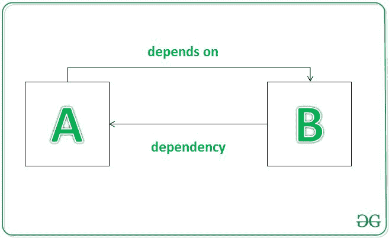
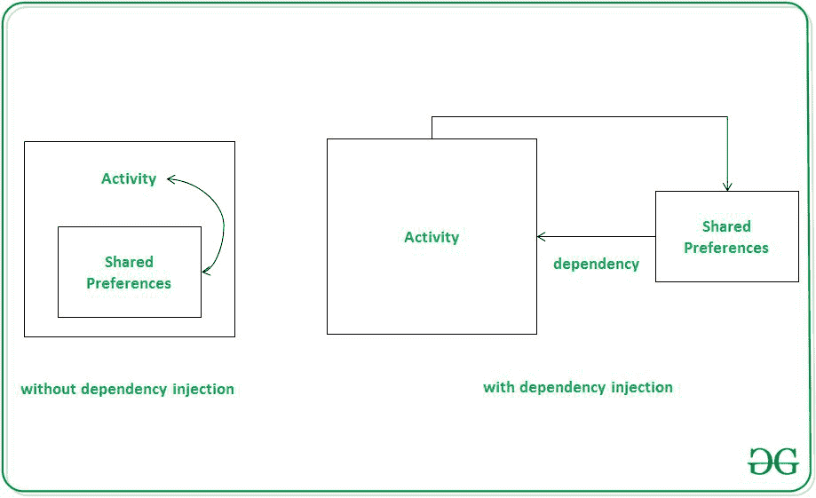
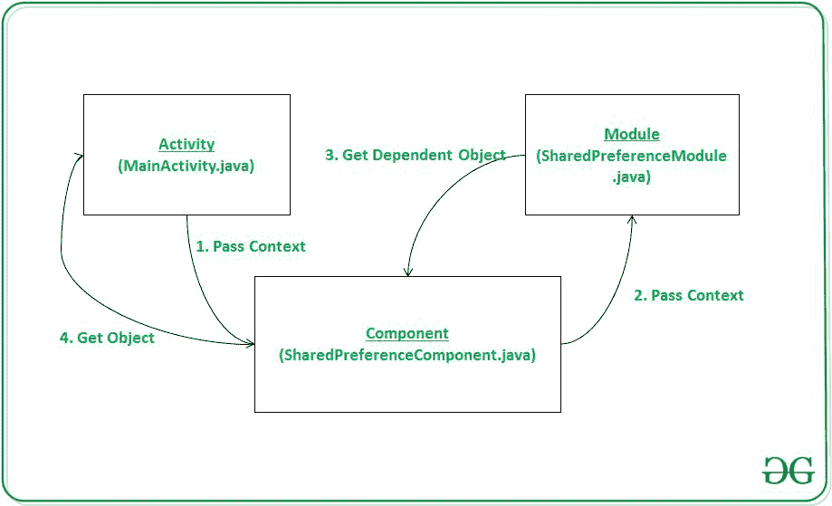

# 安卓中匕首 2 的依赖注入

> 原文:[https://www . geesforgeks . org/dependency-injection-with-dagger-in-2-Android/](https://www.geeksforgeeks.org/dependency-injection-with-dagger-2-in-android/)

如果有两个类，A 类和 B 类**A 类依赖于 B 类**，那么 B 类被称为 A 类的依赖者。



所以，每次我们想要访问 A 类中的 B 类时，我们都需要在 A 类中创建一个 B 类的实例，或者使用静态工厂方法来访问 A 类。但是这将使我们的代码紧密耦合，难以管理和测试。为了消除这些问题，我们使用依赖注入。**依赖注入**是一种从编程代码中去除依赖，使应用程序易于管理和测试的设计模式。它还使编程代码松散耦合。

## **安卓中的依赖注入**

假设我们想在[shared references](https://www.geeksforgeeks.org/shared-preferences-in-android-with-examples/)中存储一些数据。为了保存或检索共享首选项数据，我们需要在活动的样板代码中有共享首选项的实例。并且可能导致测试、管理等方面的问题。如果我们的代码库很大。这就是安卓依赖注入的帮助。在这里，shared references**作为我们的 activity 的依赖项**，所以我们不在我们的 Activity 中创建它的实例，而是从其他类中注入它。下面是情况的说明。



## **匕首 2**

匕首 2 是一个编译时安卓依赖注入框架，使用 **Java 规范请求 330** 和[注释](https://www.geeksforgeeks.org/annotations-in-java/)。匕首 2 中使用的一些基本注释包括:

1.  **@Module** 该注释用于构造对象和提供依赖关系的类。
2.  **@提供**这在模块类中返回对象的方法上使用。
3.  **@Inject** 用于字段、构造函数或方法，表示请求依赖关系。
4.  **@Component** 这在组件接口上使用，该接口充当@Module 和@Inject 之间的桥梁。(模块类不直接向请求类提供依赖，它使用组件接口)
5.  **@Singleton** 这用于指示仅创建了依赖对象的单个实例。

### **例**

在本例中，我们将向共享首选项添加一些数据，然后使用**匕首 2** 库从那里检索数据。下面是我们在这个例子中要做的事情的图片。注意，我们将使用 **Java** 语言来实现这个项目。



### **分步实施**

**第一步:创建新项目**

在安卓工作室创建新项目请参考 [如何在安卓工作室创建/启动新项目](https://www.geeksforgeeks.org/android-how-to-create-start-a-new-project-in-android-studio/) 。注意选择 **Java** 作为编程语言。

**步骤 2:添加依赖关系**

为了在 dagger 2 库的帮助下使用依赖注入，我们需要添加它的依赖。转到**梯度脚本>** [**构建.梯度(模块:app)**](https://www.geeksforgeeks.org/android-build-gradle/) 并添加以下依赖项。添加这些依赖项后，您需要点击**立即同步**。

> 依赖项{
> 
> 实现“com.google .匕首:剑柄-核心:2.29-alpha”
> 
> 注释处理器“com.google .匕首:刀柄-编译器:2.29-alpha”
> 
> }

在进一步移动之前，让我们添加一些颜色属性，以增强应用程序栏。转到应用> res >值> colors.xml 并添加以下颜色属性。

## 可扩展标记语言

```
<resources> 
    <color name="colorPrimary">#0F9D58</color> 
    <color name="colorPrimaryDark">#16E37F</color> 
    <color name="colorAccent">#03DAC5</color> 
</resources> 
```

**步骤 3:使用 activity_main.xml 文件**

在这一步中，我们将为应用程序创建一个布局文件。我们使用[编辑文本](https://www.geeksforgeeks.org/material-design-edittext-in-android-with-examples/)从用户处获取输入，使用[文本视图](https://www.geeksforgeeks.org/textview-widget-in-android-using-java-with-examples/)分别显示输出以及保存和显示按钮。下面是 **activity_main.xml** 文件的代码片段。

## 可扩展标记语言

```
<?xml version="1.0" encoding="utf-8"?>
<RelativeLayout 
    xmlns:android="http://schemas.android.com/apk/res/android"
    xmlns:tools="http://schemas.android.com/tools"
    android:layout_width="match_parent"
    android:layout_height="match_parent"
    tools:context=".MainActivity">

    <Button
        android:id="@+id/saveBtn"
        android:layout_width="wrap_content"
        android:layout_height="wrap_content"
        android:layout_below="@+id/inputField"
        android:layout_centerInParent="true"
        android:layout_margin="8dp"
        android:background="@color/colorPrimary"
        android:text="Save"
        android:textColor="#ffffff" />

    <Button
        android:id="@+id/getBtn"
        android:layout_width="wrap_content"
        android:layout_height="wrap_content"
        android:layout_below="@+id/outputField"
        android:layout_centerInParent="true"
        android:layout_margin="8dp"
        android:background="@color/colorPrimary"
        android:text="Show"
        android:textColor="#ffffff" />

    <!--For input we have used EditText-->
    <EditText
        android:id="@+id/inputField"
        android:layout_width="match_parent"
        android:layout_height="wrap_content"
        android:layout_margin="8dp"
        android:hint="Input Data"
        android:textAlignment="center" />

    <!--For output we have used TextView-->
    <TextView
        android:id="@+id/outputField"
        android:layout_width="match_parent"
        android:layout_height="wrap_content"
        android:layout_below="@+id/saveBtn"
        android:layout_margin="8dp"
        android:hint="Output Data"
        android:textAlignment="center" />

</RelativeLayout>
```

**第 4 步:创建模块类**

现在，我们将创建一个模块类，用于构造对象并提供依赖关系。 **@Module** 注释在模块类上使用。这个类包含一个初始化上下文的[构造函数](https://www.geeksforgeeks.org/java-gq/constructors-2-gq/)和一个返回依赖对象的方法，这个依赖对象使用了**@提供的**注释。这里，provideSharedPreferences()方法将返回依赖对象。一般来说，返回依赖对象的方法后面会跟一个单词 provide。转到 **app > java >包>右键创建一个新的 java 类**并命名为 **SharedPreferenceModule** 。以下是**SharedPreferenceModule.java**文件的代码片段。

## Java 语言(一种计算机语言，尤用于创建网站)

```
import android.content.Context;
import android.content.SharedPreferences;
import android.preference.PreferenceManager;
import javax.inject.Singleton;
import dagger.Module;
import dagger.Provides;

// @Module annotation is used over the class that 
// creates construct object and provides dependencies
@Module
public class SharedPreferenceModule {
    private Context context;

    // Context gets initialize from the constructor itself
    public SharedPreferenceModule(Context context) {
        this.context = context;
    }

    @Singleton
    @Provides
    public Context provideContext() {
        return context;
    }

    // @Singleton indicates that only single instance 
    // of dependency object is created
    // @Provide annotations used over the methods that
    // will provides the object of module class
    // This method will return the dependent object
    @Singleton
    @Provides
    public SharedPreferences provideSharedPreferences(Context context) {
        return PreferenceManager.getDefaultSharedPreferences(context);
    }
}
```

**步骤 5:创建** **组件界面**

在这一步中，我们将创建一个接口。转到 **app > java >包>右键创建一个界面**，命名为**SharedPreferenceComponent**。我们使用@Component 注释来提及所有模块。

> @组件(模块= { sharedpreferencemodle })

可能请求模块声明的依赖关系的活动、[片段](https://www.geeksforgeeks.org/introduction-fragments-android/)、[、](https://www.geeksforgeeks.org/introduction-fragments-android/)或[服务](https://www.geeksforgeeks.org/services-in-android-with-example/)必须在此接口中用单独的 **inject()** 方法声明。以下是**SharedPreferenceComponent.java**界面的代码片段。

## Java 语言(一种计算机语言，尤用于创建网站)

```
import javax.inject.Singleton;
import dagger.Component;

// All the modules are mentioned under 
// the @Component annotation
@Singleton
@Component(modules = {SharedPreferenceModule.class})
public interface SharedPreferenceComponent {
    void inject(MainActivity mainActivity);
}
```

**步骤 6:使用 MainActivity.java 文件**

在这一步中，我们将首先初始化我们的视图，然后将 Dagger 绑定到我们的应用程序。哪个组件接口后面是匕首关键字。

> sharedPreferenceComponent = Daggersharedpreferencecomponent . builder()。sharedPreferenceModule(新的 SharedPreferenceModule(this))。build()；
> 
> sharedpreferencecomponent . inject(this)；

下面是 MainActivity.java 文件的代码片段。

> **注意:**当您将 Dagger 用作 Component 的前缀时(这里是 SharedPreferenceComponent)，有时您可能会收到错误或警告，这是因为 DaggerSharedPreferenceComponent 是在编译后生成的。

## Java 语言(一种计算机语言，尤用于创建网站)

```
import android.content.SharedPreferences;
import android.os.Bundle;
import android.view.View;
import android.widget.Button;
import android.widget.EditText;
import android.widget.TextView;
import androidx.appcompat.app.AppCompatActivity;
import javax.inject.Inject;

public class MainActivity extends AppCompatActivity implements View.OnClickListener {

    EditText editText;
    TextView textView;
    Button saveBtn, getBtn;
    private SharedPreferenceComponent sharedPreferenceComponent;

    // @Inject is used to tell which activity, 
    // fragment or service is allowed to request
    // dependencies declared in Module class
    @Inject
    SharedPreferences sharedPreferences;

    @Override
    protected void onCreate(Bundle savedInstanceState) {
        super.onCreate(savedInstanceState);
        setContentView(R.layout.activity_main);

        // Referencing the EditText, TextView and Buttons
        editText = (EditText) findViewById(R.id.inputField);
        textView = (TextView) findViewById(R.id.outputField);
        saveBtn = (Button) findViewById(R.id.saveBtn);
        getBtn = (Button) findViewById(R.id.getBtn);

        // Setting onClickListener behavior on button to reference
        // to the current activity(this MainActivity)
        saveBtn.setOnClickListener(this);
        getBtn.setOnClickListener(this);

        // Here we are binding dagger to our application
        // Dagger keyword will be prefix to the component name
        sharedPreferenceComponent = DaggerSharedPreferenceComponent.builder().sharedPreferenceModule(
                new SharedPreferenceModule(this)).build();

        // we are injecting the shared preference dependent object
        sharedPreferenceComponent.inject(this);
    }

    @Override
    public void onClick(View view) {
        switch (view.getId()) {
            case R.id.saveBtn:
                // Saving data to shared preference
                // inputField acts as key and editText data as value to that key
                SharedPreferences.Editor editor = sharedPreferences.edit();
                editor.putString("inputField", editText.getText().toString().trim());
                editor.apply();
                break;
            case R.id.getBtn:
                // getting shared preferences data and set it to textview
                // s1: is the default string, You can write any thing there or leave it
                textView.setText(sharedPreferences.getString("inputField", ""));
                break;
        }
    }
}
```

### **输出:在仿真器上运行**

<video class="wp-video-shortcode" id="video-517149-1" width="640" height="360" preload="metadata" controls=""><source type="video/mp4" src="https://media.geeksforgeeks.org/wp-content/uploads/20201122224243/Dependency-Injection-with-Dagger-2-in-Android.mp4?_=1">[https://media.geeksforgeeks.org/wp-content/uploads/20201122224243/Dependency-Injection-with-Dagger-2-in-Android.mp4](https://media.geeksforgeeks.org/wp-content/uploads/20201122224243/Dependency-Injection-with-Dagger-2-in-Android.mp4)</video>