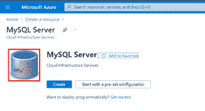
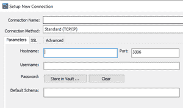
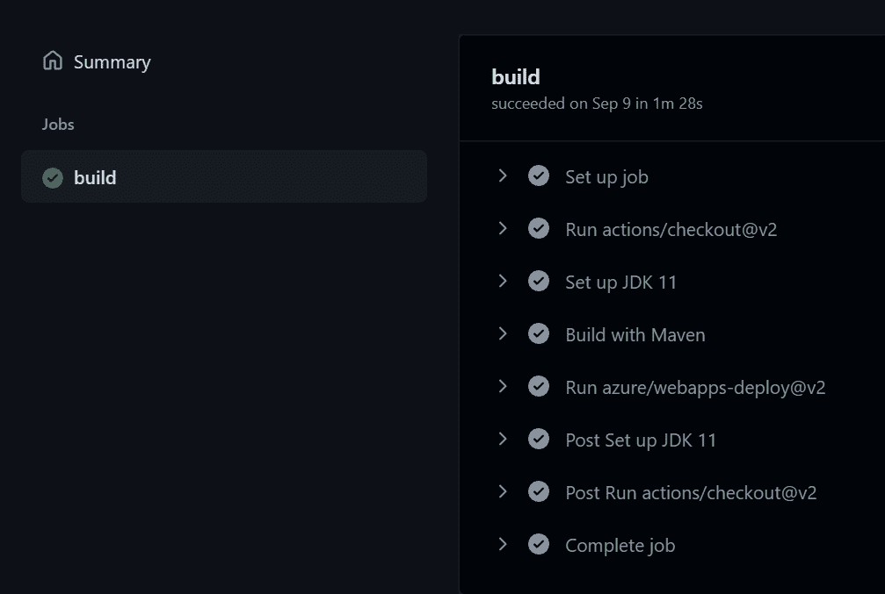

# 在 Azure 上部署带有 MySQL 数据库的 Spring Boot 应用程序

> 原文:[https://www . geesforgeks . org/deployment-spring-boot-application-with-MySQL-database-on-azure/](https://www.geeksforgeeks.org/deploying-spring-boot-application-with-mysql-database-on-azure/)

Azure 是微软的云平台，就像谷歌有谷歌云，亚马逊有亚马逊 Web Service 或者 AWS.000 一样，一般来说，它是一个我们可以通过它来使用微软资源的平台。随着用户喜欢云优于内部基础架构的概念，云部署如今正获得巨大的吸引力。本文清晰地解释了如何在 [Azure 云平台](https://www.geeksforgeeks.org/introduction-microsoft-azure-cloud-computing-service/)上使用 [MySQL 数据库](https://www.geeksforgeeks.org/mysql-database-files/)部署春季启动应用程序。让我们看看如何在 Azure 上使用 MySQL 数据库部署 Spring Boot 应用程序:

1.  首先在 Azure 上部署 MySQL 数据库
2.  准备好使用 MySQL 连接
3.  为部署配置 Spring Boot 应用程序

插图:

为了建立一个巨大的服务器，我们将需要巨大的投资、努力、物理空间等等。在这种情况下，微软 Azure 来拯救我们。它将为我们提供虚拟机、快速数据处理、分析和监控工具等，使我们的工作更加简单。Azure 的定价也更简单、更划算。通俗地说就是“随用随付”，意思是你用了多少钱，就只付多少钱。

现在，我们将按顺序详细讨论以下步骤，以便在 Azure 上部署应用程序，如下所示:

**步骤 1:** 从在 Azure 上部署 MySQL 数据库开始

**1.1:** 在 Azure 上搜索 MySQL Server 创建一个资源部分。

**1.2:** 在提供一些基本细节(如区域)并选择您选择的计划后，单击创建资源。

**1.3:** 资源创建完成后，转到您的仪表板并打开资源以查看其详细信息。

**1.4:** 点击连接安全，添加当前 IP 地址。

**1.5:** 点击连接字符串，复制 JDBC 连接字符串并保存。

**1.6:** 在本地系统打开 MySQL 工作台。

**1.7:** 点击 MySQL 连接旁边的“+”。

**步骤 2:** 准备好 MySQL 连接

**2.1:** 将打开一个对话框，给出您选择的连接名称，提供主机名作为 Azure MySQL 数据库概述部分中的服务器名称。最后，输入在创建资源时生成的用户名和密码。

**2.2:** 成功验证详细信息后，点击测试连接，如果一切正常，则使用上面输入的用户名和密码登录工作台。

**2.3:** 使用命令‘创建数据库‘名称’”创建您选择的数据库，执行‘使用数据库‘名称’”。

**步骤 3:** 配置 Spring Boot 应用程序进行部署

**3.1:** 打开“*application . properties”*文件。

**3.2:** 在其中添加如下属性

> server . port = 8080 spring . data source . driver-class-name = com . MySQL . JDBC . driver spring . data source . URL = JDBC:MySQL://[server-name]:3306/[database-name]？useSSL = true spring . data source . username =[username]spring . data source . password =[password]spring . JPA . show-SQL:true spring . JPA . hibernate . DDL-auto = update spring . JPA . database-platform = org . hibernate . quality . MySQL 5 innodbavoice

**3.3:** 现在将应用程序作为 Spring-Boot 应用程序运行。运行 hibernate 时，会在 Azure MySQL 数据库上自动为您的项目配置表结构。

**3.4:** 在 Azure 上创建 app 服务。

**3.5:** 将您的 Git-hub 帐户作为一个组织进行连接，并为 Azure 提供包含当前应用程序代码的存储库的访问权限。

**3.6:** 最后点击创建按钮。

这些步骤可用于在 Azure 云平台上部署带有 MySQL 数据库的 Spring Boot 应用程序。

> **注意:**要查看部署周期，请转到您的 Git-hub 帐户的**操作**选项卡，您会发现上述操作正在进行中。最后，如果应用程序没有错误，那么将生成一个部署链接。