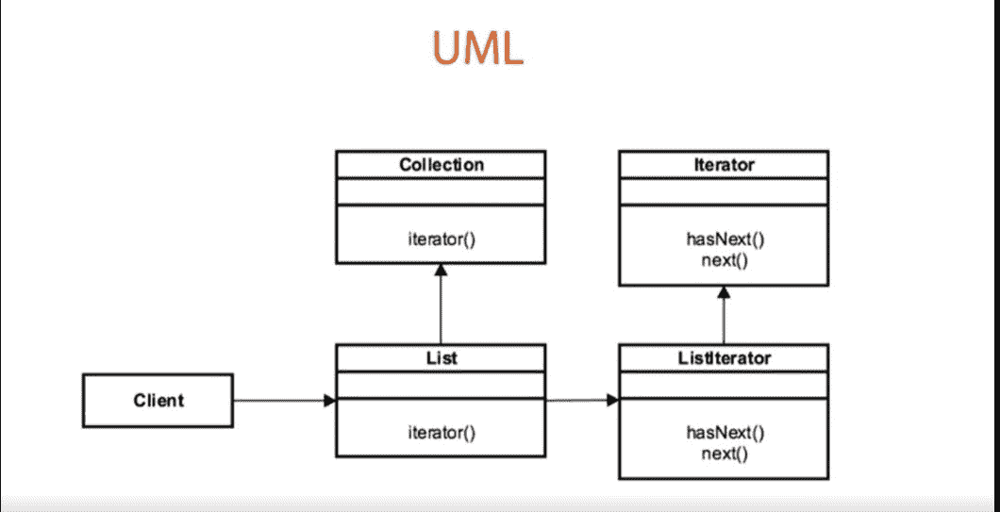

# Java 中的设计模式——迭代器模式

> 原文:[https://www . geesforgeks . org/design-patterns-in-Java-iterator-pattern/](https://www.geeksforgeeks.org/design-patterns-in-java-iterator-pattern/)

一个**设计模式**被证明是解决特定问题/任务的解决方案。我们需要记住，设计模式是独立于编程语言的，用于解决常见的面向对象设计问题。换句话说，设计模式代表一个想法，而不是一个特定的实现。使用设计模式可以使您的代码更加灵活、可重用和可维护。

**设计模式的类型:**Java 中有 3 种类型的设计模式，下面以表格的形式描述得更清楚。

1.  行为设计模式
2.  创新设计模式
3.  结构设计模式

<figure class="table">

| ***行为*** | ***创造*** | ***结构*** |
| --- | --- | --- |
| ***<u>迭代器模式</u>*** | 工厂模式 | 适配器模式 |
| 解释器模式 | 抽象工厂模式 | 桥模式 |
| 调解人模式 | 单一模式 | 复合图案 |
| 纪念品图案 | 原型模式 | 装饰图案 |
| 观察者模式 | 构建器模式 | 立面图案 |
| 状态模式 |   | 飞行重量模式 |
| 战略模式 |   | 代理模式 |
| 模板模式 |   |   |
| 游客模式 |   |   |

</figure>

**行为–迭代器模式**

这里我们将通过一个例子来讨论迭代器模式。

*   迭代器模式是一个很好的模式，可以在不暴露对象结构的情况下提供导航。
*   穿过一个集装箱。在 Java 和大多数当前的编程语言中，都有集合的概念。列表、地图、集合都是我们想要遍历的集合的示例。历史上，我们使用某种类型的循环和索引到您的集合中来遍历它。
*   不会暴露我们想要导航的对象的底层结构。导航各种结构可能有不同的算法或方法来循环数据。
*   将数据从用于遍历的算法中分离出来

**设计:**迭代器模式

*   这是一种基于界面的设计模式。无论您想要迭代哪个对象，都将提供一个方法来从该对象返回迭代器的实例。
*   在获取迭代器实例的方式上遵循基于工厂的方法模式。
*   每个迭代器都是以独立于其他迭代器的方式开发的。
*   迭代器也会快速失败。快速失败意味着迭代器不能在不抛出错误的情况下修改底层对象。



*   列表界面扩展了收集界面。
*   列表接口包含一个工厂方法迭代器()。这个迭代器工厂方法返回迭代器接口的一个实例。
*   在列表及其实现的情况下，底层实例是列表迭代器。
*   列表迭代器是迭代器接口的实现，它理解如何在集合应用编程接口中迭代各种列表对象。它声明组合中对象的接口。

迭代器有如下陷阱:

*   你不能访问任何类型的索引。如果你想得到某个位置的元素，没有迭代就没有办法。在集合和映射的情况下，没有方法在某个索引位置抓取元素
*   单向:它只在正向迭代对象。
*   尽管迭代器是循环遍历任何类型对象的最有效方法。但是在某些情况下，它可能比使用索引并循环遍历要慢。

**示例:**

## Java 语言(一种计算机语言，尤用于创建网站)

```java
// Java Program to Implement Behavioral>Iterator Pattern

// importing required package to
// implement Behavioral>Iterator Pattern
package com.demo.application;

// Importing required libraries
// Here Iterator Interface to
// use it to iterate over the elements
import java.util.Iterator;

// Class 1

// Car Class Implementing Iterable Interface so
// that we can implement the iterator method and
// add our own implementation

public class Car implements Iterable<String> {
  private String[] cars;
  private int index;

  // Default Constructor
  public Car() {
    cars = new String[10];
    index = 0;
  }

  // Method 1
  // Adding method to add Cars
  public void addCar(String car) {
    if (index == cars.length) {
      String[] largerCars = new String[cars.length + 5];
      System.arraycopy(cars, 0, largerCars, 0, cars.length);
      cars = largerCars;
      largerCars = null;
    }
    cars[index] = car;
    index++;
  }

  // Method 2
  // Implementing the iterator method and
  // adding your own implementation
  @Override
  public Iterator<String> iterator() {
    Iterator<String> it = new Iterator<String>() {

      private int currentIndex = 0;

      // Method 3
      // Finding whether during iteration if
      // there is next element or not
      @Override
      public boolean hasNext() {
        return currentIndex < cars.length && cars[currentIndex] != null;
      }

      // Method 4
      // Going to grab each car element by one by one
      // according to the index
      @Override
      public String next() {
        return cars[currentIndex++];
      }

      // Method 5
      @Override
      public void remove() {
        throw new UnsupportedOperationException();
      }
    };

    return it;
  }

  // Method 6
  // Main driver method
  public static void main(String[] args) {

    // Instantiating Car object
    Car cars = new Car();

    // Adding cars to the Array
    cars.addCar("Dodge");
    cars.addCar("Ferrari");
    cars.addCar("Sedan");

    // Creating an Iterator and pointing the cursor
    // to the index just before the first element in cars
    Iterator<String> carIterator = cars.iterator();

    // Checking whether the next element is available or not
    while (carIterator.hasNext()) {
      System.out.println(carIterator.next());
    }
  }
}
```

**结论:**

*   迭代器是遍历对象的有效方法。
*   对客户端隐藏算法，以便客户端的简单性包含在您为其创建迭代器的容器中的算法中
*   帮助我们简化客户。
*   帮助我们利用 for each 语法，这无疑简化了在 for each 循环中迭代该对象的过程。