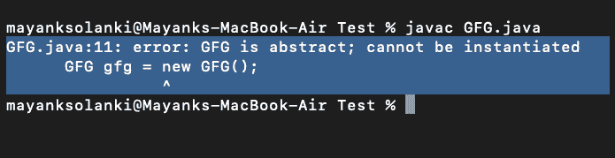
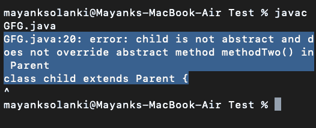

# Java 中抽象类和抽象方法的区别

> 原文:[https://www . geesforgeks . org/Java 中抽象类和抽象方法的区别/](https://www.geeksforgeeks.org/difference-between-abstract-class-and-abstract-method-in-java/)

[抽象](https://www.geeksforgeeks.org/abstract-keyword-in-java/)是只适用于方法和类的修饰符，不适用于变量。即使我们没有实现，我们仍然可以用抽象修饰符声明一个方法。也就是说，抽象方法只有声明，没有实现。因此，抽象方法声明应该强制以分号结束。

插图:

```
public abstract void methodOne(); ------>valid
public abstract void methodOne(){} ------->Invalid
```

**示例:**

## Java 语言(一种计算机语言，尤用于创建网站)

```
// Java Program to illustrate Abstract class

// Abstract Class
// Main class
abstract class GFG {

    // Main driver method
    public static void main(String args[])
    {

        // Creating object of class inside main() method
        GFG gfg = new GFG();
    }
}
```

**输出:**



**输出解释:**

> 如果一个类包含至少一个抽象方法，那么必须用抽象修饰符声明相应的类。因为实现不完整，所以我们不能创建该类的对象。

即使该类不包含任何抽象方法，我们仍然可以将该类声明为抽象类，它是一个抽象类，可以包含零个抽象方法。

插图 1:

```
class Parent 
{  // Method of this class 
   public void methodOne();
}
```

**输出:**

```
Compile time error.
missing method body, or declared abstract
public void methodOne();
```

**插图 2:**

```
class parent {
   // Method of this class
   public abstract void methodOne() {}
}
```

**输出:**

```
Compile time error.
abstract method cannot have a body.
public abstract void methodOne(){}
```

**插图 3:**

```
class parent {

   // Method of this class
   public abstract void methodOne();
}
```

**输出:**

```
Compile time error.
Parent is not abstract and does not override abstract method methodOne() in Parent class
Parent
```

> 如果一个类扩展了任何抽象类，那么我们必须为父类的每个抽象方法提供实现，否则我们必须将子类声明为抽象类。

**示例:**

## Java 语言(一种计算机语言，尤用于创建网站)

```
// Java Program to Illustrate Abstract Method

// Main class
// Abstract class
abstract class Parent {

    // Methods of abstract parent class
    public abstract void methodOne();
    public abstract void methodTwo();
}

// Class 2
// Child class
class child extends Parent {

    // Method of abstract child class
    public void methodOne() {}
}
```

**输出:**



> **注意:**如果我们声明孩子是抽象的，那么代码编译正常，但是孩子的孩子负责为 *methodTwo()提供一个实现。*

现在，让我们在充分了解两者之后，最终总结出它们之间的差异。

<figure class="table">

| 抽象类 | 抽象方法 |
| --- | --- |
| 抽象类不能被实例化。 | 抽象方法体必须为空。 |
| 其他类扩展抽象类。 | 子类必须实现抽象类的抽象方法。 |
| 既可以有抽象的方法，也可以有具体的方法。 | 在类中没有定义。 |
| 类似于接口，但可以

*   实现方法
*   字段可以有各种访问修饰符
*   子类只能扩展一个抽象类

 | 必须在派生类中实现。 |

</figure>