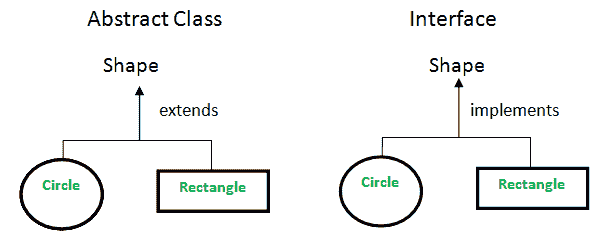

# Java 中抽象类和接口的区别

> 原文:[https://www . geesforgeks . org/Java 中抽象类和接口的区别/](https://www.geeksforgeeks.org/difference-between-abstract-class-and-interface-in-java/)

正如我们所知，抽象是指隐藏特性的内部实现，并且只向用户显示功能。即它的工作原理(显示)、工作原理(隐藏)。[抽象类](https://www.geeksforgeeks.org/abstract-classes-in-java/)和[接口](https://www.geeksforgeeks.org/interfaces-in-java/)都用于抽象，因此接口和抽象类是必需的先决条件



### **抽象类 vs 接口**

*   **方法类型:**接口只能有抽象方法。抽象类可以有抽象和非抽象方法。从 Java 8 开始，它也可以有默认和静态方法。
*   **最终变量:**Java 接口中声明的变量默认为最终变量。抽象类可能包含非最终变量。
*   **变量类型:**抽象类可以有 final、non-final、static 和 non-static 变量。接口只有静态变量和最终变量。
*   **实现:**抽象类可以提供接口的实现。接口不能提供抽象类的实现。
*   **继承 vs 抽象:**一个 Java 接口可以用关键字“implements”实现，一个抽象类可以用关键字“extends”扩展。
*   **多个实现:**一个接口只能扩展另一个 Java 接口，一个抽象类可以扩展另一个 Java 类，实现多个 Java 接口。
*   **数据成员的可访问性:**默认情况下，Java 接口的成员是公共的。Java 抽象类可以有私有、受保护等类成员。

**例 1-A:**

## Java 语言(一种计算机语言，尤用于创建网站)

```
// Java Program to Illustrate Concept of
// Abstract Class

// Importing required classes
import java.io.*;

// Class 1
// Helper abstract class
abstract class Shape {

    // Declare fields
    String objectName = " ";

    // Constructor of this class
    Shape(String name) { this.objectName = name; }

    // Method
    // Non-abstract methods
    // Having as default implementation
    public void moveTo(int x, int y)
    {
        System.out.println(this.objectName + " "
                           + "has been moved to"
                           + " x = " + x + " and y = " + y);
    }

    // Method 2
    // Abstract methods which will be
    // implemented by its subclass(es)
    abstract public double area();
    abstract public void draw();
}

// Class 2
// Helper class extending Class 1
class Rectangle extends Shape {

    // Atributes of rectangle
    int length, width;

    // Constructor
    Rectangle(int length, int width, String name)
    {

        // Super keyword refers to current instance itself
        super(name);

        // this keyword refers to current instance itself
        this.length = length;
        this.width = width;
    }

    // Method 1
    // To draw rectangle
    @Override public void draw()
    {
        System.out.println("Rectangle has been drawn ");
    }

    // Method 2
    // To compute rectangle area
    @Override public double area()
    {
        // Length * Breadth
        return (double)(length * width);
    }
}

// Class 3
// Helper class extending Class 1
class Circle extends Shape {

    // Attributes of a Circle
    double pi = 3.14;
    int radius;

    // Constructor
    Circle(int radius, String name)
    {
        // Super keyword refers to parent class
        super(name);
        // This keyword refers to current instance itself
        this.radius = radius;
    }

    // Method 1
    // To draw circle
    @Override public void draw()
    {
        // Print statement
        System.out.println("Circle has been drawn ");
    }

    // Method 2
    // To compute circle area
    @Override public double area()
    {
        return (double)((pi * radius * radius));
    }
}

// Class 4
// Main class
class GFG {

    // Main driver method
    public static void main(String[] args)
    {
        // Creating the Object of Rectangle class
        // and using shape class reference.
        Shape rect = new Rectangle(2, 3, "Rectangle");

        System.out.println("Area of rectangle: "
                           + rect.area());

        rect.moveTo(1, 2);

        System.out.println(" ");

        // Creating the Objects of circle class
        Shape circle = new Circle(2, "Circle");

        System.out.println("Area of circle: "
                           + circle.area());

        circle.moveTo(2, 4);
    }
}
```

**Output**

```
Area of rectangle: 6.0
Rectangle has been moved to x = 1 and y = 2

Area of circle: 12.56
Circle has been moved to x = 2 and y = 4
```