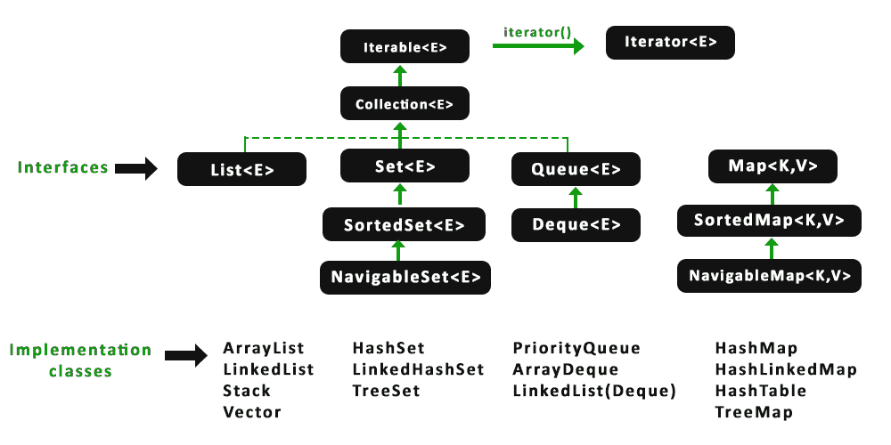

# Java 中数组列表和 HashMap 的区别

> 原文:[https://www . geesforgeks . org/ArrayList-and-hashmap-in-Java/](https://www.geeksforgeeks.org/difference-between-arraylist-and-hashmap-in-java/)之间的差异

[**数组列表**](https://www.geeksforgeeks.org/arraylist-in-java/) 是[集合框架](https://www.geeksforgeeks.org/collections-in-java-2/)的一部分，存在于 [java.util 包](https://www.geeksforgeeks.org/java-util-package-java/)中。它为我们提供了 Java 中的动态数组。尽管它可能比标准数组慢，但在需要对数组进行大量操作的程序中会很有帮助。 [**HashMap**](https://www.geeksforgeeks.org/java-util-hashmap-in-java/) 是 Java 1.2 以来 Java 集合的一部分。它提供了 Java 的[映射接口的基本实现。](https://www.geeksforgeeks.org/map-interface-java-examples/)它以(键，值)对存储数据，为了访问一个值，必须知道它的键。哈希映射被称为哈希映射，因为它使用了一种叫做哈希的技术。[](https://www.geeksforgeeks.org/hashing-set-1-introduction/)

> [哈希](https://www.geeksforgeeks.org/hashing-set-1-introduction/)是一种将大字符串转换为代表相同字符串的小字符串的技术。较短的值有助于索引和更快的搜索。HashSet 内部也使用 HashMap。它在内部使用一个链接列表来存储已经在 [HashSet](https://www.geeksforgeeks.org/hashset-in-java/) 中详细解释过的键值对，以及其他文章。

在这里，我们将继续讨论它们之间的共同特征。然后，我们将通过在一个 Java 程序中对它们执行多组操作并感知输出之间的差异来讨论它们之间的差异。

首先，让我们讨论一下 Java 中数组列表和 HashMap 的相似之处

*   数组列表和哈希映射都不同步。因此，为了在多线程环境中使用它们，需要首先进行同步。
*   数组列表和哈希映射都允许 null。数组列表允许空值，哈希表允许空键和值
*   数组列表和哈希映射都允许重复，数组列表允许重复元素，哈希映射允许重复值
*   在 Java 中，数组列表和哈希映射都可以通过迭代器遍历。
*   两者都使用数组，数组列表由数组支持，HashMap 也由数组在内部实现
*   两者都使用 ***get()方法*** ，ArrayList.get()方法基于一个索引工作，而 HashMap.get()方法获取一个对象类型的参数 key_element，并引用其关联值应该被获取的键，因此两者都提供了恒定时间性能。



到目前为止，我们从上面提供的媒体中获得了一些清晰的信息，现在我们将对它们执行一组操作，以便通过总结同一操作的输出差异来感知真正的差异，这增加了我们理解数组列表和哈希映射之间差异的智力。

*   语法旁边的层次结构
*   插入顺序的维护
*   内存消耗
*   重复元素处理
*   获取元素的简易性
*   空元素存储

### Java 中数组列表和哈希映射的区别

**1。** **层级与句法并列**

**接口实现:**数组列表实现[列表接口](https://www.geeksforgeeks.org/list-interface-java-examples/)，而 HashMap 是[地图接口](https://www.geeksforgeeks.org/map-interface-java-examples/)的实现。

**语法:**数组列表类的声明

```java
public class ArrayList 
extends AbstractList 
implements List, RandomAccess, Cloneable, Serializable
```

**语法:**HashMap 类的声明

```java
public class HashMap 
extends AbstractMap 
implements Map, Cloneable, Serializable  
```

**2。插入顺序的维护**

ArrayList 维护插入顺序，而 HashMap 不维护插入顺序，这意味着 ArrayList 以相同的顺序返回列表项，而 HashMap 不维护任何顺序，因此返回的键值对具有任何顺序。

**示例:**

## Java 语言(一种计算机语言，尤用于创建网站)

```java
// Java Program to llustrate Maintenance of Insertion Order
// in ArrayList vs HashMap 

// Importing all utility classes
import java.util.*;

// Main class
class GFG {

    // Main driver method
    public static void main(String args[])
    {

        // Creating ArrayList of string type
        ArrayList<String> list = new ArrayList<String>();

        // Adding object in ArrayList
        list.add("A");
        list.add("B");
        list.add("C");
        list.add("D");

        // Invoking ArrayList object
        System.out.println("ArrayList: " + list);

        // Creating HashMap
        HashMap<Integer, String> hm
            = new HashMap<Integer, String>();

        // Adding object in HashMap object created above
        // using put() method
        hm.put(1, "A");
        hm.put(2, "B");
        hm.put(3, "C");
        hm.put(4, "D");

        // Invoking HashMap object
        // It might or might not display elements
        // in the insertion order
        System.out.print("Hash
                         Map: " + hm);
    }
}
```

**Output:** 

```java
ArrayList: [A, B, C, D]
HashMap: {1=A, 2=B, 3=C, 4=D}
```

**3。内存消耗**

ArrayList 仅将元素存储为值，并在内部维护每个元素的索引。而 HashMap 用键和值对存储元素，这意味着两个对象。所以 HashMap 相对来说需要更多的内存。

**语法:**数组列表

```java
list.add("A");
// String value is stored in ArrayList
```

**语法:** HashMap

```java
hm.put(1, "A");
// Two String values stored
// as the key value pair in HashMap
```

**4。重复元素处理**

ArrayList 允许重复元素，而 HashMap 不允许重复键，但允许重复值。

**例**

## Java 语言(一种计算机语言，尤用于创建网站)

```java
// Java Program to Illustrate Duplicate Elements Insertion
// in ArrayList vs HashMap

// Importing utility classes
import java.util.*;

// Main class
class GFG {

    // Main driver method
    public static void main(String args[])
    {
        // Creating ArrayList of string type
        ArrayList<String> list = new ArrayList<String>();

        // Adding object in ArrayList
        list.add("A");
        list.add("B");

        // Add duplicates
        list.add("A");
        list.add("A");

        // Invoking ArrayList object
        System.out.println("ArrayList: " + list);

        // Creating HashMap
        HashMap<Integer, String> hm
            = new HashMap<Integer, String>();

        // Adding object in HashMap
        hm.put(1, "A");
        hm.put(2, "B");

        // Add duplicates key
        // Change value if index exist
        hm.put(3, "A");
        hm.put(3, "A");

        // Add duplicates values
        // allow duplicates value
        hm.put(4, "A");
        hm.put(5, "A");

        // Invoking HashMap object
        System.out.print("HashMap: " + hm);
    }
}
```

**Output:** 

```java
ArrayList: [A, B, A, A]
HashMap: {1=A, 2=B, 3=A, 4=A, 5=A}
```